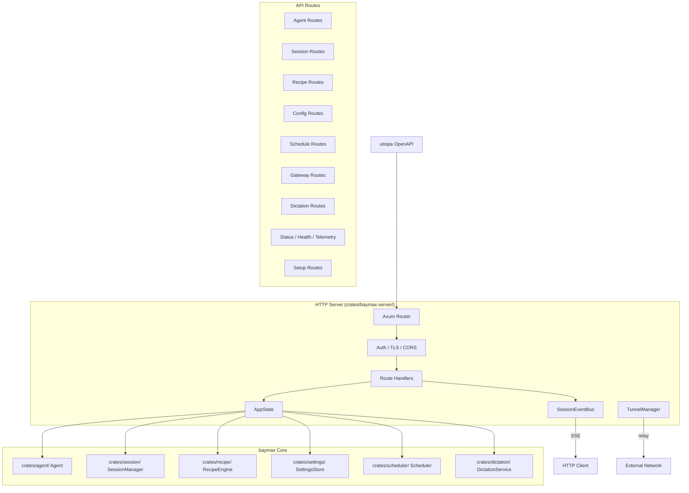

# Design Document: REST API Server

## 1. Overview

Migrate goose's HTTP REST API server (`goose-server`) into baymax. This server provides a full HTTP API for interacting with the agent, managing sessions, recipes, schedules, and more — enabling embedding baymax into other applications and services.

### Key Architectural Decisions

- **New `crates/baymax-server/` crate**: Separate from the desktop app binary. Optional feature, not compiled by default.
- **Axum-based**: Goose already uses axum (which is a workspace dependency in baymax). Continue with axum for the HTTP layer.
- **Shared state from `crates/agent/`**: The server instantiates an agent and exposes it via HTTP, reusing the same agent infrastructure.
- **SSE for streaming**: Server-Sent Events for streaming responses, consistent with goose and ACP patterns.
- **OpenAPI via `utoipa`**: Use `utoipa` for OpenAPI documentation generation from Rust types.
- **Tunnel via `bore` or similar**: Lightweight tunnel protocol for exposing the server publicly.

## 2. Architecture



## 3. Components and Interfaces

### Component: Server Configuration

```rust
pub struct ServerConfig {
    pub host: String,
    pub port: u16,
    pub tls: Option<TlsConfig>,
    pub auth: Option<AuthConfig>,
    pub cors: CorsConfig,
    pub tunnel: Option<TunnelConfig>,
}

pub struct TlsConfig {
    pub cert_path: PathBuf,
    pub key_path: PathBuf,
}

pub enum AuthConfig {
    ApiKey { key: String },
    BearerToken { token: String },
    None,
}
```

### Component: Route Handlers

```rust
// Agent routes
async fn agent_message(State(state): State<AppState>, Json(req): Json<AgentRequest>) -> Result<Json<AgentResponse>, ApiError>;
async fn agent_stream(State(state): State<AppState>, Json(req): Json<AgentRequest>, ws: WebSocketUpgrade) -> Response;
async fn agent_status(State(state): State<AppState>) -> Json<AgentStatus>;

// Session routes
async fn list_sessions(State(state): State<AppState>) -> Result<Json<Vec<SessionSummary>>, ApiError>;
async fn create_session(State(state): State<AppState>, Json(req): Json<NewSessionRequest>) -> Result<Json<SessionDetail>, ApiError>;
async fn get_session(State(state): State<AppState>, Path(id): Path<String>) -> Result<Json<SessionDetail>, ApiError>;
async fn delete_session(State(state): State<AppState>, Path(id): Path<String>) -> StatusCode;

// Recipe routes
async fn list_recipes(State(state): State<AppState>) -> Json<Vec<RecipeManifest>>;
async fn get_recipe(State(state): State<AppState>, Path(name): Path<String>) -> Result<Json<Recipe>, ApiError>;
async fn run_recipe(State(state): State<AppState>, Path(name): Path<String>, Json(req): Json<RunRecipeRequest>) -> Result<Json<RecipeOutput>, ApiError>;

// Config routes
async fn get_config(State(state): State<AppState>) -> Json<Value>;
async fn update_config(State(state): State<AppState>, Json(config): Json<Value>) -> Result<Json<Value>, ApiError>;
```

### Component: Session Event Bus

```rust
pub struct SessionEventBus {
    subscribers: HashMap<SessionId, Vec<mpsc::Sender<SessionEvent>>>,
}

impl SessionEventBus {
    pub fn subscribe(&mut self, session_id: &SessionId) -> mpsc::Receiver<SessionEvent>;
    pub fn publish(&mut self, session_id: &SessionId, event: SessionEvent);
    pub fn unsubscribe(&mut self, session_id: &SessionId, sender_id: usize);

    pub async fn stream_events(&self, session_id: &SessionId) -> impl Stream<Item = SessionEvent>;
}

pub enum SessionEvent {
    MessageAdded { message: Message },
    ToolCalled { tool_call: ToolCall },
    ToolCompleted { tool_call: ToolCall, result: Value },
    StatusChanged { old: SessionStatus, new: SessionStatus },
}
```

### Component: Tunnel Manager

```rust
pub struct TunnelManager {
    local_port: u16,
    relay_url: String,
    connection: Option<TunnelConnection>,
}

impl TunnelManager {
    pub async fn start(&mut self) -> Result<String>; // returns public URL
    pub async fn stop(&mut self) -> Result<()>;
    pub fn status(&self) -> TunnelStatus;
}
```

### Component: OpenAPI Documentation

```rust
#[derive(OpenApi)]
#[openapi(
    paths(
        agent_message,
        agent_status,
        list_sessions,
        create_session,
        // ... all routes
    ),
    components(
        schemas(AgentRequest, AgentResponse, SessionDetail, Recipe, ...)
    ),
    tags(
        (name = "agent", description = "Agent interaction endpoints"),
        (name = "sessions", description = "Session management"),
        (name = "recipes", description = "Recipe management"),
        // ... more tags
    )
)]
pub struct ApiDoc;
```

## 4. Data Models

```rust
pub struct ApiError {
    pub code: u16,
    pub error: String,
    pub detail: Option<String>,
    pub request_id: Option<String>,
}

impl IntoResponse for ApiError { /* creates JSON error response */ }

pub struct PaginatedResponse<T> {
    pub data: Vec<T>,
    pub total: usize,
    pub page: usize,
    pub page_size: usize,
}
```

## 5. Correctness Properties

### Property 1: Idempotent Session Deletion

_For any_ session ID [deleted via DELETE /sessions/:id], [if the session does not exist], THE endpoint SHALL return 404, not error.

**Validates: Requirement 3.6**

### Property 2: Streaming Delivery

_For any_ SSE subscription [to session events], [for each event published], THE event SHALL be delivered to all active subscribers within 1 second.

**Validates: Requirement 4.2**

### Property 3: Auth Enforcement

_For any_ API request [to a protected endpoint], [without valid authentication], THE server SHALL return 401 Unauthorized.

**Validates: Requirement 13.3**

### Property 4: Config Validation

_For any_ config update request [with invalid values], THE server SHALL return 400 with validation errors.

**Validates: Requirement 6.4**

## 6. Error Handling

| Error Scenario | Handling |
|---|---|
| Agent busy processing | Return 503 Service Unavailable with retry-after |
| Session not found | Return 404 with session ID in error detail |
| Recipe execution fails mid-way | Return 200 with partial results and error flag |
| TLS certificate expired | Log error on startup, fall back to HTTP with warning |
| Tunnel relay unreachable | Log warning, continue in local-only mode |

## 7. Testing Strategy

- **Unit tests**: Request/response serialization, validation, auth
- **Integration tests**: Full HTTP request cycle with mock agent
- **SSE tests**: Event streaming, reconnection, filtering
- **OpenAPI tests**: Generated spec matches actual routes
- **Tunnel tests**: With mock relay server

## References

- Source: `goose/crates/goose-server/`
- Baymax: `crates/agent/`, `crates/session/`, `crates/settings/`, `crates/scheduler/`
