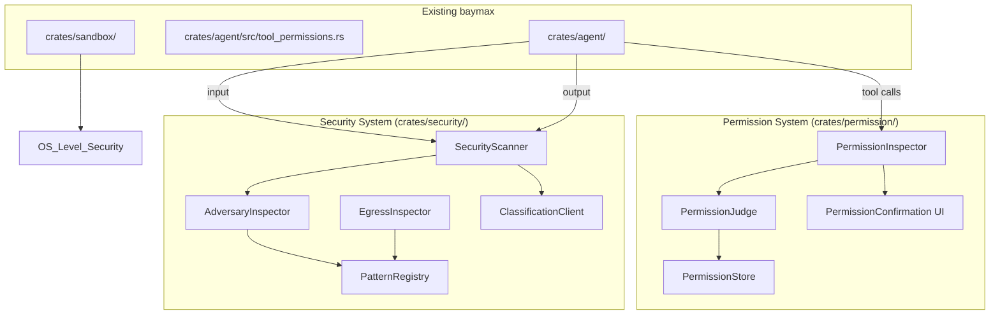

# Design Document: Security and Permissions

## 1. Overview

Migrate goose's security and permission systems into baymax's existing security infrastructure (`crates/sandbox/`). The security system provides adversarial input inspection, egress data inspection, content classification, and pattern-based threat detection. The permission system provides user-in-the-loop confirmation, intelligent judging, and persistent permission storage.

### Key Architectural Decisions

- **Layer on top of `crates/sandbox/`**: Baymax already has sandbox primitives. The goose security system adds content-level inspection (not just OS-level sandboxing).
- **`crates/security/` new crate**: A dedicated crate for content security inspection, keeping it separate from the OS-level sandbox.
- **`crates/permission/` new crate**: Separates the permission confirmation UI and storage from the agent's tool permission logic (which partially exists in `crates/agent/src/tool_permissions.rs`).
- **Pluggable inspectors**: The security scanner supports registering multiple inspectors, making it extensible.

## 2. Architecture



## 3. Components and Interfaces

### Component: Security Scanner

```rust
pub struct SecurityScanner {
    inspectors: Vec<Box<dyn SecurityInspector>>,
}

#[async_trait]
pub trait SecurityInspector: Send + Sync {
    fn name(&self) -> &str;
    fn inspect_input(&self, content: &str, context: &InspectionContext) -> Result<InspectionResult>;
    fn inspect_output(&self, content: &str, context: &InspectionContext) -> Result<InspectionResult>;
}

pub struct InspectionResult {
    pub passed: bool,
    pub severity: Severity,
    pub findings: Vec<Finding>,
}
```

### Component: Adversary Inspector

```rust
pub struct AdversaryInspector {
    patterns: Vec<Pattern>,
    sensitivity: SensitivityLevel,
}

impl SecurityInspector for AdversaryInspector {
    // Checks for prompt injection, jailbreak attempts, indirect injection
}
```

### Component: Egress Inspector

```rust
pub struct EgressInspector {
    patterns: Vec<Pattern>,
}

impl SecurityInspector for EgressInspector {
    // Checks for API keys, secrets, PII in outgoing content
}
```

### Component: Permission System

```rust
pub struct PermissionInspector {
    judge: PermissionJudge,
    store: PermissionStore,
}

impl PermissionInspector {
    pub async fn check_tool_call(&self, tool_call: &ToolCall, cx: &App) -> Result<PermissionDecision>;
}

pub enum PermissionDecision {
    Allowed,
    Denied(String),
    NeedsConfirmation { reason: String, risk_level: RiskLevel },
}

pub struct PermissionStore {
    // Persisted to SQLite/db
    entries: HashMap<(String, String), StoredDecision>, // (tool, args_hash) -> decision
}
```

## 4. Data Models

```rust
pub struct Pattern {
    pub id: String,
    pub name: String,
    pub category: PatternCategory,
    pub pattern: String, // regex or other format
    pub severity: Severity,
    pub action: PatternAction,
}

pub enum PatternCategory {
    PromptInjection,
    SensitiveData,
    Pii,
    Credentials,
    HarmfulContent,
    Custom(String),
}

pub struct StoredDecision {
    pub tool_name: String,
    pub args_pattern: String, // glob or regex
    pub decision: DecisionType,
    pub created_at: DateTime<Utc>,
    pub expires_at: Option<DateTime<Utc>>,
}

pub enum DecisionType {
    AlwaysAllow,
    AlwaysDeny,
    AllowOnce,
    DenyOnce,
}
```

## 5. Correctness Properties

### Property 1: Input Security

_For any_ user input [containing known prompt injection patterns], AFTER adversary inspection, THE system SHALL block the input and notify the user.

**Validates: Requirement 1.2**

### Property 2: Output Security

_For any_ agent output [containing configured sensitive data patterns], AFTER egress inspection, THE system SHALL redact or block the output.

**Validates: Requirement 2.2**

### Property 3: Permission Consistency

_For any_ tool call [matching a stored "always allow" decision], THE system SHALL proceed without user confirmation.

**Validates: Requirement 9.2**

### Property 4: Never-Silent Failure

_For any_ blocked action [by security or permission systems], THE system SHALL inform the user with a reason.

**Validates: Requirements 1.2, 8.5**

## 6. Error Handling

| Error Scenario | Handling |
|---|---|
| Classification API unavailable | Fail-open (allow) or fail-closed (deny) based on configuration |
| Permission store corrupted | Reset to defaults, log warning |
| Pattern compilation error | Skip invalid pattern, warn during startup |
| Concurrent permission check | Queue/atomic operations on store |

## 7. Testing Strategy

- **Unit tests**: Each inspector with known-good and known-bad inputs
- **Pattern tests**: Pattern matching accuracy (no false positives for benign content)
- **Permission store tests**: Persistence, expiration, concurrent access
- **Integration tests**: Full security flow with mock agent
- **Penetration tests**: Prompt injection attempts at various levels

## References

- Source: `projects/goose/crates/goose/src/security/`
- Source: `projects/goose/crates/goose/src/permission/`
- Baymax: `crates/sandbox/`
- Baymax: `crates/agent/src/tool_permissions.rs`
