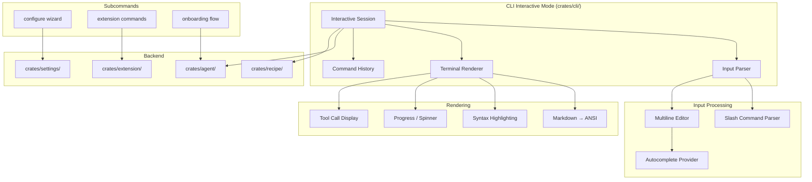

# Design Document: Text UI / Terminal UI (GPUI/CLI Equivalents)

## 1. Overview

Migrate goose's text-based terminal UI features into baymax's existing CLI (`crates/cli/`) and terminal infrastructure (`crates/terminal/`, `crates/terminal_view/`). Goose's React-based TUI becomes a new interactive CLI mode with rich terminal output — markdown rendering, configuration wizard, extension management, onboarding, and slash commands.

### Key Architectural Decisions

- **Interactive CLI mode**: A new `goose interactive` subcommand (or `goose tui`) that opens an interactive session in the terminal.
- **Terminal rendering via `crossterm` + `ratatui`**: Lightweight TUI rendering without requiring a full GPUI context. Baymax's GPUI is for the desktop app; a terminal UI should use standard terminal libraries.
- **CLI crate extension**: Add interactive mode to `crates/cli/` rather than creating a new crate. The CLI crate already handles subcommands.
- **Markdown via `crates/markdown/`**: Use baymax's existing markdown parser, adding ANSI terminal rendering on top.
- **Configuration wizard uses existing settings**: The wizard reads/writes the same settings files as the desktop UI and GPUI settings panels.

## 2. Architecture



## 3. Components and Interfaces

### Component: Interactive Session

```rust
pub struct InteractiveSession {
    conversation: Vec<Message>,
    current_input: String,
    input_history: Vec<String>,
    history_index: isize,
}

impl InteractiveSession {
    pub async fn start(&mut self, cx: &mut App) -> Result<()>;
    pub async fn process_input(&mut self, input: &str, cx: &mut App) -> Result<()>;
    pub fn render_conversation(&self) -> String;
    pub fn handle_slash_command(&mut self, cmd: &str, args: &str) -> Result<()>;
}
```

### Component: Terminal Renderer

```rust
pub struct TerminalRenderer {
    width: u16,
    height: u16,
}

impl TerminalRenderer {
    pub fn render_message(&self, msg: &Message) -> Vec<String>; // lines of output
    pub fn render_markdown(&self, md: &str) -> Vec<String>;
    pub fn render_code_block(&self, code: &str, language: &str) -> Vec<String>;
    pub fn render_spinner(&self, label: &str) -> String;
    pub fn render_tool_call(&self, tool: &ToolCall, state: ToolState) -> Vec<String>;
    pub fn clear(&self);
    pub fn set_status(&self, status: &str);
}
```

### Component: Configuration Wizard

```rust
pub struct ConfigWizard {
    steps: Vec<WizardStep>,
    current_step: usize,
    answers: HashMap<String, String>,
}

impl ConfigWizard {
    pub async fn run(&mut self) -> Result<()>;
    pub fn current_prompt(&self) -> &str;
    pub fn process_answer(&mut self, answer: &str) -> Result<()>;
    pub fn is_complete(&self) -> bool;
}

struct WizardStep {
    prompt: String,
    input_type: InputType,
    validator: Option<Box<dyn Fn(&str) -> Result<()>>>,
    default: Option<String>,
}

enum InputType {
    Text { secret: bool },
    Confirm,
    Select { options: Vec<String> },
    File { must_exist: bool },
}
```

### Component: Extension Commands (CLI)

```rust
pub fn cmd_ext_list(extensions: &ExtensionStore) -> Result<()>;
pub fn cmd_ext_add(path: &str) -> Result<()>;
pub fn cmd_ext_remove(name: &str) -> Result<()>;
pub fn cmd_ext_status(name: &str) -> Result<()>;
```

### Component: Onboarding Flow

```rust
pub struct CliOnboarding {
    steps: Vec<OnboardingStep>,
}

impl CliOnboarding {
    pub fn is_first_run() -> bool;
    pub async fn run(&mut self) -> Result<()>;
}

enum OnboardingStep {
    Welcome,
    ProviderSetup,
    FirstMessage,
    ExtensionIntro,
    Complete,
}
```

### Component: Slash Commands (CLI)

```rust
pub struct CliSlashCommands {
    commands: HashMap<String, CliSlashHandler>,
}

type CliSlashHandler = Box<dyn Fn(&str, &mut InteractiveSession) -> Result<()>>;

impl CliSlashCommands {
    pub fn default() -> Self;
    pub fn handle(&self, cmd: &str, args: &str, session: &mut InteractiveSession) -> Result<()>;
    pub fn help_text(&self) -> String;
}

// Built-in commands:
// /help        → Show available commands
// /recipe      → Run a recipe
// /skill       → Load a skill
// /clear       → Clear conversation
// /save        → Save session
// /load        → Load session
// /model       → Switch model
// /mode        → Change agent mode
// /exit        → Quit
```

## 4. Data Models

```rust
pub struct Message {
    pub role: Role,
    pub content: String,
    pub timestamp: DateTime<Utc>,
}

pub enum Role {
    User,
    Assistant,
    System,
    Tool,
}

pub enum ToolState {
    Running,
    Completed { result: String },
    Failed { error: String },
}
```

## 5. Correctness Properties

### Property 1: Markdown Fidelity

_For any_ markdown content [rendered in the terminal], ALL structural elements (headings, lists, code blocks, links, tables) SHALL be visually distinguishable.

**Validates: Requirement 4.1**

### Property 2: Configuration Persistence

_For any_ setting [changed via the configuration wizard], [after the wizard completes], THE setting SHALL be persisted to the same configuration files used by the desktop UI.

**Validates: Requirement 2.4**

### Property 3: Command History

_For any_ input [submitted in the interactive session], [when the user presses up-arrow], THE previous input SHALL be recalled.

**Validates: Requirement 1.2**

## 6. Error Handling

| Error Scenario | Handling |
|---|---|
| Terminal too narrow (< 80 cols) | Warn and recommend wider terminal |
| Unicode rendering issues | Fall back to ASCII alternatives |
| Provider config invalid in wizard | Re-prompt with error message |
| Extension load fails | Show error, do not crash session |
| Agent takes too long | Show progress indicator with cancel option |

## 7. Testing Strategy

- **Unit tests**: Markdown → ANSI rendering, slash command parsing
- **Integration tests**: Full interactive session with mock agent
- **Wizard tests**: All wizard paths (success, validation error, cancel)
- **Performance tests**: Rendering throughput for long conversations

## References

- Source: `goose/ui/text/` — React TUI (design reference)
- Baymax: `crates/cli/` — CLI framework
- Baymax: `crates/terminal/`, `crates/terminal_view/` — terminal emulator
- Baymax: `crates/markdown/` — markdown parsing
- Baymax: `crates/agent_ui/src/terminal_inline_assistant.rs` — terminal inline agent
