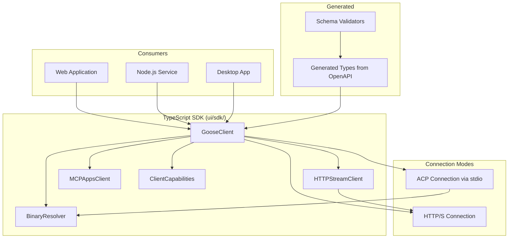

# Design Document: TypeScript SDK

## 1. Overview

Migrate goose's TypeScript SDK, which provides a programmatic client for interacting with the sim agent from TypeScript/JavaScript applications. The SDK enables embedding agent functionality into web apps, Node.js services, and other JavaScript environments.

### Key Architectural Decisions

- **Standalone npm package**: Published separately from the Rust codebase, likely from `ui/sdk/` within the monorepo.
- **Generated from OpenAPI**: The SDK is largely derived from the OpenAPI spec (see REST API server design), ensuring type safety and API alignment.
- **ACP-based for desktop, HTTP for remote**: The SDK supports both local ACP connections (to a local sim instance) and HTTP connections (to a remote sim-server).
- **Binary resolution for local mode**: When connecting locally, the SDK locates and manages the sim binary process.

## 2. Architecture



## 3. Components and Interfaces

### Component: GooseClient

```typescript
export class GooseClient {
  constructor(config: GooseClientConfig)

  // Session management
  async createSession(options?: CreateSessionOptions): Promise<Session>
  async listSessions(): Promise<Session[]>
  async getSession(id: string): Promise<Session>
  async deleteSession(id: string): Promise<void>

  // Messaging
  async sendMessage(sessionId: string, message: Message): Promise<Response>
  sendMessageStream(sessionId: string, message: Message): AsyncIterable<StreamEvent>

  // Agent status
  async getStatus(): Promise<AgentStatus>

  // Recipes
  async listRecipes(): Promise<RecipeManifest[]>
  async runRecipe(name: string, variables?: Record<string, string>): Promise<RecipeOutput>

  // Connection management
  async connect(): Promise<void>
  async disconnect(): Promise<void>
  onConnectionStateChange(callback: (state: ConnectionState) => void): void
}
```

### Component: HTTPStreamClient

```typescript
export class HttpStreamClient {
  constructor(baseUrl: string, options?: HttpStreamOptions)

  async *streamEvents(
    sessionId: string,
    options?: StreamOptions
  ): AsyncGenerator<StreamEvent>

  // Reconnection
  onReconnect(callback: () => void): void
  setMaxRetries(retries: number): void
}

export type StreamEvent =
  | { type: 'message'; message: Message }
  | { type: 'tool_call'; toolCall: ToolCallInfo }
  | { type: 'tool_result'; toolCallId: string; result: unknown }
  | { type: 'error'; error: string }
  | { type: 'done' }
```

### Component: MCPAppsClient

```typescript
export class MCPAppsClient {
  constructor(gooseClient: GooseClient)

  // Register MCP app tools
  async registerTool(tool: MCPTool): Promise<void>

  // Invoke app tools
  async callTool(name: string, args: unknown): Promise<unknown>

  // Lifecycle
  async start(): Promise<void>
  async stop(): Promise<void>
}
```

### Component: BinaryResolver

```typescript
export class BinaryResolver {
  constructor(options?: BinaryResolverOptions)

  async resolveBinary(): Promise<string>
  async launchBinary(args?: string[]): Promise<ChildProcess>
  async findInstalledVersion(): Promise<string | null>

  // Custom path support
  setCustomPath(path: string): void
}

export interface BinaryResolverOptions {
  customPath?: string
  version?: string
  allowDownload?: boolean
}
```

### Component: Client Capabilities

```typescript
export interface ClientCapabilities {
  version: string
  platform: 'web' | 'node' | 'electron'
  features: Feature[]
  streaming: boolean
  maxMessageSize: number
}

export type Feature =
  | 'streaming'
  | 'mcp_apps'
  | 'recipes'
  | 'scheduling'
  | 'dictation'
```

## 4. Data Models

```typescript
export interface GooseClientConfig {
  // Connection mode
  mode: 'http' | 'acp' | 'auto'

  // HTTP mode
  baseUrl?: string
  apiKey?: string

  // ACP mode
  binaryPath?: string

  // General
  timeout?: number
  maxRetries?: number
}

export interface Message {
  role: 'user' | 'assistant' | 'system' | 'tool'
  content: string | ContentBlock[]
  id?: string
  timestamp?: string
}

export interface Session {
  id: string
  title: string
  created_at: string
  updated_at: string
  message_count: number
  status: 'active' | 'archived'
}
```

## 5. Correctness Properties

### Property 1: Type Safety

_For any_ API response [received by the SDK], THE response SHALL be validated against the generated TypeScript types.

**Validates: Requirement 6.2**

### Property 2: Error Propagation

_For any_ failed API call, THE SDK SHALL throw a typed `GooseError` with the error code and message from the server.

**Validates: Requirement 1.5**

### Property 3: Binary Resolution

_For any_ platform [macOS, Linux, Windows], THE binary resolver SHALL find the correct binary for the current architecture.

**Validates: Requirement 5.1**

## 6. Error Handling

| Error Scenario | Handling |
|---|---|
| Server unavailable | Retry with exponential backoff, emit connection error |
| Invalid API key | Throw `AuthenticationError` |
| Stream disconnected | Auto-reconnect if enabled, emit reconnection events |
| Binary not found | Throw `BinaryNotFoundError` with install guidance |
| Request timeout | Throw `TimeoutError` |

## 7. Testing Strategy

- **Unit tests**: Client methods with mock HTTP/ACP transport
- **Integration tests**: Against a running sim-server instance
- **Binary resolver tests**: On each platform in CI
- **Type generation tests**: Generated types match the OpenAPI schema

## References

- Source: `projects/goose/ui/sdk/` — TypeScript SDK
- Source: `projects/goose/crates/goose-sdk/` — Rust SDK bindings
- Source: `projects/goose/crates/goose-sdk-types/` — SDK type definitions
- Sim: `crates/sim-server/` (design) — REST API server
