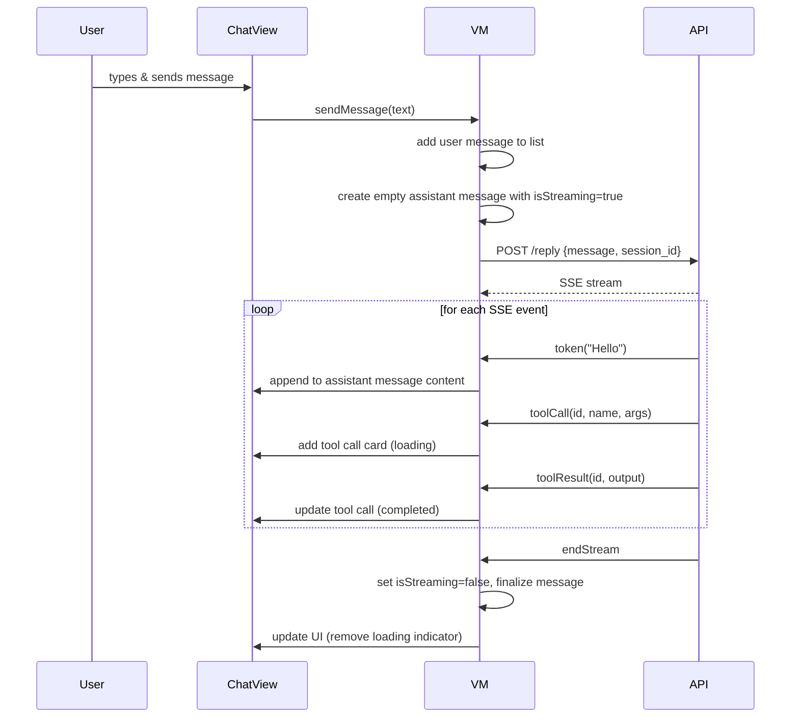

# Design: Agent Chat Interface

## 1. Overview

The chat interface follows a **message list + input bar** pattern common to messaging apps. Messages are rendered in a scrollable list with incremental updates from SSE streaming. The architecture separates rendering concerns (markdown, code blocks, tool calls) into dedicated view components driven by a ViewModel that manages message state.

### Key Decisions

| Decision | Choice | Rationale |
|----------|--------|-----------|
| Message storage | In-memory array (no persistence in v1) | Sessions are server-backed; reload on session open |
| Streaming approach | Append tokens to last assistant message | Simple, matches SSE event order |
| Markdown rendering | Platform-native renderers (AttributedString/Compose Markdown) | Avoid heavy dependencies; reuse existing `MarkdownText.kt` |
| Code highlighting | Syntax highlighter library (iOS: Splash, Android: existing `SyntaxHighlighter.kt`) | Performance on long code blocks |
| Tool call display | Dedicated card component with collapsible sections | Complex structured data needs dedicated layout |

## 2. Architecture

```mermaid
graph TB
    subgraph "UI Layer"
        ChatView[ChatView / ChatScreen]
        MessageList[MessageList]
        InputBar[InputBar]
        ToolCallCard[ToolCallCard]
    end

    subgraph "ViewModel Layer"
        VM[ChatViewModel / ChatViewState]
        MSG[MessageState<br/>- messages[]<br/>- isStreaming<br/>- connectionStatus]
    end

    subgraph "Rendering Components"
        MD[MarkdownRenderer]
        SH[SyntaxHighlighter]
        TCC[ToolCallCardView]
        CB[CodeBlockView]
    end

    subgraph "Service Layer"
        API[AgentAPIService]
        SSE[SSEStreamManager]
    end

    ChatView --> VM
    MessageList --> MSG
    VM --> API
    VM --> SSE
    MessageList --> MD
    MessageList --> SH
    MessageList --> TCC
    InputBar --> VM
    TCC --> CB
```

## 3. Components

### ChatViewModel

**Purpose:** Manages message state for the active session, handles send/receive/stream lifecycle.

**Interface:**
```
var messages: [Message]          // Ordered message list
var isStreaming: Bool            // True while SSE stream is active
var inputText: String            // Current input text
var streamingMessageId: String?  // ID of message being streamed to

func sendMessage(text: String)
func cancelStream()
func retryLastMessage()
func loadSession(id: String)
func loadMoreMessages()          // Paginate older messages
```

### Message Model

```
struct Message: Identifiable {
    id: String
    role: MessageRole        // user | assistant | tool
    content: String          // Markdown text (assistant) or plain text (user)
    timestamp: Date
    toolCalls: [ToolCall]?  // Only for assistant messages
    isStreaming: Bool        // True while this message is still receiving tokens
}
```

### ToolCall Model

```
struct ToolCall {
    id: String
    name: String
    arguments: [String: Any]  // JSON object
    status: ToolCallStatus    // running | completed | failed
    result: String?           // Formatted output
}
```

## 4. Data Flow: Message Streaming



## 5. Correctness Properties

### Property 1: Message Ordering
_For any_ sequence of SSE events within a stream, messages SHALL appear in the chat in the order they were sent/received.

### Property 2: Streaming Atomicity
_For any_ SSE stream, either an `endStream` event or an error event SHALL terminate the stream, and the message SHALL never be left in a streaming state permanently.

### Property 3: Tool Call Integrity
_For any_ `toolCall` event, the corresponding `toolResult` SHALL update the same tool call card (matched by ID), not create a new one.

## 6. Error Handling

| Error | Handling |
|-------|----------|
| Stream interrupted mid-response | Show "Reconnecting..." inline; auto-reconnect; truncate partial message if reconnect fails |
| Message send fails | Show inline error on user message with "Retry" button |
| Tool call fails (toolResult with error) | Show tool card in error state (red) with error message |
| Invalid markdown | Render as plain text (graceful degradation) |

## 7. Tasks

- [ ] 1. Implement Message and ToolCall data models
  - Define `Message`, `MessageRole`, `ToolCall`, `ToolCallStatus` models
  - Implement `Identifiable` conformance
  - _writes: iOS: `Models/Message.swift`; Android: `data/model/Message.kt`_

- [ ] 2. Implement ChatViewModel with message state management
  - Message list with append, update, replace operations
  - Streaming state tracking
  - Send message → SSE stream → append tokens
  - _writes: iOS: `ViewModels/ChatViewModel.swift`; Android: `ui/screens/ChatViewModel.kt` (extend)_

- [ ] 3. Implement markdown rendering component
  - Render bold, italic, lists, links, headings, code blocks, blockquotes
  - Platform-native renderers (iOS: `AttributedString` + markdown init; Android: Compose Markdown)
  - _writes: iOS: `Components/MarkdownRenderer.swift`; Android: `ui/components/MarkdownText.kt` (extend)_

- [ ] 4. Implement syntax highlighting for code blocks
  - Language detection from fence info string
  - Token-based colorization
  - Copy button on each code block
  - _writes: iOS: `Components/CodeBlockView.swift`; Android: `ui/components/SyntaxHighlighter.kt` (extend)_

- [ ] 5. Implement ToolCallCard component
  - Tool name header, collapsible arguments, status indicator
  - Loading, completed, failed states
  - _writes: iOS: `Components/ToolCallCard.swift`; Android: `ui/components/ToolCallCard.kt` (extend)_

- [ ] 6. Implement input bar with slash commands
  - Auto-expanding text field
  - Attachment and microphone buttons
  - Slash command autocomplete (type `/` → show filtered list)
  - Send button
  - _writes: iOS: `Components/ChatInputBar.swift`; Android: `ui/components/ChatInputView.kt` (extend)_

- [ ] 7. Implement message actions (context menu)
  - Long-press → context menu: Copy, Share, Edit (user only), Copy Response (assistant)
  - Copy code block button
  - _writes: iOS: `Components/MessageContextMenu.swift`; Android: `ui/components/MessageActions.kt`_

- [ ] 8. Wire streaming to ChatView
  - Connect ChatViewModel → SSEStreamManager
  - Implement token-by-token rendering
  - Handle stream interruption and reconnection
  - _writes: iOS: `ChatView.swift` (modify); Android: `ui/screens/ChatScreen.kt` (modify)_
