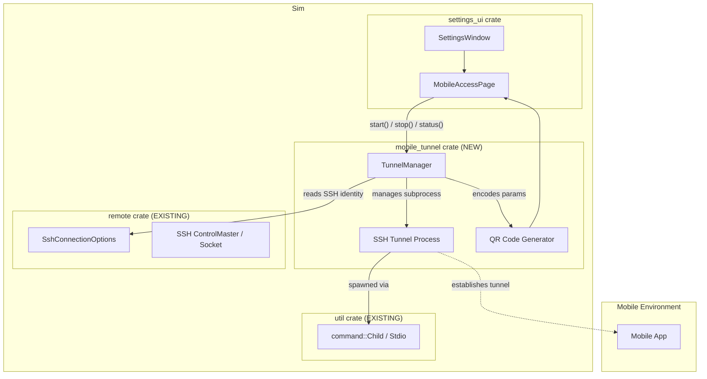
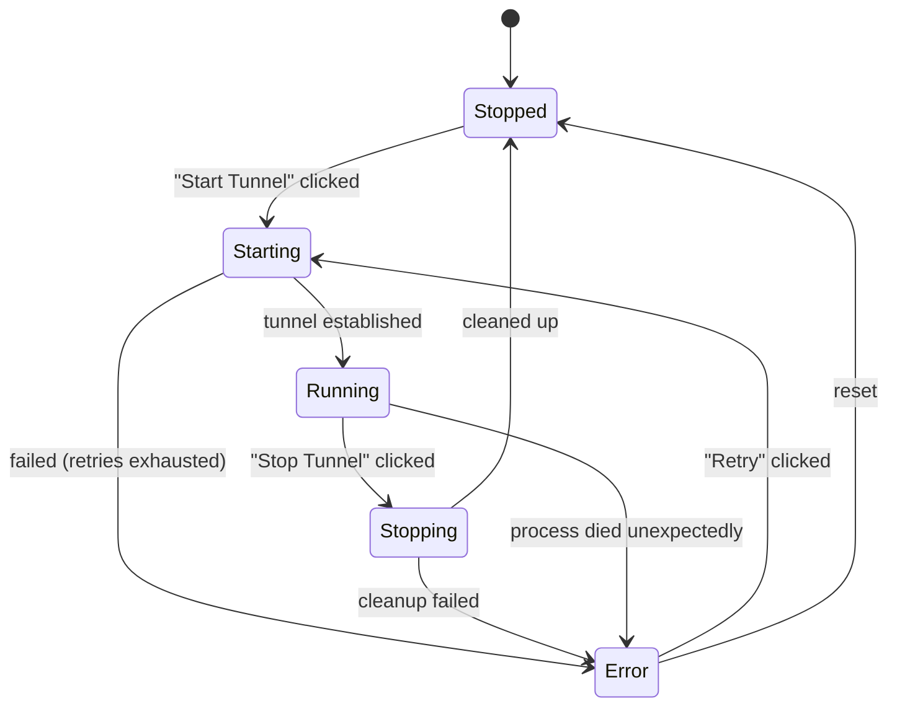

# Design Document: Mobile Access via Secure Tunneling

## 1. Overview

### Problem

Sim users who work on remote machines can use the desktop client via the existing SSH remote server infrastructure, but there is no way for the **Sim mobile app** to securely connect to those remote environments. Users need a way to start a secure tunnel and obtain connection details (via QR code) that the mobile app can scan.

### Solution

**Migrate** the tunnel management logic (currently in the `goose-server` crate's `/tunnel/start`, `/tunnel/stop`, `/tunnel/status` endpoints) into Sim as a native module, and add a **Mobile Access** settings page that interacts with this module directly.

This means:
- No external HTTP dependency on goose-server for tunnel management
- The tunnel manager is a first-class Sim component, callable via direct programmatic API
- The settings panel lives in `settings_ui` (following existing patterns)
- QR code generation and rendering is done natively

### Key Architectural Decisions

| Decision | Choice | Rationale |
|----------|--------|-----------|
| **Where to host the tunnel manager** | A new `mobile_tunnel` crate (or reuse the existing `remote` crate), exposing a `TunnelManager` struct/entity | The tunnel logic is a distinct concern from SSH connections; a dedicated crate keeps it clean and testable. Alternatively, if the logic is small, it can live in a module within `remote`. |
| **How the UI communicates with the tunnel manager** | Direct method calls on a `TunnelManager` entity (no HTTP), with state updates via `cx.notify()` and events | No serialization overhead, no server process needed, consistent with GPUI patterns. |
| **QR code rendering** | Add `qrcode` crate as a workspace dependency; encode connection params as a QR code in memory, render via GPUI's `img` element | The `qrcode` crate is pure Rust, lightweight, and integrates with the `image` crate that Sim already uses. |
| **Tunnel mechanism** | SSH reverse tunnel (using Sim's existing SSH infrastructure) or a relay-based tunnel, matching what goose-server currently does | Reuses existing battle-tested SSH code. The exact mechanism is ported from goose-server's implementation. |
| **Tunnel config persistence** | Store goose-server URL and last-used settings in Sim's `settings.json` user settings | Follows the existing patterns for user settings persistence. |
| **Subprocess management** | Use `util::command` for any subprocess lifecycle (same pattern as SSH kernel and remote server) | Consistent with existing Sim patterns for managing external processes. |

### Dependencies

- **Add**: `qrcode` crate (workspace dependency, pure Rust QR code generation)
- **New crate (or module)**: `mobile_tunnel` - the tunnel manager module ported from goose-server
- **Existing**: `remote` (SSH connection infrastructure), `util::command`, `http_client`, `image`, `serde`, `serde_json`, `gpui`, `futures`

---

## 2. Architecture

### Component Diagram



### Data Flow

1. **User opens Mobile Access settings page** → `SettingsWindow` renders the page via `render_mobile_access_setup_page()`. The page binds to a shared `TunnelManager` instance (stored as a global or on the `App`). It queries `tunnel_manager.status()` to display the current state.

2. **User clicks "Start Tunnel"** → The page calls `tunnel_manager.start(ssh_hint)`. The `TunnelManager`:
   - Spawns an SSH tunnel subprocess (or uses `ControlMaster` for an existing connection)
   - Waits for the tunnel to establish (with retries — matching existing SSH kernel patterns)
   - Generates connection parameters (endpoint URL, auth token)
   - Returns `TunnelInfo` back to the page
   - The page renders the QR code

3. **User clicks "Stop Tunnel"** → The page calls `tunnel_manager.stop()`. The `TunnelManager` kills the subprocess and cleans up ports.

4. **Error** → The `TunnelManager` returns an error, which the page displays inline.

---

## 3. Components and Interfaces

### 3.1 TunnelManager (the ported goose-server logic)

**Purpose**: Manages the lifecycle of a secure tunnel — starting, stopping, and monitoring — by reusing Sim's existing SSH remote infrastructure. This is the core logic migrated from `goose-server`'s `/tunnel/*` endpoints.

**Location**: A new crate `crates/mobile_tunnel/src/lib.rs` (or `crates/remote/src/tunnel.rs` if folded into the remote crate)

**Responsibilities**:
- Start a secure SSH tunnel to expose the local workspace for mobile app access
- **Reuse the existing ControlMaster socket** when an `SshRemoteConnection` is active — call `build_forward_ports_command()` to create a forwarded-port session without re-authentication
- When no SSH remote connection is active, fall back to a standalone SSH subprocess with user-provided `SshConnectionOptions` and `port_forwards`
- Stop the tunnel and clean up resources (kill only the forward session, not the ControlMaster)
- Provide current tunnel status
- Generate connection parameters (endpoint URL, optional auth token)
- Clean up orphaned tunnels on startup

**Interface**:

```rust
pub struct TunnelInfo {
    pub endpoint_url: String,
    pub auth_token: Option<String>,
    pub local_port: u16,
}

#[derive(Debug, Clone, PartialEq)]
pub enum TunnelStatus {
    Stopped,
    Starting,
    Running(TunnelInfo),
    Stopping,
    Error { message: SharedString },
}

pub struct TunnelManager {
    status: TunnelStatus,
    ssh_connection: Option<SshConnectionRef>,
    child_process: Option<util::command::Child>,
}

/// A handle to either an active `SshRemoteConnection` (via its ControlMaster socket)
/// or standalone `SshConnectionOptions` for direct SSH.
enum SshConnectionRef {
    /// Reuse an existing ControlMaster connection — no new auth needed.
    /// `build_forward_ports_command()` is called on the `SshRemoteConnection`.
    ControlMaster(WeakEntity<RemoteClient>),
    /// Standalone SSH options when no remote connection is active.
    Standalone(SshConnectionOptions),
}

impl TunnelManager {
    /// Create a new TunnelManager.
    /// If an active `RemoteClient` is available, store a weak reference to it
    /// so the tunnel can reuse its ControlMaster socket.
    pub fn new(ssh_connection: Option<SshConnectionRef>) -> Self;

    /// Start the tunnel. Returns once the tunnel is established or fails.
    /// - If `SshConnectionRef::ControlMaster`: calls `build_forward_ports_command()`
    ///   on the existing connection to create a forwarded-port SSH session.
    /// - If `SshConnectionRef::Standalone`: spawns a new SSH subprocess with
    ///   `SshConnectionOptions` + `port_forwards`.
    pub async fn start(&mut self, cx: &mut AsyncApp) -> Result<TunnelInfo>;

    /// Stop the tunnel and clean up.
    /// Kills the forward-session subprocess but does NOT kill the ControlMaster.
    pub async fn stop(&mut self, cx: &mut AsyncApp) -> Result<()>;

    /// Return the current tunnel status without side effects.
    pub fn status(&self) -> &TunnelStatus;
}
```

**Porting Notes** (from goose-server):
- The `/tunnel/start` endpoint's SSH setup logic becomes `TunnelManager::start()`
- The `/tunnel/stop` endpoint's cleanup logic becomes `TunnelManager::stop()`
- The `/tunnel/status` endpoint's query logic becomes `TunnelManager::status()`
- Any retry logic or connection health checks are preserved
- Goose-server-specific HTTP framing is replaced with direct method calls

### 3.2 Mobile Access Page (Render Function)

**Purpose**: Renders the Mobile Access settings page content.

**Location**: `crates/settings_ui/src/pages/mobile_access_setup.rs`

**Interface**:

```rust
pub(crate) fn render_mobile_access_setup_page(
    settings_window: &SettingsWindow,
    scroll_handle: &ScrollHandle,
    window: &mut Window,
    cx: &mut Context<SettingsWindow>,
) -> AnyElement
```

**Layout**:

```
┌──────────────────────────────────────────┐
│  Section: Mobile Access                   │
│                                           │
│  "Configure secure tunnel to expose your  │
│   workspace to the Sim mobile app."    │
│                                           │
│  Status: ● Running at 127.0.0.1:9999     │
│          ○ Stopped                        │
│          ⚠ Error: connection refused      │
│                                           │
│  SSH Host (optional): [dev.example.com]   │
│                                           │
│  ┌──────────────────────────────────────┐ │
│  │  ┌──────────┐  [Start Tunnel]        │ │
│  │  │ QR Code  │  [Stop Tunnel]         │ │
│  │  │ (200x200)│                        │ │
│  │  └──────────┘                        │ │
│  │                                      │ │
│  │  "Open the Sim mobile app,        │ │
│  │   tap 'Add Connection', and          │ │
│  │   scan this QR code."                │ │
│  └──────────────────────────────────────┘ │
└──────────────────────────────────────────┘
```

**State-driven rendering**:

| State | Start Button | Stop Button | QR Code | Status Indicator |
|-------|-------------|-------------|---------|-----------------|
| Stopped | Enabled | Hidden | Hidden | "Stopped" (gray) |
| Starting | Disabled/Spinner | Hidden | Hidden | "Starting..." (animated) |
| Running | Hidden | Enabled | Visible | "Running at {url}" (green) |
| Stopping | Hidden | Disabled/Spinner | Hidden | "Stopping..." (animated) |
| Error | Enabled ("Retry") | Hidden | Hidden | Error message (red banner) |

### 3.3 QR Code Generator

**Purpose**: Generates a QR code image from a connection string.

**Location**: `crates/mobile_tunnel/src/qr_code.rs` (or inline in the settings page)

**Approach**:
1. Depend on the `qrcode` crate (add to workspace `Cargo.toml`)
2. Encode the connection string as a QR code using `qrcode::QrCode::new(data)`
3. Render as an `image::GrayImage` (black/white bitmap)
4. Wrap in a GPUI-compatible `img` element

```rust
use image::GrayImage;

fn generate_qr_code_png(connection_string: &str) -> Result<Vec<u8>> {
    let code = qrcode::QrCode::new(connection_string)?;
    let image = code.render::<image::Luma<u8>>()
        .min_dimensions(200, 200)
        .build();
    let mut buf = Vec::new();
    image.write_to(&mut std::io::Cursor::new(&mut buf), image::ImageFormat::Png)?;
    Ok(buf)
}
```

### 3.4 Settings Page Registration

**Location**: `crates/settings_ui/src/page_data.rs`

Add a new "Remote Development" section (or add to an existing page like "Network" or "Server"):

```rust
fn network_page() -> SettingsPage {
    fn network_section() -> [SettingsPageItem; 3] { /* existing */ }
    fn remote_development_section() -> [SettingsPageItem; 1] {
        [SettingsPageItem::SubPageLink(SubPageLink {
            title: "Mobile Access".into(),
            description: Some("Configure secure tunnel for Sim mobile app connection.".into()),
            json_path: Some("mobile_access"),
            in_json: true,
            files: USER,
            render: render_mobile_access_setup_page,
        })]
    }

    SettingsPage {
        title: "Network",
        items: concat_sections![network_section(), remote_development_section()],
    }
}
```

### 3.5 Settings Persistence

**Location**: `crates/settings_content` + `crates/settings_ui/src/page_data.rs`

```rust
// In Sim settings content (auto-generated or manual):
#[derive(Deserialize, Serialize, Default)]
struct MobileAccessSettings {
    /// The SSH host to use for tunneling (optional — auto-discovered if empty)
    ssh_host: Option<String>,
    /// The SSH port
    ssh_port: Option<u16>,
}
```

---

## 4. Data Models

### 4.1 Tunnel State

```rust
#[derive(Debug, Clone, PartialEq)]
pub enum TunnelStatus {
    Stopped,
    Starting,
    Running(TunnelInfo),
    Stopping,
    Error { message: SharedString },
}

#[derive(Debug, Clone, PartialEq)]
pub struct TunnelInfo {
    /// The local address where the tunnel is listening
    pub endpoint_url: String,
    /// An optional authentication token for the mobile app
    pub auth_token: Option<String>,
    /// The local port number
    pub local_port: u16,
}
```

### 4.2 Persisted Settings

```json
{
  "mobile_access": {
    "ssh_host": "dev.example.com",
    "ssh_port": 22
  }
}
```

### 4.3 Connection String (QR Code Payload)

The QR code encodes a URL-like string that the mobile app can parse:

```
sim-tunnel://127.0.0.1:{port}?token={auth_token}&host={ssh_host}
```

### 4.4 State Transitions



---

## 5. Correctness Properties

### Property 1: State Machine Integrity

_For any_ `TunnelManager` in state `Starting` or `Stopping`, the system SHALL ignore concurrent start/stop calls (the button SHALL be disabled).

**Validates: Requirement 2.5, 2.6**

### Property 2: QR Code Only When Running

_For any_ render of the Mobile Access page, the QR code SHALL be visible ONLY when `TunnelStatus::Running` is active, and SHALL be hidden during `Stopped`, `Starting`, `Stopping`, or `Error` states.

**Validates: Requirement 3.1, 3.4**

### Property 3: Error Visibility

_For any_ failure in tunnel start or stop, the system SHALL display a user-visible message on the Mobile Access page describing the failure.

**Validates: Requirement 2.7, 2.8**

### Property 4: Tunnel Persists After Panel Close

_For any_ user action that closes the Settings window while the tunnel is running, the tunnel SHALL continue running.

**Validates: Requirement 5.3**

### Property 5: QR Code Regeneration

_For any_ tunnel restart that produces new connection parameters, the QR code SHALL be regenerated to encode the new parameters.

**Validates: Requirement 3.3**

### Property 6: SSH Integration Graceful Degradation

_For any_ state where no active SSH remote connection exists, the system SHALL still allow the user to manually configure the tunnel host and start a tunnel.

**Validates: Requirement 4.1, 4.2**

### Property 7: Subprocess Cleanup

_For any_ `stop()` call or unexpected `TunnelManager` drop, the spawned tunnel subprocess SHALL be killed and its resources released.

**Validates: Requirement 5.1, 5.2**

---

## 6. Error Handling

### Failure Scenarios

| Scenario | UX Treatment |
|----------|-------------|
| SSH connection refused / host unreachable | Display error banner: "Unable to connect to {host}:{port}. Check that the remote host is running and accessible." |
| Tunnel process exits unexpectedly | Detect via subprocess monitoring, transition to `Error` state with message: "Tunnel process exited unexpectedly (exit code {code})." |
| Port already in use | Retry with a different local port; if all ports exhausted, show: "Failed to allocate a local port for the tunnel." |
| SSH authentication failure | Show: "SSH authentication failed. Check your SSH credentials." |
| Invalid SSH host format | Validate input before attempting connection; show inline validation error. |

### Concurrency

- Start and stop operations are sequential — a start request during `Starting` is ignored
- The `TunnelManager` uses an internal `state` field protected against concurrent mutations (single-threaded GPUI model already provides this)

### Cleanup

- `TunnelManager`'s `Drop` implementation kills the tunnel subprocess if still running
- On Sim startup, any leftover tunnel processes from a previous session are detected via a PID file or port scan and cleaned up

---

## 7. Testing Strategy

### Unit Tests

| Test | Coverage |
|------|----------|
| `TunnelManager` state transitions | All valid and invalid transitions |
| QR code generation | Connection string is correctly encoded, output is valid PNG |
| Settings serialization/deserialization | `MobileAccessSettings` round-trips correctly |
| Process monitoring | Simulated subprocess exits trigger correct state changes |

### Integration Tests

| Test | Coverage |
|------|----------|
| Settings page renders in all states | Visual rendering of Stopped, Starting, Running, Error states |
| Start/Stop button states | Buttons correctly enabled/disabled per state |
| QR code appears/disappears | QR code visible only when Running |

### Mock Strategy

- `MockTunnelManager` implementing the same interface as `TunnelManager`, returning pre-configured results
- Fake SSH subprocess that simulates tunnel establishment and failures
- Use GPUI's `TestAppContext` for rendering tests (following existing `settings_ui` test patterns)

---

## 8. Migration Plan (goose-server → Sim)

| Step | What | Description |
|------|------|-------------|
| 1 | Port SSH tunnel logic | Extract the core SSH tunnel creation, retry, and monitoring logic from `goose-server`'s `/tunnel/start` handler into `TunnelManager::start()` |
| 2 | Port cleanup logic | Port the `/tunnel/stop` handler's cleanup code into `TunnelManager::stop()` |
| 3 | Port status query | Port the `/tunnel/status` handler into `TunnelManager::status()` |
| 4 | Adapt to GPUI | Replace HTTP request/response framing with direct method calls and async spawning via `cx.background_spawn()` |
| 5 | Add QR code generation | Implement QR code encoding using the `qrcode` crate |
| 6 | Build settings page | Implement the Mobile Access settings page in `settings_ui` |
| 7 | Wire up persistence | Add settings fields and wire them into the page |
