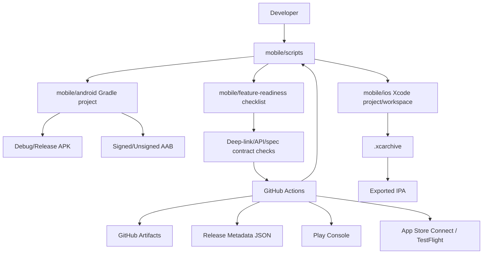

# Design Document: Mobile Build and Publish

## 1. Overview

The mobile build and publish foundation should make Android and iOS builds reproducible from the Baymax repository root, while keeping signing and external publishing optional and explicit. The design uses checked-in platform build scripts as the stable interface, with root-level GitHub Actions workflows calling those scripts for CI validation and release artifacts.

The main constraints are:

- Android already has a Gradle project under `mobile/android`.
- iOS has Swift sources and deployment notes under `mobile/ios`, but the repository must include `xcodebuild` project metadata before reliable archive/publish workflows can pass.
- Existing mobile workflows under `mobile/.github` are not active from the root repository workflow directory and should be treated as source material, not production workflows.
- Published mobile builds must validate the implemented feature surface from the mobile specs, including but not limited to remote connection/tunneling compatibility.

### Key Architectural Decisions

| Decision | Choice | Rationale |
|---|---|---|
| Build entry points | Add scripts under `mobile/scripts/` | Local developers and CI run the same commands, which reduces workflow-only behavior. |
| Workflow location | Add active workflows under `.github/workflows/` | GitHub only runs workflows from the root workflow directory for this repository. |
| Android artifact | Build signed AAB for publishing, and a debug-signed APK for direct GitHub downloads in artifact-only mode | Play Console expects AAB; direct APK downloads need an installable artifact before release signing secrets exist. |
| iOS artifact | Build an Xcode archive and export IPA | TestFlight/App Store Connect upload flows require an archive/export path. |
| Signing | Read signing material from environment variables and CI secrets | Avoids storing secrets in the repository and supports local opt-in signing. |
| Publishing | Support artifact-only mode by default, explicit external upload mode | Release owners can validate artifacts without requiring store credentials. |
| Feature readiness | Store a machine-readable checklist in the repo and validate automatable items | This gives release builds a clear definition of what is expected to work. |

## 2. Architecture



### Data Flow

1. A developer or workflow invokes a script under `mobile/scripts/`.
2. The script validates required toolchain and environment inputs for the requested action.
3. Platform build commands run from the correct mobile subdirectory.
4. Tests and readiness checks run before release artifact publication.
5. Build artifacts are copied to a predictable output directory under `mobile/build/`.
6. A metadata JSON file records platform, channel, version, build number, commit SHA, artifact paths, and publish status.
7. GitHub Actions uploads artifacts and metadata. If publishing is enabled, the workflow uploads to Play Console or App Store Connect.

## 3. Components and Interfaces

### 3.1 Mobile Build Scripts

**Purpose**: Provide stable local and CI entry points for mobile build, test, archive, and publish preparation.

**Location**: `mobile/scripts/`

**Responsibilities**:

- Run platform commands from the correct directory.
- Validate required tools before invoking Gradle or Xcode.
- Validate signing environment variables for signed builds.
- Normalize artifact output paths.
- Generate release metadata.

**Interface**:

```text
mobile/scripts/android-build.sh --variant debug|release --signed true|false --artifact apk|aab|both
mobile/scripts/android-test.sh
mobile/scripts/ios-build.sh --configuration Debug|Release
mobile/scripts/ios-archive.sh --signed true|false --export true|false
mobile/scripts/mobile-readiness-check.sh --platform android|ios|all
mobile/scripts/write-release-metadata.sh --platform <platform> --channel <channel> --version <version> --build <build>
```

Scripts should exit non-zero with a concise error when required inputs are missing. They should not print secret values.

### 3.2 Android Build Configuration

**Purpose**: Make the Android app produce reproducible debug and release artifacts.

**Location**: `mobile/android/app/build.gradle.kts`, `mobile/android/gradle.properties`, `mobile/scripts/android-*`

**Responsibilities**:

- Read `versionName` and `versionCode` from Gradle properties or environment-provided CI inputs.
- Configure release signing only when signing material is present.
- Produce AAB for Play Console upload.
- Preserve debug APK generation for local development.
- Run unit tests before release artifact upload.

**Signing Inputs**:

| Variable | Meaning |
|---|---|
| `ANDROID_KEYSTORE_BASE64` | Base64-encoded release keystore |
| `ANDROID_KEYSTORE_PASSWORD` | Keystore password |
| `ANDROID_KEY_ALIAS` | Signing key alias |
| `ANDROID_KEY_PASSWORD` | Signing key password |

### 3.3 iOS Project and Archive Configuration

**Purpose**: Make the iOS app buildable and archivable from checked-in project metadata.

**Location**: `mobile/ios/`, `mobile/scripts/ios-*`

**Responsibilities**:

- Add or restore an Xcode project/workspace that includes the Swift sources in `mobile/ios/Baymax`.
- Define bundle identifier, marketing version, and build number in project settings.
- Support local simulator/device compile validation.
- Support signed archive and IPA export when signing material is available.
- Fail early when project metadata or signing material is missing.

**Signing Inputs**:

| Variable | Meaning |
|---|---|
| `IOS_BUNDLE_IDENTIFIER` | Bundle identifier for the app |
| `IOS_TEAM_ID` | Apple Developer Team ID |
| `IOS_SIGNING_CERTIFICATE_BASE64` | Base64-encoded signing certificate |
| `IOS_SIGNING_CERTIFICATE_PASSWORD` | Certificate password |
| `IOS_PROVISIONING_PROFILE_BASE64` | Base64-encoded provisioning profile |
| `APP_STORE_CONNECT_API_KEY_ID` | App Store Connect key ID |
| `APP_STORE_CONNECT_API_ISSUER_ID` | App Store Connect issuer ID |
| `APP_STORE_CONNECT_API_KEY_BASE64` | Base64-encoded private key |

### 3.4 GitHub Actions Workflows

**Purpose**: Provide active root-level CI and release workflows for mobile apps.

**Location**: `.github/workflows/`

**Workflows**:

| Workflow | Trigger | Responsibility |
|---|---|---|
| `mobile_android_ci.yml` | PR/push path filter for `mobile/android/**`, `mobile/scripts/**`, relevant specs | Run Android tests and debug build. |
| `mobile_ios_ci.yml` | PR/push path filter for `mobile/ios/**`, `mobile/scripts/**`, relevant specs | Run iOS compile validation once project metadata exists; fail with clear setup blocker before then. |
| `mobile_release.yml` | Manual dispatch | Build Android, iOS, or both; upload artifacts; optionally publish externally. Android artifact-only runs also upload an installable APK for direct GitHub download. |

**Release Inputs**:

```yaml
platform: android | ios | all
channel: artifact | play-internal | testflight
version: optional explicit marketing version
build_number: optional explicit build number
publish: false | true
```

### 3.5 Feature Readiness Checklist

**Purpose**: Define which mobile feature contracts must be validated before release artifacts are considered useful tester builds.

**Location**: `mobile/feature-readiness.yml`

**Responsibilities**:

- Trace validation items back to mobile specs.
- Mark validation mode as `automated` or `manual`.
- Scope each item to Android, iOS, or both.
- Include shared contracts such as QR/deep-link payloads and API models.
- Provide inputs for `mobile-readiness-check.sh`.

**Example Schema**:

```yaml
items:
  - id: connection-deeplink-contract
    title: Connection configuration deep-link contract
    specs:
      - .agents/specs/mobile/mobile-core-infrastructure/requirements.md
      - .agents/specs/mobile/mobile-access-secure-tunneling/requirements.md
    platforms: [android, ios]
    mode: automated
    checks:
      - android-manifest-scheme
      - ios-info-plist-scheme
      - qr-payload-parser-fixture
  - id: voice-input
    title: Voice input is present where supported
    specs:
      - .agents/specs/mobile/mobile-calls-voice/requirements.md
    platforms: [android, ios]
    mode: manual
    expected: "Tester can start voice input and see transcribed text or a clear permission error."
```

### 3.6 Release Metadata

**Purpose**: Make every release artifact traceable.

**Location**: `mobile/build/release-metadata/*.json`

**Fields**:

```json
{
  "platform": "android",
  "channel": "artifact",
  "version": "1.0.0",
  "build_number": "123",
  "commit_sha": "abc123",
  "artifacts": ["mobile/build/android/baymax-android-artifact-1.0.0-abc123.aab"],
  "published": false,
  "created_at": "2026-06-29T12:00:00Z"
}
```

## 4. Data Models

### Build Target

| Field | Type | Validation |
|---|---|---|
| `platform` | enum | `android`, `ios`, `all` |
| `channel` | enum | `artifact`, `play-internal`, `testflight` |
| `version` | string | Semantic-ish marketing version, no whitespace |
| `build_number` | integer string | Positive integer; monotonic for external publishing |
| `signed` | bool | Required for external publishing |
| `publish` | bool | Requires signed artifacts and publishing credentials |

### Feature Readiness Item

| Field | Type | Validation |
|---|---|---|
| `id` | string | Unique kebab-case |
| `title` | string | Non-empty |
| `specs` | list of paths | Each path exists |
| `platforms` | list | Contains `android`, `ios`, or both |
| `mode` | enum | `automated` or `manual` |
| `checks` | list | Required when mode is `automated` |
| `expected` | string | Required when mode is `manual` |

### Version Strategy

Default CI build numbers should use `GITHUB_RUN_NUMBER` for manual workflow dispatches. External publishing should also allow an explicit `build_number` input so release owners can recover from store-side version conflicts without changing source files.

Android `versionCode` and iOS `CURRENT_PROJECT_VERSION` use the same generated build number by default. Android `versionName` and iOS `MARKETING_VERSION` use the same supplied or default marketing version.

## 5. Correctness Properties

### Property 1: Android Release Artifact

_For any_ Android release build invocation from the documented command, if the command exits successfully, the system SHALL produce an Android release artifact under the documented output directory.

**Validates: Requirement 1.1**

### Property 2: Android Signing Gate

_For any_ Android signed release build, if required signing material is missing, the system SHALL fail before producing a falsely named signed artifact.

**Validates: Requirement 1.2, 1.3**

### Property 3: Android CI Test Gate

_For any_ Android release workflow run, the system SHALL run Android unit tests before publishing artifacts externally.

**Validates: Requirement 1.5**

### Property 4: iOS Project Metadata

_For any_ iOS archive invocation, if `xcodebuild` project or workspace metadata is missing, the system SHALL fail with an explicit setup blocker.

**Validates: Requirement 2.1, 2.2**

### Property 5: iOS Signing Gate

_For any_ iOS signed archive or export, if required signing material is missing, the system SHALL fail before attempting TestFlight upload.

**Validates: Requirement 2.3, 2.4**

### Property 6: Active Workflow Location

_For any_ mobile CI or release workflow required by this feature, the workflow SHALL live under `.github/workflows/` and SHALL run from repository-root paths.

**Validates: Requirement 3.1, 3.2, 3.5**

### Property 7: Artifact Metadata Traceability

_For any_ successful mobile release workflow run, the system SHALL write metadata containing platform, version, build number, commit SHA, and artifact names.

**Validates: Requirement 3.3, 5.1, 5.5**

### Property 8: Publish Credential Gate

_For any_ workflow run with external publishing enabled, if upload credentials are missing or invalid, the workflow SHALL fail without printing secret values.

**Validates: Requirement 4.1, 4.2, 4.3, 4.5**

### Property 9: Artifact-Only Mode

_For any_ mobile release workflow run with publishing disabled, the system SHALL build and upload GitHub artifacts without attempting external store upload.

**Validates: Requirement 4.4**

### Property 10: Android GitHub APK Download

_For any_ Android mobile release workflow run with publishing disabled, the system SHALL upload an installable APK artifact with an artifact name that includes Android, APK, version, build number, and commit SHA.

**Validates: Requirements 3.6, 5.5**

### Property 11: Version Validation

_For any_ explicit version or build number input, if the value is malformed, the system SHALL fail before applying it to Android or iOS project settings.

**Validates: Requirement 5.3**

### Property 12: Feature Readiness Traceability

_For any_ feature readiness checklist item, the system SHALL record platform scope, validation mode, expected behavior or automated checks, and at least one mobile spec path.

**Validates: Requirement 6.1, 6.5**

### Property 12: Shared Contract Agreement

_For any_ shared mobile contract validated by automated checks, if Android, iOS, and any producer fixtures disagree, the readiness validation SHALL fail.

**Validates: Requirement 6.3, 6.4, 6.6**

### Property 13: Developer Entry Point Coverage

_For any_ documented mobile build command, the command SHALL map to a checked-in script or platform command that can be run from the repository.

**Validates: Requirement 7.1, 7.3, 7.4**

## 6. Error Handling

| Error | Detection | Behavior |
|---|---|---|
| Missing Android SDK/JDK | `android-build.sh` checks tool availability and Gradle failure output | Exit non-zero with toolchain setup message. |
| Missing Android signing material | Script checks required environment variables for signed builds | Exit before Gradle signing with missing variable names only. |
| Invalid Android version code | Version validation script rejects non-positive integers | Exit before modifying Gradle properties or invoking release build. |
| Missing iOS project metadata | `ios-build.sh` checks for `.xcodeproj` or `.xcworkspace` | Exit with explicit setup blocker and point to the iOS project task. |
| Missing Xcode | `ios-build.sh` checks `xcodebuild` availability | Exit with Xcode requirement. |
| Missing iOS signing material | Archive script checks certificate/profile/API inputs for signed/export/upload modes | Exit before archive export or upload. |
| Store upload failure | Upload step returns non-zero | Preserve local artifact and metadata, mark publish status as failed in workflow summary where possible. |
| Readiness checklist references missing spec path | Readiness script validates paths | Fail validation and print invalid item IDs. |
| Manual-only readiness item | Readiness script detects `mode: manual` | Include in generated validation summary without failing automated release unless configured as required manual approval. |
| Secret leak risk | Scripts never echo secret values; workflows use masked secrets | Print variable names, not values. |

## 7. Testing Strategy

### Unit and Script Tests

- Test version/build-number validation with valid and invalid inputs.
- Test release metadata generation.
- Test readiness checklist parsing, required fields, missing spec paths, and duplicate IDs.
- Test QR/deep-link fixture checks for Android manifest and iOS Info.plist declarations.

### Platform Build Validation

- Android CI runs `mobile/scripts/android-test.sh` and debug build on PRs.
- Android release workflow runs tests before signed release build.
- iOS CI runs compile validation once project metadata exists; before that, it should fail with a clear known-blocker message when explicitly requested.
- iOS release workflow runs archive/export only when signing inputs are present.

### Workflow Validation

- Use workflow path filters so Android changes do not force iOS validation unless shared mobile scripts or specs change.
- Run artifact-only release dispatch before enabling external publishing.
- Verify uploaded artifact names include platform, channel, version, and commit SHA.

### Feature Readiness Validation

- Automated checks should start with stable static contracts:
  - Android manifest contains supported deep-link schemes.
  - iOS Info.plist contains supported deep-link schemes.
  - Android and iOS QR/deep-link parser fixtures accept the same payload shape.
  - Required API model fixtures decode on both platforms where tests exist.
- Manual readiness items should be generated into a validation summary that testers can use for real-device coverage.
