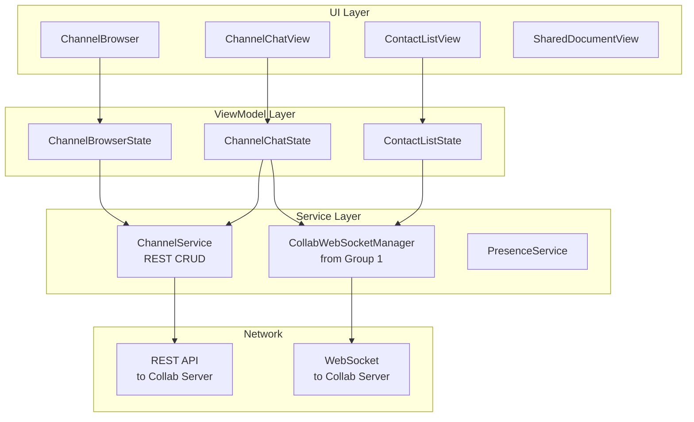

# Design: Collaboration Features

## 1. Overview

Collaboration features connect the mobile app to the Sim Collab Server via WebSocket. The architecture separates channel browsing, channel chat, contacts, and shared documents into distinct feature modules that share the collab WebSocket connection. The design prioritizes real-time updates via WebSocket events with REST fallback for initial data loading.

### Key Decisions

| Decision | Choice | Rationale |
|----------|--------|-----------|
| Real-time transport | WebSocket (via CollabWebSocketManager from Group 1) | Supports presence, push events, low latency |
| Initial data loading | REST API | Bulk data loads unsuitable for WebSocket |
| Channel state | In-memory, refreshed on app foreground | Server is source of truth |
| Document viewing | Read-only (mobile) | Complex editing is a desktop concern |

## 2. Architecture

## 3. Components

### ChannelBrowser

Displays the channel list in categorized sections (Favorites, Channels, DMs). Fetches on mount, updates on WebSocket events.

### ChannelChatView

Shows messages for the selected channel. Loads history on open, receives new messages in real-time via WebSocket.

### ContactListView

Shows contacts with presence indicators. Real-time presence updates via WebSocket.

## 4. Correctness Properties

### Property 1: Unread Count Consistency
_For any_ channel list state, the unread count SHALL decrement when the user views the channel.

### Property 2: Presence Freshness
_For any_ contact list displayed, presence indicators SHALL update within 2 seconds of a WebSocket presence event.

### Property 3: Real-Time Message Delivery
_For any_ channel the user has joined, new messages SHALL appear in the chat view within 1 second of the WebSocket event.

## 5. Tasks

- [ ] 1. Channel data models and ChannelService (REST CRUD)
- [ ] 2. ChannelBrowser UI with categorization
- [ ] 3. ChannelChatView with real-time message display
- [ ] 4. Contact list with presence indicators
- [ ] 5. Shared document viewer (read-only)
- [ ] 6. Project sharing notification and accept flow
- [ ] 7. Agent thread sharing (share to channel)
