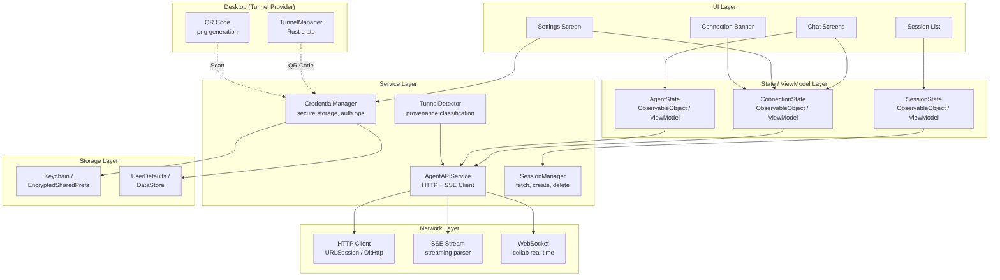
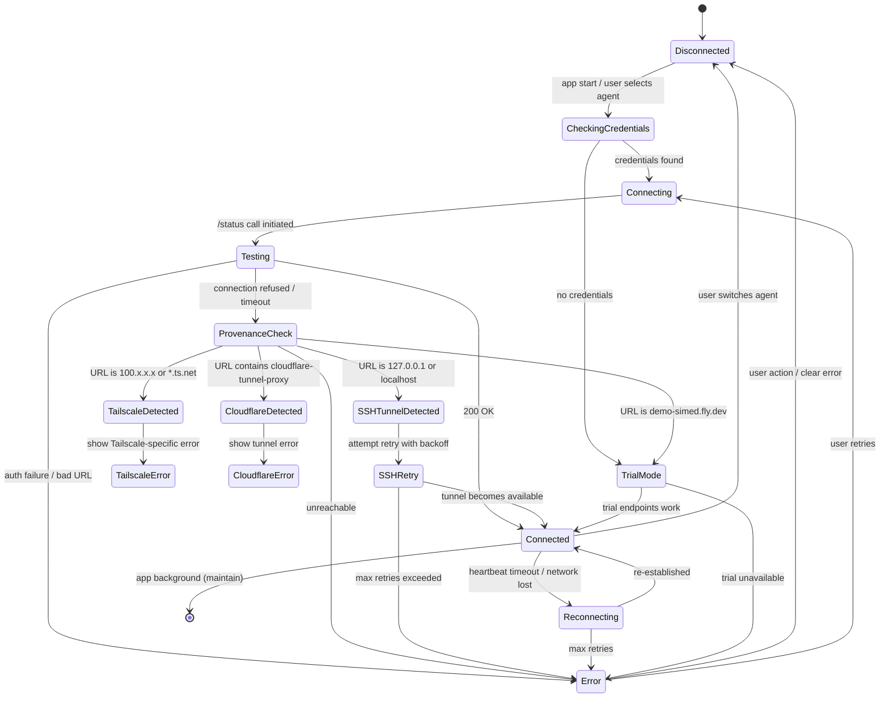
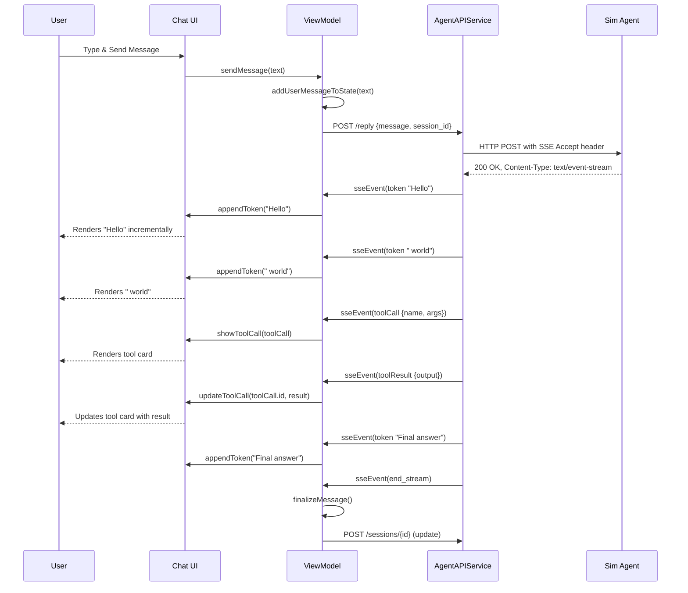
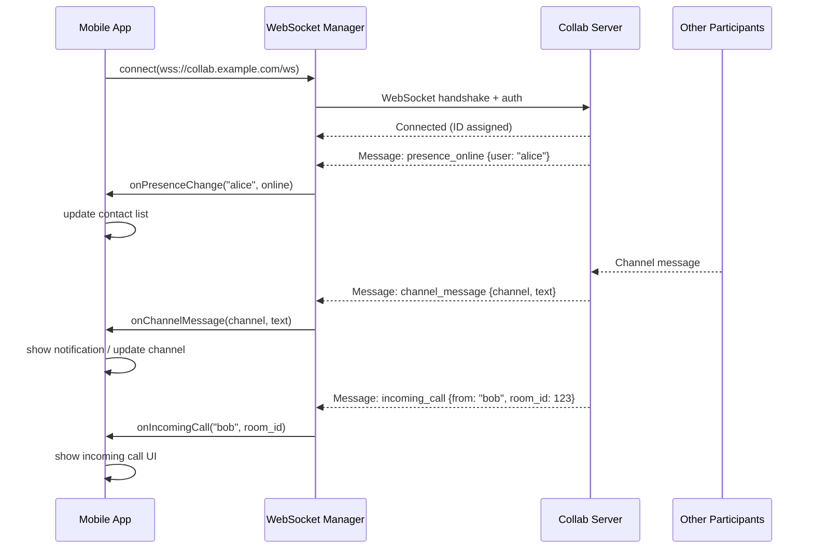

# Design: Core Infrastructure & Connectivity

## 1. Overview

### High-Level Approach

The core infrastructure layer provides a **unified connectivity foundation** that both iOS and Android clients build upon. While the platforms are fundamentally different (Swift/SwiftUI vs Kotlin/Jetpack Compose), they share:

1. **A common connection state machine** — same states, transitions, and invariants
2. **Identical URL/provenance detection algorithms** — same pattern matching for tunnel type
3. **Matching data models** — same entity shapes with platform-appropriate serialization
4. **Equivalent error taxonomy** — same error categories with platform-appropriate UI treatment
5. **SSE and WebSocket wire protocols** — same agent API endpoints and collab server protocols

The design is **layered**, separating concerns into UI state, business logic, networking, and storage.

### Key Architectural Decisions

| Decision | Choice | Rationale |
|----------|--------|-----------|
| **Architecture Pattern** | MVVM (Model-View-ViewModel) | Standard for both SwiftUI and Jetpack Compose; clean testability |
| **State Propagation** | Observable state objects | iOS: `@Published` + `ObservableObject`; Android: `StateFlow` in `ViewModel` |
| **Secure Storage** | Platform-native | iOS: Keychain via `react-native-keychain` pattern → native `Security` framework; Android: `EncryptedSharedPreferences` |
| **Connection Lifecycle** | Explicit state machine | Prevents invalid transitions; single source of truth for UI |
| **SSE Transport** | URLSession streaming / OkHttp streaming | Native HTTP streaming; no external SSE library needed |
| **Provenance Detection** | Declarative pattern matching | Pure function; testable without network; same algorithm on both platforms |
| **Retry Strategy** | Exponential backoff with jitter | Prevents thundering herd on reconnect; standard best practice |
| **Biometric Lock** | Platform-native APIs | iOS: `LocalAuthentication`; Android: `BiometricPrompt` |

### Technology Stack

| Layer | iOS | Android | Shared (Documented) |
|-------|-----|---------|---------------------|
| UI | SwiftUI | Jetpack Compose | — |
| State | `@Published` + `ObservableObject` | `StateFlow` + `ViewModel` | State machine definitions |
| Network | `URLSession` + async/await | OkHttp + coroutines | Wire protocol (SSE, REST) |
| Serialization | `Codable` | `kotlinx.serialization` | JSON schema |
| Secure Storage | Keychain (`Security` framework) | `EncryptedSharedPreferences` | Credential data model |
| Biometrics | `LocalAuthentication` | `BiometricManager` / `BiometricPrompt` | Lock/unlock protocol |

---

## 2. Architecture

### High-Level Component Diagram



### Data Flow: Connection Lifecycle



### Data Flow: Message Send & Response Streaming



### Data Flow: Collab WebSocket



---

## 3. Components and Interfaces

### 3.1 Connection State Machine

**Purpose:** Single source of truth for the app's connection status, driving UI state (banners, enabled/disabled controls) and preventing illegal transitions.

**State Enum:**

```
enum ConnectionState {
    disconnected
    checkingCredentials
    connecting
    testing
    connected(provenance: Provenance, serverVersion: String)
    reconnecting(attempt: Int, maxAttempts: Int)
    tailscaleError(url: String)
    tunnelError(tunnelType: TunnelType, url: String)
    error(reason: ConnectionError, recoverable: Bool)
    trialMode
}
```

**Provenance Enum:**

```
enum Provenance {
    directLan
    tailscale
    cloudflare
    sshTunnel
    trialMode
}
```

**TunnelType Enum:**

```
enum TunnelType {
    none
    tailscale
    cloudflare
    ssh
}
```

**Illegal Transitions (must be prevented):**
- `disconnected → connected` (must go through `connecting → testing`)
- `connecting → error` without recording the cause
- `error → connected` without going through `reconnecting` or `connecting`

### 3.2 TunnelDetector

**Purpose:** Pure function that classifies a server URL into a `TunnelType` and `Provenance`. Must be identical on both platforms.

**Interface:**

```
// Input: server URL string
// Output: detected tunnel type
fun detectTunnelType(url: String): TunnelType

// Input: server URL string
// Output: connection provenance
fun detectProvenance(url: String): Provenance

// Input: server URL string
// Output: true if URL is on a private network
fun isPrivateNetworkURL(url: String): Bool

// Input: server URL string
// Output: user-facing error message for tunnel failure
fun tunnelErrorMessage(url: String): String
```

**Detection Algorithm (identical on both platforms):**

```
detectProvenance(url):
    lower = url.lowercase()
    
    // Trial mode check first
    if "demo-simed.fly.dev" in lower:
        return trialMode
    
    // Tailscale: 100.x.x.x IP or .ts.net domain
    if matches(https?://100\.\d{1,3}\.\d{1,3}\.\d{1,3}) or ".ts.net" in lower:
        return tailscale
    
    // Cloudflare tunnel proxy
    if "cloudflare-tunnel-proxy" in lower or ".trycloudflare.com" in lower or "cf-tunnel" in lower:
        return cloudflare
    
    // SSH tunnel (local port forward)
    if host is "127.0.0.1" or host is "localhost":
        return sshTunnel
    
    // Default
    return directLan
```

### 3.3 AgentAPIService

**Purpose:** Single HTTP client for all communication with the Sim agent server. Handles REST calls, SSE streaming, retry logic, and error classification.

**Interface:**

```
// Connection
func testConnection() async -> Result<Void, ConnectionError>
func getStatus() async -> Result<ServerStatus, ConnectionError>

// Sessions
func fetchSessions() async -> Result<[ChatSession], APIError>
func fetchSession(id: String) async -> Result<ChatSession, APIError>
func createSession(title: String?) async -> Result<ChatSession, APIError>
func deleteSession(id: String) async -> Result<Void, APIError>
func renameSession(id: String, title: String) async -> Result<Void, APIError>

// Messages
func sendMessage(sessionId: String, text: String) async -> Result<Void, APIError>
func streamResponse(sessionId: String, message: String) -> AsyncStream<SSEEvent>

// Agent Info
func getToolList() async -> Result<[ToolDefinition], APIError>
func getServerVersion() async -> Result<String, APIError>
```

**SSE Event Model:**

```
enum SSEEvent {
    case token(String)           // Streamed text token
    case toolCall(ToolCall)      // Tool invocation request
    case toolResult(ToolResult)  // Tool execution result
    case error(String)           // Server-side error
    case endStream               // Stream complete
    case ping                    // Keep-alive
}
```

**Retry Configuration:**

| Parameter | Value |
|-----------|-------|
| Max Attempts | 2 |
| Retry Delay | 1 second |
| Retryable Errors | Timeout, network lost, 502, 503, 504 |
| Non-Retryable | 401, 403, 404, 422, Decoding error |

### 3.4 CredentialManager

**Purpose:** Manages the lifecycle of agent configurations: create, read, update, delete. Uses platform-native secure storage for secrets.

**Interface:**

```
// Agent CRUD
func getSavedAgents() -> [AgentConfiguration]
func getCurrentAgent() -> AgentConfiguration?
func saveAgent(config: AgentConfiguration)
func updateAgent(id: String, config: AgentConfiguration)
func deleteAgent(id: String)
func switchToAgent(id: String)

// Secure storage
func storeCredentials(url: String, secret: String)
func getCredentials() -> (url: String, secret: String)?
func clearCredentials()

// QR configuration
func parseQRURL(_ url: URL) -> ConfigurationData?
func applyConfiguration(_ config: ConfigurationData) async -> Bool

// Biometric lock
func isBiometricAvailable() -> Bool
func enableBiometricLock()
func disableBiometricLock()
func authenticateWithBiometrics(reason: String) async -> Bool
```

**AgentConfiguration Data Model:**

```
struct AgentConfiguration {
    id: String              // UUID
    name: String?           // Optional custom name
    url: String             // Server base URL
    secret: String          // Secret key (stored in secure storage)
    lastUsed: Date          // Last connection timestamp
    provenance: Provenance  // Auto-detected on save
}
```

### 3.5 SessionManager

**Purpose:** Manages the session list lifecycle — fetch, paginate, cache, and sync session metadata.

**Interface:**

```
// Session operations
func fetchSessions(daysBack: Int) async -> Result<[ChatSession], APIError>
func fetchSessionMessages(id: String) async -> Result<[Message], APIError>
func createSession() async -> Result<ChatSession, APIError>
func deleteSession(id: String) async -> Result<Void, APIError>
func renameSession(id: String, title: String) async -> Result<Void, APIError>

// Favorites (local-only)
func getFavoriteSessions() -> [String]     // Returns session IDs
func toggleFavorite(sessionId: String)
func isFavorite(sessionId: String) -> Bool

// Polling (for session with recent activity)
func startPolling(sessionId: String) -> AsyncStream<Message>
func stopPolling(sessionId: String)
```

**ChatSession Data Model:**

```
struct ChatSession {
    id: String              // UUID
    title: String           // Display name (first message or custom)
    updatedAt: String       // ISO 8601 timestamp
    createdAt: String       // ISO 8601 timestamp
    messageCount: Int       // Number of messages
    lastMessagePreview: String?  // Truncated last message text
}
```

### 3.6 SSEStreamManager

**Purpose:** Manages the lifecycle of SSE connections for streaming agent responses. Handles connection, reconnection, parsing, and cancellation.

**Interface:**

```
func startStream(
    sessionId: String,
    message: String
) -> AsyncStream<SSEEvent>

func cancelStream()
func isStreamActive() -> Bool
```

**SSE Parsing Rules:**

```
// Wire format:
// data: {"type": "token", "content": "Hello"}\n\n
// data: {"type": "toolCall", "name": "search", "args": {...}}\n\n
// data: {"type": "endStream"}\n\n

Parse each "data:" line as JSON.
Ignore comments (lines starting with ":").
Empty line ("\n\n") delimits events.
```

### 3.7 CollabWebSocketManager

**Purpose:** Manages the WebSocket connection to the Sim collaboration server for real-time features (presence, channel messages, call notifications).

**Interface:**

```
func connect(url: String, authToken: String) async -> Result<Void, Error>
func disconnect()
func isConnected() -> Bool

func sendMessage(_ message: CollabMessage)

// Incoming event stream
var events: AsyncStream<CollabEvent> { get }
```

**CollabEvent Types:**

```
enum CollabEvent {
    case presenceChanged(userId: String, online: Bool)
    case channelMessage(channelId: String, message: ChannelMessage)
    case incomingCall(from: User, roomId: UInt64)
    case projectShared(owner: User, projectId: UInt64)
    case notification(NotificationPayload)
    case connectionStateChanged(ConnectionState)
}
```

---

## 4. Data Models

### 4.1 AgentConfiguration (Persisted)

| Field | Type | Storage | Notes |
|-------|------|---------|-------|
| `id` | UUID | UserDefaults / DataStore | Primary key |
| `name` | String? | UserDefaults / DataStore | User-visible label |
| `url` | String | UserDefaults / DataStore | Server URL |
| `secret` | String | Keychain / EncryptedSharedPrefs | Auth secret |
| `lastUsed` | Date | UserDefaults / DataStore | Sort order |
| `provenance` | Provenance | UserDefaults / DataStore | Auto-detected |

**Lifecycle:**
```
Created → Saved → Selected → SwitchedAway → Updated → Deleted
```

**Validation Rules:**
- `url` must be a valid URL (http or https scheme)
- `url` must not be empty
- `secret` must not be empty
- `id` must be unique across all saved agents

### 4.2 ConnectionState (In-Memory + UI-Observable)

| Field | Type | Notes |
|-------|------|-------|
| `status` | ConnectionState enum | Current state |
| `provenance` | Provenance? | Only when connected |
| `serverVersion` | String? | From /status response |
| `errorMessage` | String? | Latest error description |
| `isRetrying` | Bool | True during auto-reconnect |
| `retryAttempt` | Int | Current retry attempt number |

**State Transitions:**

```
disconnected:
  → checkingCredentials (on app start / agent switch)
  → trialMode (no credentials, fallback URL)
  
checkingCredentials:
  → connecting (credentials found)
  → trialMode (no saved credentials)
  
connecting:
  → testing (/status call initiated)
  → error (network unreachable immediately)

testing:
  → connected (200 OK)
  → tailscaleError (URL matches Tailscale pattern)
  → trialMode (URL is demo-simed)
  → error (all other failures)

connected:
  → reconnecting (heartbeat timeout / network loss)
  → disconnected (user switches agent)

reconnecting:
  → connected (re-established)
  → error (max retries exceeded)

error:
  → connecting (user retries)
  → disconnected (user clears / switches)
```

### 4.3 ChatSession (API-Backed, Cached In-Memory)

| Field | Type | Source |
|-------|------|--------|
| `id` | String | API |
| `title` | String | API (or locally overridden) |
| `updatedAt` | String (ISO 8601) | API |
| `createdAt` | String (ISO 8601) | API |
| `messageCount` | Int | API |
| `lastMessagePreview` | String? | API |
| `isFavorite` | Bool | Local only |
| `customName` | String? | Local override of title |

**Pagination Strategy:**
- Initial load: sessions from last 5 days
- "Load more": increment by 5 days
- Cache: keep sessions in memory for current app session
- Refresh: re-fetch on app foreground

### 4.4 Message (In-Memory)

| Field | Type | Notes |
|-------|------|-------|
| `id` | String | Server-assigned |
| `role` | enum(user, assistant, tool) | Message origin |
| `content` | String | Text content (markdown for assistant) |
| `toolCalls` | [ToolCall]? | Only for assistant messages |
| `timestamp` | Date | Server timestamp |

### 4.5 SSEEvent (Transient, Stream-Only)

| Event Type | Fields | Description |
|------------|--------|-------------|
| `token` | content: String | Single text token for incremental render |
| `toolCall` | id, name, arguments | Tool invocation request |
| `toolResult` | id, status, output | Tool execution result |
| `error` | message | Server-side error during streaming |
| `endStream` | — | Stream complete signal |

---

## 5. Correctness Properties

### Property 1: Connection State Machine Guards

_For any_ connection transition, the system SHALL only allow transitions defined in the state machine and SHALL reject illegal transitions (e.g., `disconnected → connected` without going through `connecting → testing`).

**Validates:** Requirement 1.1, 1.3, 1.4, 1.7

### Property 2: Provenance Detection Determinism

_For any_ server URL string, the `detectProvenance()` and `detectTunnelType()` functions SHALL return the same result on both iOS and Android given the same input.

**Validates:** Requirement 2.1

### Property 3: Secret Isolation

_For any_ saved agent configuration, the `secret` field SHALL be stored exclusively in platform-secure storage (iOS: Keychain, Android: EncryptedSharedPreferences) and SHALL NOT be stored in UserDefaults, DataStore, or any unencrypted persistence mechanism.

**Validates:** Requirement 5.1

### Property 4: Reconnection Boundedness

_For any_ connection loss event, the automatic reconnection SHALL use exponential backoff (1s, 2s, 4s, 8s, max 30s) and SHALL NOT exceed the maximum backoff interval.

**Validates:** Requirement 1.8

### Property 5: SSE Stream Integrity

_For any_ SSE stream from `/reply`, the system SHALL either receive an `endStream` event OR an error event, and SHALL NOT leave the stream in a partially-received state without notifying the UI.

**Validates:** Requirement 3.3, 3.4, 3.5

### Property 6: Credential Deletion Completeness

_For any_ delete agent operation, the system SHALL remove both the metadata (from UserDefaults/DataStore) and the secret (from Keychain/EncryptedSharedPreferences).

**Validates:** Requirement 5.6

### Property 7: QR Configuration Atomicity

_For any_ QR code scan that successfully parses, the system SHALL test the connection before persisting the configuration. IF the test fails THEN the configuration SHALL NOT be saved.

**Validates:** Requirement 5.8

### Property 8: Biometric Lock Grace Period

_For any_ biometric lock enabled, the system SHALL NOT require re-authentication if the app was backgrounded less than 5 minutes ago.

**Validates:** Requirement 5.9

### Property 9: Trial Mode Feature Restriction

_For any_ connection with `provenance == trialMode`, the system SHALL hide collaboration features and SHALL display a trial mode banner.

**Validates:** Requirement 5.11

### Property 10: Agent Configuration Switch Isolation

_For any_ agent switch operation, the system SHALL disconnect from the current agent before connecting to the new one, and SHALL NOT leak the previous agent's connection state.

**Validates:** Requirement 1.9

### Property 11: Session Pagination Consistency

_For any_ paginated session fetch, the system SHALL not duplicate sessions across page boundaries and SHALL maintain stable ordering.

**Validates:** Requirement 4.3

### Property 12: Heartbeat Detection

_For any_ active connection, the system SHALL detect heartbeat failure within 30 seconds and SHALL transition to `reconnecting` state.

**Validates:** Requirement 3.10

---

## 6. Error Handling

### 6.1 Error Taxonomy

All errors are classified into a hierarchy for consistent UI treatment:

```
ConnectionError
├── NetworkUnreachable      — No internet connectivity
├── ServerUnreachable       — DNS failure / connection refused
├── Timeout                 — Request exceeded timeout
├── AuthenticationFailed    — Invalid secret key / 401
├── ServerError             — 5xx server errors
├── ConfigurationError      — Invalid URL, empty secret
├── TunnelNotRunning        — Tunnel endpoint connection refused
├── TunnelUnreachable       — Tailscale/Cloudflare tunnel timeout
├── TunnelAuthFailed        — Invalid tunnel auth token
├── SSEDisconnected         — Mid-stream SSE failure
├── SSETimeout              — SSE stream idle timeout
├── WebSocketDisconnected   — Collab WS dropped
└── Unknown                 — Catch-all
```

### 6.2 Error Recovery by Category

| Error Category | Recoverable? | Recovery Strategy | UI Treatment |
|---------------|--------------|-------------------|--------------|
| NetworkUnreachable | Yes | Wait for connectivity (NetInfo listener), auto-retry on restore | Banner: "No internet connection" |
| ServerUnreachable | Yes | Exponential backoff retry (up to 5 attempts) | Banner: "Cannot reach server" |
| Timeout | Yes | One immediate retry, then escalate | Banner with retry button |
| AuthenticationFailed | No | — | Modal: "Invalid secret key. Check your configuration." |
| ServerError | Yes | Retry 1x after 2s delay | Banner: "Server error, please try again" |
| ConfigurationError | No | — | Inline validation error in settings |
| TunnelNotRunning | No (user action) | Open Tailscale app / check tunnel | Tailscale-specific error with app link |
| TunnelUnreachable | No (user action) | Suggest checking tunnel status | Tunnel-type-specific error message |
| SSEDisconnected | Yes | Auto-resume stream from last token | Spinner on last message |
| WebSocketDisconnected | Yes | Auto-reconnect with backoff | Collab features become unavailable (no user-facing error unless needed) |

### 6.3 Connection Banner States

The connection banner (reused pattern from mobile-dev's `ConnectionBanner`) maps to connection states:

| ConnectionState | Banner Type | Banner Text | Action |
|----------------|-------------|-------------|--------|
| `disconnected` | None | — | — |
| `connecting` | Info (hidden after 3s) | "Connecting..." | — |
| `connected` | None | — | — |
| `reconnecting` | Warning | "Reconnecting..." (with attempt count) | — |
| `tailscaleError` | Error | "Please log in to Tailscale" | Button: "Open Tailscale" |
| `tunnelError` (Cloudflare) | Error | "Could not reach your Cloudflare tunnel" | — |
| `tunnelError` (SSH) | Error | "Cannot reach your agent via SSH tunnel" | Button: "Retry" |
| `error` (transient) | Warning | "Connection issue. Retrying..." | Button: "Retry Now" |
| `error` (permanent) | Error | [Specific error message] | Button: "Go to Settings" |
| `trialMode` | Info | "Trial Mode — limited functionality" | Button: "Configure" |

### 6.4 Error Logging

All errors SHALL be:
1. Logged to platform console (iOS: `os_log`, Android: `Log`)
2. Reported to Sentry (via `@sentry/react-native` equivalent — iOS: `Sentry SDK`, Android: `Sentry Android SDK`)
3. Screen-scrubbed: never log the `secret` key value (log `***` instead)

---

## 7. Testing Strategy

### 7.1 Unit Tests

| Component | Tests | Priority |
|-----------|-------|----------|
| **TunnelDetector** | Each URL pattern → expected Provenance/TunnelType, edge cases (malformed URLs, case sensitivity, port variations) | P0 |
| **Connection State Machine** | All valid transitions, illegal transitions rejected, initial state, terminal states | P0 |
| **SSE Parser** | Token events, tool call events, end stream, malformed JSON, multi-line events, comment lines | P0 |
| **CredentialManager** | Save/load/delete round-trip, secure storage isolation, overwrite existing, no-op delete | P0 |
| **Connection Retry** | Exponential backoff values, max attempt boundary, retryable vs non-retryable error classification | P1 |
| **Biometric Lock** | Available vs unavailable, authentication success/failure, grace period enforcement | P1 |

### 7.2 Integration Tests

| Flow | Description | Validates |
|------|-------------|-----------|
| **Full Connection Lifecycle** | Start app with saved config → auto-connect → verify status → disconnect → reconnect | R1.1–R1.4 |
| **Tunnel URL Connection** | Connect via Tailscale URL → verify provenance → handle failure → show Tailscale error | R2.1–R2.2 |
| **SSE Message Stream** | Send message → receive token events → receive tool call → receive end stream | R3.2–R3.5 |
| **Multiple Agent Configs** | Save agent A → verify stored → save agent B → switch to A → verify connection | R5.2–R5.5 |
| **QR Configuration** | Parse QR URL → test connection → save on success → NOT save on failure | R2.7, R5.7–R5.8 |
| **Session Pagination** | Fetch sessions → verify count → load more → verify no duplicates | R4.3 |
| **Offline Recovery** | Start connected → simulate network loss → verify reconnection → verify state | R1.7–R1.8 |

### 7.3 Property-Based Tests

| Property | Test Framework | Input Space |
|----------|----------------|-------------|
| P1 (State Machine Guards) | State machine model checker | All possible input events × all states |
| P2 (Provenance Det. Determinism) | Golden file comparison | Predefined URL corpus (100+ URLs) |
| P5 (SSE Stream Integrity) | Fuzz testing | Malformed SSE payloads, partial streams |
| P11 (Session Pagination) | Property: no duplicates | Multi-page session data |

### 7.4 Platform-Specific Testing

| Platform | Test Tooling | Focus |
|----------|-------------|-------|
| iOS | XCTest + XCUITest | UI state observation, Keychain interaction, SSE streaming via URLSession |
| Android | JUnit + Compose Test + MockWebServer | ViewModel state flows, OkHttp SSE, EncryptedSharedPrefs |
| Cross-Platform | Manual test matrix | Tunnel detection URL corpus verification on both platforms |
