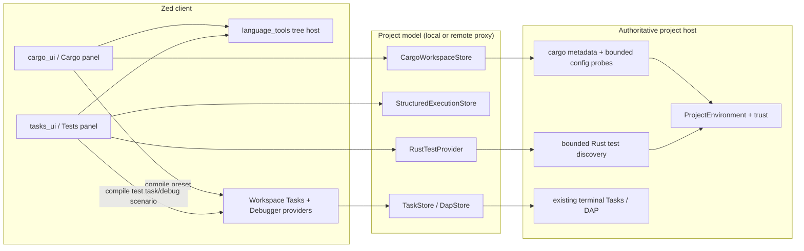

# Design: Rust Development Workspace

## Design goals

The design evolves the implemented Cargo tool window without replacing its model, panel, remote store, or generic tree host. It adds only three reusable seams required by the first Rust deliverable: an active Cargo configuration/preset compiler, an internal structured-execution store and task lifecycle bridge, and a Rust test provider. Cargo concepts remain on the Rust side of each boundary.

Addresses: Requirements 1.1, 1.2, 1.3, 1.4, 1.5, 1.6, 1.7, 1.8, 1.9

Addresses: Requirements 2.1, 2.2, 2.3, 2.4, 2.5, 2.6, 2.7, 2.8

Addresses: Requirements 3.1, 3.2, 3.3, 3.4, 3.5, 3.6, 3.7, 3.8, 3.9, 3.10

Addresses: Requirements 4.1, 4.2, 4.3, 4.4, 4.5, 4.6, 4.7, 4.8

Addresses: Requirements 5.1, 5.2, 5.3, 5.4, 5.5, 5.6, 5.7, 5.8, 5.9, 5.10, 5.11

Addresses: Requirements 6.1, 6.2, 6.3, 6.4, 6.5, 6.6, 6.7, 6.8

Addresses: Requirements 7.1, 7.2, 7.3, 7.4, 7.5, 7.6, 7.7, 7.8, 7.9

Addresses: Requirements 8.1, 8.2, 8.3, 8.4, 8.5, 8.6, 8.7, 8.8

Addresses: Requirements 9.1, 9.2, 9.3, 9.4, 9.5, 9.6, 9.7, 9.8

## Repository audit and baseline evidence

The following implementation facts determine the design:

- `crates/language_tools/src/language_tool_tree.rs` already owns generic tree projection, focus, selection, stable expansion, refresh generations, stale/error state, accessibility, context menus, `uniform_list` rendering, and a 10,000-row test.
- `crates/project/src/cargo_workspace.rs` already converts `cargo_metadata::Metadata` into direct-only typed workspace/package/target/feature/dependency data. `crates/project/src/cargo_workspace_store.rs` owns manifest discovery, authoritative-host metadata execution, trust, project environment, local/remote modes, cancellation, bounded failures, and typed snapshots.
- `crates/cargo_ui/src/cargo_panel.rs` already projects that data into the dockable `CargoPanel`, navigates through `ProjectPath`, preserves tree state, and exposes read-only refresh/expand/collapse interactions.
- `crates/languages/src/rust.rs` already creates Rust `TaskTemplate` values and performs a private limited `cargo metadata --no-deps` lookup for task-target discovery. That private path is not a reusable Cargo project model.
- `crates/project/src/task_store.rs`, `task_inventory.rs`, `crates/task/`, `crates/tasks_ui/`, and `crates/workspace/src/tasks.rs` own task contexts, templates, resolution, history, save policy, remote readiness, terminal spawning, and scheduling.
- `crates/project/src/debugger/locators/cargo.rs` already translates Cargo build/test/bench tasks into executable discovery using Cargo JSON messages, while `Workspace::start_debug_session` and the debugger provider own DAP sessions.
- `TerminalProvider::spawn` currently returns eventual exit status but no generic cancellation/output-observer handle. Terminal output is rendered by the terminal subsystem and is not a suitable structured protocol.
- `Project::active_toolchain` and `ToolchainStore` are generic and remote-capable, but the audited Rust language does not register a Rust `ToolchainLister`; Cargo configuration therefore cannot assume an active Rust toolchain is available there.
- There is no generic structured test/result store or Tests panel. Existing editor runnables and rust-analyzer extensions are useful inputs, not a workspace-wide result model.
- `zed/rust-tools`, `project/cargo-workspace`, `remote_server/rust-tools`, settings feature forwarding, release scripts, CI, and `script/check-rust-tools-feature-boundary` already form the optional Cargo boundary. Existing Rust language initialization remains unconditional.

## Recommended architecture



The arrows are dependency/data-flow direction, not a new service layer. In a local project, Project and Host are the same process. In a remote or multiplayer project, existing typed RPC separates them.

## Design decisions

### D1: Extend the verified baseline in place

Keep the dedicated `CargoPanel`, `CargoTreeProvider`, `CargoWorkspaceStore`, `cargo_workspace` model, and `language_tool_tree`. New dashboard rows and actions are extensions of `cargo_ui`; no dashboard placement decision remains open. The panel keeps the user-facing title **Cargo**, direct-only dependencies, lazy activation, stable opaque IDs, and current navigation/status behavior.

The old tool-window implementation tasks are not repeated. Extension tests first capture the verified baseline at the new integration seams so changes cannot regress it.

### D2: Keep ownership aligned with existing dependency direction

Ownership is:

| Component | Owner | Responsibility |
| --- | --- | --- |
| Generic tree interaction/rendering | `language_tools::language_tool_tree` | Opaque tree state and generic actions only |
| Cargo metadata/configuration snapshot | `project::cargo_workspace` and `CargoWorkspaceStore` | Manifest roots, metadata conversion, bounded configuration discovery |
| Cargo presentation/preset compiler | `cargo_ui` | Rust/Cargo labels, configuration UI, contextual action eligibility, `TaskTemplate`/`DebugScenario` conversion |
| Generic result state | `project::structured_execution` | Internal provider/run/node/event store and protocol |
| Generic Tests presentation | `tasks_ui::test_explorer` | Result-tree projection, filters, summaries, run/cancel UI |
| Rust test discovery | `project::rust_test_provider` | Cargo/Rust discovery protocol, stable test identities, mapping to source and task selectors |
| Process execution | existing Tasks, terminals, DAP | Save, environment, remote command, output, cancellation, history, debugging |

`project` remains below workspace/UI crates. `cargo_ui` and `tasks_ui` may depend on `project`, `task`, and `workspace`; `project` must not depend on either UI crate. No public provider registry is introduced: the Tests panel binds the one in-tree Rust provider under `rust-tools`, while the generic store accepts internal provider IDs and opaque node keys.

### D3: Add a bounded Cargo configuration projection, not a Cargo config reimplementation

Extend `CargoWorkspaceSnapshot` with a configuration section keyed by existing workspace/root identity:

- profile descriptors: implicit `dev`/`release` and custom `[profile.<name>]` names found in visible root manifests;
- declared toolchain descriptor parsed from the nearest applicable visible `rust-toolchain.toml` or legacy `rust-toolchain` file;
- host compiler descriptor from an injectable, trusted, bounded `rustc -vV` probe using `ProjectEnvironment` (`release`, `host` triple, status); and
- configuration diagnostics/completeness with the existing bounded failure conventions.

Manifest reads go through the visible worktree/project APIs. The parser records names and supported toolchain declaration fields only; it does not evaluate all Cargo profile inheritance or rustup state. The probe is metadata/model discovery, so `CargoWorkspaceStore` may own its lifecycle, but its runner interface remains separate from `CargoMetadataRunner`. It cannot run builds, tests, benches, or user presets.

The effective target label is deliberately three-valued: explicit active preset target, probed host triple, or unresolved Cargo default. Zed does not attempt to reproduce Cargo's layered `.cargo/config.toml`, environment, alias, or target-selection algorithm. Relevant visible config files trigger invalidation because Cargo may use them, but unresolved influence is labeled rather than guessed.

### D4: Model active configuration and presets outside the metadata store

`cargo_ui` defines Cargo-specific preset/configuration types and a pure compiler. A preset uses typed enums for subcommand, scope, target kind/selector, feature/default-feature policy, profile, working-directory policy, and reveal/save behavior; argument and environment values remain arrays/maps.

Persistence follows the recommended OQ1 default:

- user presets: `cargo.presets` in user `settings.json`;
- project presets: `cargo.presets` in trusted `.zed/settings.json`, merged by stable ID over user presets;
- ephemeral presets: panel memory only;
- active preset: stable ID plus non-secret selection overrides in the existing workspace database/panel serialization; missing IDs fall back to the default ephemeral configuration with a migration notice.

Settings schema/default registration stays behind `settings/rust-tools` and `settings_content/rust-tools`. The Cargo snapshot contains only configuration facts; it never contains preset environment values. The panel combines snapshot facts and local preset selection into a view model.

### D5: Compile every contextual action into existing Tasks or DAP

The pure Cargo preset compiler produces:

- `TaskTemplate` with `command = "cargo"`, structured `args`, `env`, working directory, save/reveal/hide/concurrency policy, and a stable source/label;
- `TaskContext` derived through existing project/worktree context APIs; and
- for Debug, `DebugScenario` whose `BuildTaskDefinition::Template` is the compiled Cargo task.

The compiler applies Cargo arguments in a deterministic order and never shell-concatenates user data. Contextual action eligibility is a table over the selected Cargo node and preset subcommand. For example, Run is available to binaries/examples, Bench to bench targets, Test to packages/test-bearing targets, and Debug only where the existing Cargo locator/DAP path supports an executable harness. Build and Check may apply to workspace/package/target scopes.

Execution calls `Workspace::schedule_task` or `Workspace::start_debug_session`. Existing Rust task helpers should be extracted only where sharing the Cargo argument builder removes verified duplication; the private task-target metadata types in `languages::rust` remain private and are not imported by UI. The metadata store receives no execution methods.

For a remote project, opaque Rust test node keys are resolved by the authoritative provider through a versioned, bounded `ResolveRustTestAction` request. The response carries a validated internal action plan with structured arguments and no environment values; the client then submits that plan to the same existing remote Tasks/DAP path used by ordinary actions. An old or disabled host rejects the typed request and the UI reports the capability error without constructing a client-local command.

### D6: Add a generic structured-execution store in `project`

Behind a small `project/structured-execution` feature, add an internal model:

```text
ProviderId + DiscoveryGeneration
  -> ResultNode { opaque NodeId, parent, label, generic kind, optional ProjectPath }

RunId + provider/discovery generation
  -> RunState { scope roots, phase, summary, started/finished timestamps }
  -> ResultEvent { sequence, node, state, duration, bounded message/location }
```

Generic node kinds are presentation-oriented (`provider`, `suite`, `group`, `case`) rather than Cargo-shaped. Providers own opaque keys and mapping to execution requests. Events include a monotonically increasing sequence and run/discovery generation. The store applies duplicate events idempotently, rejects gaps/stale projects according to protocol policy, and preserves `last_complete_run` while `current_run` changes.

Retention defaults are explicit constants, initially 20 completed runs per provider, 10,000 nodes per discovery snapshot, 50,000 events per run, 64 KiB total bounded messages per run, and protocol page/chunk limits. Reaching a limit produces a `partial/truncated` marker rather than silent loss. Exact constants may be tuned from the large fixture without changing the contract.

The protocol uses `ProjectPath`, opaque IDs, enums, counters, durations, and bounded messages. It excludes environment fields, commands, terminal output, raw metadata, and absolute paths. Protobuf may remain inert in disabled builds.

### D7: Extend task scheduling with a generic lifecycle handle, not terminal scraping

Introduce an opt-in structured-task scheduling path beside `Workspace::schedule_resolved_task`. It uses the same resolved task and `TerminalProvider`, but returns/attaches a generic handle containing task identity, eventual `ExitStatus`, cancellation request, and terminal navigation identity. The ordinary scheduling path remains source-compatible.

The terminal provider already owns terminal entities and completion receivers; implementation should expose a narrow handle rather than pipe terminal-rendered bytes into `project`. Cancellation delegates to the existing terminal task cancellation behavior on the execution host. The bridge reports queued/running/completed/cancelled/spawn-error lifecycle events to `StructuredExecutionStore`. Provider adapters may derive pass/fail from exact single-case process exit status. They may not parse ANSI emulator content.

Remote execution remains the existing remote terminal/task path. The client-side generic task handle forwards ordered, bounded lifecycle state through `UpdateRustTestRun`; the authoritative host validates the peer, visible-worktree scope, provider authorization, discovery generation, run ID, task ID, and lifecycle order before mutating its structured store. It retains a bounded number of pending authorizations and removes them on terminal state or discovery invalidation. If remote cancellation cannot confirm termination, the run becomes `cancelled/unknown` and late generation events are rejected.

### D8: Build the Tests panel from existing generic UI primitives

`tasks_ui::test_explorer`, behind `tasks_ui/test-explorer`, wraps `language_tool_tree` rather than adding another tree implementation. The provider projection maps generic result nodes and status to opaque tree nodes; filters create a deterministic visible projection without changing discovery identity.

The dockable panel title is **Tests**. It owns focus, selected provider/run, text/status filters, summaries, run/cancel/rerun-failed toolbar actions, result navigation, and terminal links. The generic panel has no Rust labels or Cargo argument logic. Registration occurs only when its compile-time feature is selected; the first provider registration in Now is internal and Rust-specific.

Panel persistence stores placement, size, filter, selected provider, and safe IDs, not result payloads or secrets. Result history is in-memory for Now; reopening Zed starts with discovery/no-results rather than migrating unbounded test history.

### D9: Use a separate Rust test provider with a protocol gate

`project::rust_test_provider`, behind `project/rust-tests`, depends on `cargo-workspace` and `structured-execution` and owns test discovery only. It combines:

1. Cargo workspace/package/target identity from `CargoWorkspaceStore` for suite nodes;
2. existing rust-analyzer runnable/source locations where available, without requesting a second semantic index; and
3. a separately injectable host discovery runner when full target/test enumeration requires execution.

The first task is a fixture-backed protocol gate. The recommended adapter builds or locates test harnesses using structured Cargo JSON messages, then uses a stable bounded list mode to enumerate cases. It must prove behavior for unit, integration, binary/example harnesses, benchmarks, ignored tests, and doctests on the supported stable toolchain matrix. Unknown lines/records become partial diagnostics. If this gate fails, OQ2 applies: do not ship the panel as complete and do not fall back to ANSI terminal scraping.

Discovery runner ownership does not move to `CargoWorkspaceStore`. It uses `ProjectEnvironment`, trust, visible worktrees, kill-on-drop, output/time limits, generation cancellation, and the authoritative host. It is not used for user-invoked test execution.

The provider maps a case to an exact Rust/Cargo `TaskTemplate`; a single-case run derives status from its task handle. A suite may use the ordinary suite task, but if the validated protocol cannot emit per-case outcomes, only the suite receives the aggregate result. Debug creates an existing Cargo `DebugScenario`. Rerun-failed resolves retained opaque keys against the current discovery generation and uses a bounded concurrency queue.

### D10: Keep local, remote, container, WSL, and multiplayer flows host-authoritative

Local stores use the existing `WorktreeStore`, `ProjectEnvironment`, `TrustedWorktrees`, and process runner. Remote client stores are proxies. `remote_server` constructs the local Cargo and Rust-test stores, registers typed handlers, and subscribes entities only under `rust-tools` feature forwarding.

SSH, WSL, and dev-container support is capability-based: when Zed represents the environment as a project host with Tasks/DAP and project environment support, the same provider works. There is no `std::fs`/local `cargo` fallback on the client. Unsupported project modes return typed states.

Every request carries project/peer ID, capability/protocol version, request or run ID, generation, and a bounded visible-worktree scope. Multiplayer responses and action resolution are filtered through visible worktrees before serialization. Remote action plans are resolved on the host, executed through the existing remote Task/DAP policy, and report lifecycle back to the host; they never invoke client-local Cargo. Guests may view allowed model/results but execute only if existing task/debug policy permits. Disconnect or host generation changes cancel request ownership, expire pending run authorization, and stale prior snapshots.

### D11: Apply trust and secret boundaries before command construction

Metadata/configuration probes, test discovery, Tasks, and DAP each check existing worktree trust at their owning layer. Revocation increments the relevant generation and drops kill-on-drop tasks. Opening panels performs no installation, fetch, update, or mutation.

Preset environment values exist only in user-authored settings and the in-memory TaskTemplate passed to the existing task environment path. Snapshot models, result events, UI summaries, telemetry, logs, and protocol contain key names at most. Remote Rust test action plans are accepted only when they use the fixed Cargo command shape, bounded structured arguments, a contained variable-based working directory, and no environment or task hooks. Errors use the existing bounded/sanitized conventions; path conversion uses visible `ProjectPath` containment.

### D12: Make cancellation, stale state, and partial failure explicit

Each store separates:

- input/discovery generation;
- request/run ID;
- current task handle;
- last complete privacy-safe snapshot/run; and
- current loading/error/partial status.

Relevant manifest/lock/toolchain/config/preset/source/capability changes debounce through GPUI executor timers. A new generation cancels obsolete work; every completion checks generation before mutation. Root/provider failures are isolated. Malformed data is fallible. Missing tools, restricted mode, disconnected state, unsupported host, protocol mismatch, timeout, truncation, cancellation, and ordinary command failure have distinct typed statuses.

Large parsing and fixture conversion runs on the background executor. Foreground work is bounded to entity updates and visible tree projection. Node/event limits and virtualized rendering prevent unbounded UI trees.

### D13: Extend `rust-tools` without making all Rust language support optional

Feature shape:

```text
zed/rust-tools
  -> dep:cargo_ui
  -> project/cargo-workspace
  -> project/structured-execution
  -> project/rust-tests
  -> tasks_ui/rust-test-actions
     -> tasks_ui/test-explorer
  -> settings/rust-tools

remote_server/rust-tools
  -> project/cargo-workspace
  -> project/structured-execution
  -> project/rust-tests
```

Exact forwarding may be transitively expressed through existing dependencies, but `script/check-rust-tools-feature-boundary` must assert the selected graph and cfg sites. `cargo_ui` remains optional. `cargo_metadata` remains optional under `project/cargo-workspace`. Any new Cargo/test-protocol-only dependency must be optional and absent from disabled selected graphs.

The generic tree host has no Rust feature. `project/structured-execution` and `tasks_ui/test-explorer` are generic but compile-time selectable so distributors need not ship the new UI/store. Protocol definitions remain compiled if conditional protobuf generation is disproportionate; handlers and stores do not.

Existing `languages::init`, Rust grammars, rust-analyzer adapter code, and private Rust task discovery are explicitly not moved under this feature. Making all Rust language support optional is a separate future specification.

### D14: Use additive persistence and compatibility migrations

Preset schema starts at version 1 and rejects unknown required enum values per preset while retaining other presets. Renamed/deleted preset IDs cause active configuration to fall back to Cargo defaults and display a one-time non-blocking notice. Workspace persistence adds nullable fields or a dedicated keyed record; it does not rewrite existing panel/task/debug state.

Cargo snapshot and structured-result protocol changes use optional/backward-compatible fields where possible plus explicit capability/version negotiation for required semantics. An old host yields unsupported/mismatch UI, never client execution. Result history is not persisted in Now, so no result database migration is needed.

### D15: Test through injected runners, pure compilers, and fake providers

Testing seams are:

- deterministic Cargo metadata/config/toolchain fixtures and injected `CargoMetadataRunner`/configuration probe;
- pure preset merge/validation/argument compilation functions;
- fake `TerminalProvider`/structured task handles with deterministic lifecycle events;
- fake generic structured providers/events;
- injected Rust test-discovery runner and protocol fixtures;
- local and remote/headless fake project environments and peer visibility;
- GPUI executor timers for debounce/cancellation tests; and
- synthetic 1,000-package/10,000-test datasets and 10,000-row panel projections.

Tests must not discover tools from the developer machine or use the network. CI runs focused enabled/disabled checks plus the extended boundary script.

### D16: Deliver Now in gates and leave roadmap work outside the architecture

Delivery order is: baseline/configuration facts; preset compiler/actions; generic result/task lifecycle; test protocol gate; Tests panel/provider; remote/feature/performance hardening. Contextual actions may ship before the Tests panel only under OQ2's failed-gate condition.

Next/Later capabilities may consume the generic result contract only when their data is execution-tree shaped. Coverage overlays, call hierarchy, dependency provenance, profilers, auditing, project creation, and external runner installation require separate specs and must not distort the Now model.

## Data flows

### Cargo dashboard refresh

1. `CargoPanel` activation/invalidation asks its existing provider to refresh.
2. Local or proxy `CargoWorkspaceStore` discovers visible candidates on the authoritative host.
3. Trusted background runners collect Cargo metadata and bounded configuration/toolchain facts.
4. The store publishes a generation-tagged, privacy-safe snapshot; the proxy protocol uses `ProjectPath` only.
5. `CargoTreeProvider` combines snapshot facts with the local merged preset/active selection and projects rows through `language_tool_tree`.

### Contextual Cargo action

1. The Cargo panel maps the selected opaque node to a Cargo workspace/package/target identity.
2. It merges the active preset with the explicit contextual action and validates applicability.
3. The pure compiler creates a `TaskTemplate`/`TaskContext`, or a `DebugScenario` containing that task.
4. `Workspace` schedules through existing Tasks/terminal or DAP. Remote execution follows the project's existing host path.
5. The Cargo store is not involved after providing identity/configuration facts.

### Rust test discovery and execution

1. The Rust provider obtains Cargo suites/targets and existing source/runnable hints.
2. If needed and trusted, its authoritative-host discovery runner emits a bounded discovery snapshot.
3. `StructuredExecutionStore` publishes generic provider/suite/group/case nodes to the Tests panel.
4. Run/debug requests map back through opaque provider keys to an exact `TaskTemplate` or `DebugScenario`.
5. The generic task handle reports lifecycle and cancellation; provider logic maps exact-case exit status to a result event.
6. Terminal output stays in the terminal; only bounded structured state crosses the result store/protocol.

## Failure and compatibility matrix

| Condition | Cargo panel | Tests panel/actions |
| --- | --- | --- |
| Untrusted worktree | Restricted state; no probes | Restricted state; no discovery/execution |
| Missing Cargo/rustc | Last safe snapshot stale or actionable error | Discovery/action disabled with exact missing tool |
| Partial root failure | Other roots remain navigable | Other providers/suites remain available |
| Disconnected remote | Last safe data stale | Running state cancelled/unknown; no local fallback |
| Old/disabled host | Unsupported/mismatch | Unsupported/mismatch; no request loop |
| Obsolete generation | Completion ignored | Discovery/run events ignored |
| Output/node limit | Partial/truncated marker | Partial/truncated marker with retained summary |
| Suite has aggregate only | Not applicable | Suite result only; children unknown/stale |
| `rust-tools` disabled | No Cargo UI/store path | No Tests/Rust provider path |

## Traceability

| Criterion | Design coverage | Verification type | Planned check / expected signal |
| --- | --- | --- | --- |
| 1.1 | D1, D13 | GPUI integration | Enabled build registers and restores the Cargo panel titled Cargo. |
| 1.2 | D1, D12 | GPUI lifecycle | Dormant panel causes no runner call; first activation requests once. |
| 1.3 | D1, D3 | Fixture integration | Multi-root/virtual/standalone fixtures deduplicate and retain scoped failures. |
| 1.4 | D1 | Model regression | Existing target, feature, and dependency fixture assertions remain green. |
| 1.5 | D1 | Projection regression | Dependency nodes have no recursive dependency children. |
| 1.6 | D1, D11 | Navigation test | Safe ProjectPath activations open expected files; unsafe paths are disabled. |
| 1.7 | D1, D12 | State test | Refresh preserves surviving IDs and rejects late generations. |
| 1.8 | D1, D8 | GPUI interaction | Keyboard, accessibility, toolbar, menu, scrolling, and state fixtures pass. |
| 1.9 | D1, D2 | Architecture check | No parallel Cargo model/panel/tree host is introduced. |
| 2.1 | D3 | Parser fixture | Standard/custom profiles and malformed declarations produce bounded facts. |
| 2.2 | D3 | Parser fixture | TOML and legacy toolchain declarations resolve without rustup. |
| 2.3 | D3, D11 | Injected-runner test | rustc facts and missing/restricted/failure states are deterministic. |
| 2.4 | D3, D4 | View-model test | Explicit, host, and unresolved target labels remain distinct. |
| 2.5 | D4 | UI model test | Active summary displays every configured dimension and environment keys only. |
| 2.6 | D4 | Default-state test | Missing preset yields labeled Cargo defaults without persistence. |
| 2.7 | D3, D12 | GPUI timer test | Relevant changes debounce and failed probes retain stale safe facts. |
| 2.8 | D3, D11 | Privacy test | Snapshots/protocol omit secrets, raw output, and outside paths. |
| 3.1 | D4, D5 | Schema test | All typed preset dimensions round-trip and compile deterministically. |
| 3.2 | D4, D14 | Merge test | Project overrides user by ID and invalid entries are isolated. |
| 3.3 | D4, D14 | Persistence test | Scoped settings and active ID restore with trust and fallback behavior. |
| 3.4 | D5, D7 | Task integration | Compiled preset reaches existing scheduler and terminal lifecycle. |
| 3.5 | D5 | DAP integration | Debug preset becomes Cargo DebugScenario and reaches debugger provider. |
| 3.6 | D5 | Eligibility table | Each node/target kind exposes only valid accessible actions. |
| 3.7 | D5 | Code/fixture regression | Shared builder matches established Rust task/runnable semantics. |
| 3.8 | D5, D11 | UI/security test | Execution is explicit and mutation/network actions are absent. |
| 3.9 | D5, D11 | Argument property test | Adversarial values remain separate argv/env fields. |
| 3.10 | D5, D10, D11 | Policy integration | Restricted/disconnected/guest/mismatch states schedule nothing. |
| 4.1 | D6 | Model unit test | Generic identities, hierarchy, states, durations, messages, and paths round-trip. |
| 4.2 | D2, D6 | Dependency/source audit | Generic modules contain no Cargo-shaped types. |
| 4.3 | D6, D12 | State-machine test | Duplicate/late/cross-project events cannot corrupt current or last run. |
| 4.4 | D6, D12 | Retention test | Old runs/details evict deterministically while current summary survives. |
| 4.5 | D7 | Task bridge test | Handle reports lifecycle/cancellation and ordinary terminal remains present. |
| 4.6 | D8 | GPUI panel test | Tests panel hierarchy, filters, controls, navigation, and terminal links work. |
| 4.7 | D8, D12 | State rendering | Every loading/empty/partial/stale/error/mismatch state has distinct copy/action. |
| 4.8 | D2, D6, D8, D13 | Fake-provider/build test | Non-Rust fake provider compiles; generic graphs contain no Cargo dependencies. |
| 5.1 | D9 | Discovery projection | Fixture projects stable workspace/package/target/group/case nodes and paths. |
| 5.2 | D9 | Architecture test | Provider consumes Cargo/runnable inputs and contains no Rust source indexer. |
| 5.3 | D2, D9 | Ownership test | Injected discovery runner is separate from CargoWorkspaceStore APIs. |
| 5.4 | D9, D15, D16 | Protocol gate | Stable-toolchain fixture matrix passes or Tests release remains gated. |
| 5.5 | D7, D9 | Exact-task test | Single case uses exact task and maps exit status without terminal parsing. |
| 5.6 | D9 | Aggregate semantics | Suite-only outcome leaves child results unknown/stale. |
| 5.7 | D5, D9 | DAP test | Supported cases use Cargo locator; unsupported cases expose a reason. |
| 5.8 | D7, D9, D12 | Cancellation race | Superseding/cancelled runs reject late lifecycle and discovery events. |
| 5.9 | D9, D12 | Queue test | Rerun-failed resolves current keys, caps concurrency, reports removed cases. |
| 5.10 | D6, D7, D11 | Privacy/output test | Terminal retains output; store/protocol retain only bounded safe summaries. |
| 5.11 | D9, D16 | Dependency/network audit | Now path has no nextest install or implicit network behavior. |
| 6.1 | D10, D11 | Local integration | Injected local environment receives probes/discovery/tasks. |
| 6.2 | D10 | Remote integration | Headless host receives work; client-local runner remains untouched. |
| 6.3 | D10 | Capability test | Supported host abstraction works; unsupported mode is explicit. |
| 6.4 | D10, D11 | Multiplayer test | Peer sees only visible paths and cannot bypass guest execution policy. |
| 6.5 | D10, D14 | Compatibility test | Version/feature mismatch is stable and produces no fallback or retry loop. |
| 6.6 | D6, D10, D11 | Protocol audit | Wire fixtures contain only bounded IDs/status/ProjectPath data. |
| 6.7 | D10, D12 | Reconnect race | Old peer/project generations are cancelled and ignored. |
| 6.8 | D10, D13 | Compile-time test | Handler registration exists only in capable desktop/headless builds. |
| 7.1 | D10, D11 | Trust test | Restricted worktree causes zero injected runner/task/DAP calls. |
| 7.2 | D11, D12 | Trust race | Revocation cancels work and late generation is ignored. |
| 7.3 | D3, D9, D11 | Network audit | Panel open/refresh invokes no install/fetch/update path. |
| 7.4 | D4, D6, D11 | Secret test | Models/protocol/logs omit values while task receives explicit configured env. |
| 7.5 | D3, D4, D9, D12 | Invalidation test | Each relevant input invalidates only owning generation with debounce. |
| 7.6 | D12 | Failure-state test | Last good data becomes stale; first failure remains non-stale. |
| 7.7 | D3, D4, D6, D9, D12 | Fuzz/fixture test | Malformed inputs isolate failures without panic/global data loss. |
| 7.8 | D6, D9, D12 | Limit test | Timeout/output/node/event limits produce explicit truncation/partial status. |
| 7.9 | D1, D12, D16 | Compatibility regression | Cargo navigation/tasks work when result/test features are unavailable. |
| 8.1 | D13 | Enabled build test | All Rust workspace components register under rust-tools. |
| 8.2 | D13 | Disabled build test | No UI/store/handler/runner path exists or runs. |
| 8.3 | D13 | Cargo tree audit | Disabled selected graphs exclude Cargo/test-only dependencies. |
| 8.4 | D2, D6, D8, D13 | Dependency audit | Generic host/result crates and modules have no Cargo dependency. |
| 8.5 | D10, D13 | Headless build test | Remote enabled/disabled configurations have parity. |
| 8.6 | D6, D13 | Handler audit | Proto compiles inertly; disabled builds register no handler/store. |
| 8.7 | D13 | Initialization regression | Existing languages::init/Rust code stays outside feature cfg. |
| 8.8 | D13, D15 | CI/release test | Feature script and bundle dry-runs cover both variants and mismatch. |
| 9.1 | D15 | Fixture suite | Deterministic model/preset/discovery/event fixtures cover all listed variants. |
| 9.2 | D3, D4, D15 | Configuration fixtures | Workspace/profile/toolchain/target/preset matrix passes. |
| 9.3 | D5, D15 | Pure conversion test | TaskTemplate/TaskContext/DebugScenario snapshots match exactly. |
| 9.4 | D6, D7, D9, D15 | State-machine suite | Result/cancellation/retention/aggregate/rerun/navigation cases pass. |
| 9.5 | D1, D8, D12, D15 | GPUI suite | Panels and timer-driven interaction states pass on GPUI executor. |
| 9.6 | D10, D11, D15 | Remote fixture suite | Host routing, peer filtering, trust, reconnect, bounds, mismatch pass. |
| 9.7 | D15 | Hermeticity check | Injected tests pass with tool paths unavailable and network disabled. |
| 9.8 | D6, D8, D12, D15 | Performance test | Synthetic scale meets limits without foreground parse or full-row rendering. |

## Open-question impact

OQ1 changes only preset storage/schema files described in D4/D14. OQ2 changes the release/registration gate in D9/D13/D16. Neither question changes baseline dashboard ownership, task/DAP routing, generic result shape, trust, or remote execution boundaries.
