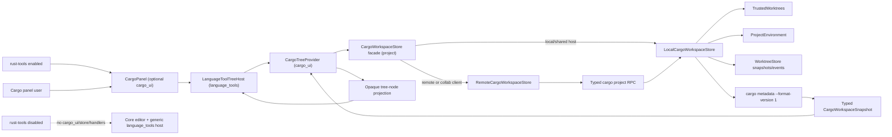
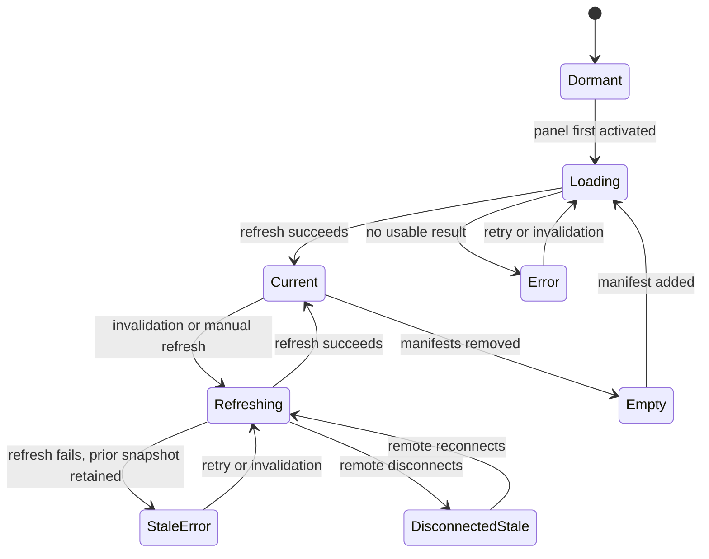

# Design: Rust Workspace Tool Window

## Overview

The feature adds a user-facing `CargoPanel` behind the compile-time `rust-tools` capability and backed by two deliberately different runtime boundaries:

1. The existing `language_tools` crate gains a reusable, Cargo-agnostic tree host for panel state, virtualized rendering, interaction, accessibility, refresh coordination, and provider activation.
2. Cargo-specific code supplies a `CargoTreeProvider` in `cargo_ui` and a host-side `CargoWorkspaceStore` in `project` for manifest discovery, trusted Cargo execution, metadata conversion, remote transport, and privacy filtering.

This is the smallest reusable split that delivers the Cargo panel without treating Cargo packages and targets as universal language concepts or making Cargo tooling an unconditional editor dependency. Future ecosystem panels may reuse the tree host in a build without `rust-tools`, but no provider registry or public extension surface is introduced.

The Cargo model comes from `cargo metadata --format-version 1` without `--no-deps` or feature-selection overrides. Cargo documents format version 1 as a machine-readable workspace/package model, includes defined features in package records, and reports enabled features in resolve nodes; `--no-deps` would remove the resolved graph needed here. Cargo also documents that the default feature is active when no feature option is supplied. See the official [cargo metadata reference](https://doc.rust-lang.org/cargo/commands/cargo-metadata.html) and [external-tool guidance](https://doc.rust-lang.org/cargo/reference/external-tools.html).

The MVP displays direct dependency declarations only. Resolve nodes annotate each direct row with its resolved package/version and enabled features, but do not become recursively expandable dependency nodes. This prevents cycles, duplicate explosion, and a misleading implication that one metadata invocation represents every possible target and feature combination. Cargo's resolver can legally contain dev-dependency cycles and unifies features according to the workspace resolver; see the official [dependency resolution reference](https://doc.rust-lang.org/cargo/reference/resolver.html).

## Existing context

- `workspace::dock::Panel` in `crates/workspace/src/dock.rs` defines persistent name/key, dock position, size, icon, activation, and focus behavior. `Workspace::add_panel` and dock persistence already own panel placement and active-panel restoration.
- The existing `crates/language_tools` crate already owns Zed's syntax-tree, highlight-tree, key-context, and language-server tool views and is initialized from `crates/zed/src/main.rs`. The reusable project-tree host extends this crate; no duplicate `language_tools` crate or second initialization entry is needed.
- `crates/zed/Cargo.toml` currently has `default = []` and uses optional dependencies plus feature forwarding for the Comfy product boundary. `script/check-comfy-feature-boundary` verifies this with manifest and `cargo tree` assertions; the Cargo feature boundary should reuse that check pattern without coupling Rust tooling to Comfy or Apple Metal features.
- `crates/languages/src/lib.rs` unconditionally constructs `rust::RustContextProvider` and `rust::RustLspAdapter` and registers the Rust language from the shared `languages::init` call used by both `crates/zed/src/main.rs` and `HeadlessProject`. The existing `languages` features gate grammar loading and test support, not Rust as an ecosystem. Therefore this specification cannot honestly make all Rust language support optional.
- `crates/project/Cargo.toml` has no ecosystem-store feature boundaries today, but `Project` directly owns local/remote `TaskStore` and `ToolchainStore` entities and wires sharing/request handlers during construction. `HeadlessProject` mirrors those lifecycles. A conditionally compiled project module fits those established ownership paths more narrowly than an external store crate.
- `crates/remote_server/Cargo.toml` has independent features and release scripts build `remote_server` in a separate Cargo invocation specifically to avoid feature unification. Its `rust-tools` selection must therefore be explicit and must match the desktop artifact produced for a Rust-oriented distribution.
- `crates/proto/build.rs` always compiles the single `proto/zed.proto` root and all imported protocol files. Feature-dependent proto generation would require parallel schemas or conditional build-script/import/envelope logic, so keeping small Cargo messages inert in both variants is the lower-risk wire-compatible choice.
- `script/bundle-mac`, `script/bundle-linux`, and `script/bundle-windows.ps1` currently select optional product features explicitly in their Cargo commands and expose dry-run build plans. Release workflows invoke those scripts. Rust-oriented distribution builds should pass one explicit `rust-tools` selection through both the Zed and remote-server commands, while core builds omit it.
- `ProjectPanel` and `OutlinePanel` register actions from `init`, load asynchronously, implement `Panel`, flatten hierarchical state, use `uniform_list`, and bind selection/open/expand actions. Their settings demonstrate left/right dock persistence and status-bar button visibility.
- `ui::TreeViewItem` has useful disclosure and accessibility behavior but hard-codes only root/child ARIA levels and lacks arbitrary-depth icons and secondary labels. The Cargo tree therefore reuses lower-level `ListItem`, `Disclosure`, `Icon`, `IndentGuide`, and `uniform_list` patterns rather than expanding `TreeViewItem` as unrelated shared-component work.
- `project::ManifestTree` finds an outermost manifest root for language-server/toolchain lookup from a known path. It does not enumerate every manifest or expose a Cargo workspace model, so it is not the Cargo panel's data source.
- `crates/languages/src/rust.rs` has private, task-oriented metadata structs and invokes `cargo metadata --no-deps` to map one source path to a binary/example task target. That behavior neither contains a resolved dependency graph nor supports a project panel. It remains unchanged; both paths may parse format-version-1 output through the existing workspace `cargo_metadata = "0.19"` dependency without sharing task-private types.
- `ProjectEnvironment` resolves CLI, worktree-shell, and remote-directory environments. Cargo execution must use the environment for the candidate worktree so PATH, rustup overrides, direnv, and remote shells match the project.
- `WorktreeStoreEvent` reports worktree add/remove/order and per-worktree updated-entry sets. Those events provide the invalidation boundary for `Cargo.toml` and `Cargo.lock` changes without a second filesystem watcher.
- `TrustedWorktreesStore::can_trust` and `TrustedWorktreesEvent` are the existing authority for local, SSH, and WSL execution trust. The Cargo store must use this authority before spawning a project command.
- `TaskStore` and `ToolchainStore` demonstrate local/remote store modes, typed project RPC request handlers, project sharing, and headless remote-server construction. `CargoWorkspaceStore` follows that pattern rather than adding client-local remote path handling.
- `Worktree` entries carry `is_private`, and shared worktree updates exclude private entries for multiplayer peers. Cargo response projection must apply the same visibility boundary before serializing packages or navigation paths.
- `initialize_panels` in `crates/zed/src/zed.rs` loads standard panels concurrently. `main.rs`, visual-test initialization, `app_menus.rs`, root workspace membership, and `crates/zed/Cargo.toml` are the established registration points.
- Settings content lives in `crates/settings_content`, while registered setting values live in their owning crates. `SettingsStore::update_default_settings` and explicit `Settings::register` permit optional `cargo_ui` to install typed Cargo defaults before registering its setting. Optional Cargo action bindings should likewise be installed from `cargo_ui::init` rather than placed in always-loaded platform keymaps.

## Architecture



Only the local store sees absolute paths, environment variables, child-process handles, or raw Cargo output. All panel and RPC data uses typed status plus `WorktreeId`/`ProjectPath` navigation coordinates.

## Design decisions

### D1: Component and naming layout

- Extend the existing `crates/language_tools` crate with `src/language_tool_tree.rs`, exported through its established `src/language_tools.rs` root. The module contains the generic tree state, provider contract, flattened-row model, and renderer alongside, but independent from, the crate's existing developer tool views.
- Add `crates/cargo_ui` with `src/cargo_ui.rs`, `src/cargo_panel.rs`, and `src/cargo_panel_settings.rs`. It contains the user-facing panel, Cargo tree projection, actions, settings, and panel tests.
- Add `crates/project/src/cargo_workspace_store.rs` to the existing project crate. Cargo discovery and transport belong beside worktree, environment, toolchain, and task stores because they need the same local/remote lifecycle.
- Add Cargo-specific protocol messages in `crates/proto/proto/cargo.proto` and register them through `zed.proto`/`proto.rs` using the existing typed request mechanism.
- Use `language_tools`, `cargo_ui`, `cargo_workspace`, `CargoWorkspaceStore`, and focused `cargo_*` identifiers. `Metal Rust` may name a product/distribution, and a later umbrella crate may be called `metal_rust`, but this feature does not add that crate. Do not use `metal_cargo` or rename Rust directories to `metal_*`: existing `comfy_backend_metal`, `native_ffi_metal`, and GPUI Metal renderer code already use Metal for Apple GPU rendering and compute.

This creates only the `cargo_ui` crate. It reuses the existing generic `language_tools` ownership unit and avoids a separate Cargo-model crate by placing project-host behavior in the existing `project` crate.

### D2: Cargo-agnostic tree host contract

`language_tools` exposes an internal Rust API, not a plugin API. Exact Rust signatures may follow repository conventions, but the boundary carries these concepts:

- `LanguageToolNodeId`: an opaque, cloneable, hashable identifier supplied by the provider.
- `LanguageToolNode`: label, optional secondary label, icon, accessibility label, optional child list, branch state, enabled state, and opaque activation capability.
- `LanguageToolSnapshot`: ordered root nodes plus provider-scoped statuses.
- The provider boundary is the snapshot plus opaque refresh, activation, and context-menu callbacks supplied by the owning panel. It is deliberately not a trait registry or plugin API.
- `LanguageToolTreeHost`: owns the focus handle used by the reusable host, selected ID, expanded-ID set, flattened visible rows, scroll handle, refresh/debounce task lifetimes and generation state, loading/stale/error presentation, and generic tree actions. `CargoPanel` exposes the same focus handle through `Panel`/`Focusable` and supplies Cargo-specific callbacks.

The host never sees `CargoPackage`, dependency kinds, feature resolution, manifest paths, or Cargo commands. It dispatches selection, disclosure, activation, and context-menu events by opaque ID to the owning provider callback. This permits a future Gradle provider to project modules/tasks/configurations and a .NET provider to project solutions/projects/frameworks without implementing Cargo-shaped types.

The host uses a full-size `uniform_list` over a flattened vector of visible rows so the list receives the panel's remaining flex height instead of collapsing to a zero-height viewport. Each row records its arbitrary ARIA level, branch/expanded state, parent ID, and node ID. The list container uses `Role::Tree`; rows use `Role::TreeItem`, `aria_level`, `aria_selected`, and conditional `aria_expanded`. `Disclosure`, existing icon components, and standard tooltip/context-menu components provide Zed-consistent rendering. A render-level GPUI regression asserts that a populated snapshot produces a non-zero list viewport and measured row.

<!-- impl: crates/language_tools/src/language_tool_tree.rs#language_tool_tree -->

### D3: Cargo workspace store and project lifecycle

`CargoWorkspaceStore` is an entity owned by both `Project` and `HeadlessProject` only when the project crate's `cargo-workspace` feature is enabled.

- Local mode owns `WorktreeStore`, `ProjectEnvironment`, the filesystem abstraction needed for command discovery/error classification, trust subscriptions, a command-runner abstraction, and active refreshes.
- Remote mode owns the upstream typed client and project ID and forwards snapshot/cancel requests to the project host.
- Shared local projects attach the store to the downstream client in `Project::shared`, like `TaskStore`.
- SSH/WSL headless projects construct local mode on the remote server and register the same request handlers.
- Multiplayer guests construct remote mode against the sharing host. They never translate or execute client-local paths.

The module declaration, store field, construction, accessor, sharing subscriptions, and Cargo request handlers in `Project` are all guarded by `#[cfg(feature = "cargo-workspace")]`. `Project` exposes the accessor only in that configuration. `cargo_ui` depends on `project` with `cargo-workspace` enabled, but no project-layer code depends on `cargo_ui` or `language_tools`.

The store returns a full typed snapshot on demand rather than streaming individual tree rows. It emits Cargo-input invalidations for relevant worktree/trust/connectivity changes. `CargoTreeProvider` translates those into the provider contract, and the generic host owns dormant/dirty state, debounce, refresh generations, loading/stale/error presentation, and reconciliation. The store owns only authoritative request/process lifetime and peer-scoped cancellation. This avoids a second shared-state channel for focus/selection/expansion and keeps collaborator UI state local.

### D4: Manifest discovery and workspace deduplication

For each current refresh, local mode:

1. Waits for the visible worktree initial scan to complete.
2. Enumerates root and indexed `Cargo.toml` candidates from each visible, non-single-file worktree snapshot, excluding candidates marked private for the requesting peer.
3. Sorts candidates by worktree order, path depth, and relative path.
4. Runs metadata for the shallowest uncovered candidate.
5. On success, converts `workspace_root`, `workspace_members`, and member manifest paths to visible `ProjectPath` values and marks the successful root/member manifests covered.
6. Skips later candidates covered by that successful workspace, but continues with uncovered nested/independent manifests.
7. On candidate failure, records a candidate-scoped error and continues; a failed candidate does not mark nested candidates covered.
8. Deduplicates successful workspaces by `(WorktreeId, workspace-root RelPath)` rather than display name or absolute path.

A virtual workspace and a package-root workspace use the same root model; `root` being absent in the resolve graph does not make a virtual workspace an error. A standalone package is represented as a one-member workspace using Cargo's reported `workspace_root` and `workspace_members`.

Workspaces or members that Cargo reports outside all requested visible worktrees are not serialized. If an otherwise valid workspace can only be represented partially after privacy/path filtering, its status is `Partial` with a bounded explanation; visible members remain usable.

### D5: Metadata invocation and side effects

The production runner builds one asynchronous command per uncovered workspace candidate:

```text
cargo metadata --format-version 1 --manifest-path <host-absolute-Cargo.toml>
```

- It sets the working directory to the candidate manifest's parent.
- It uses `ProjectEnvironment::worktree_environment` and `util::command::new_command`.
- It sets `kill_on_drop(true)`, captures stdout/stderr, and never invokes through an interactive terminal or shell string.
- It does not pass `--no-deps`, because that makes `resolve` null and omits resolved dependency packages.
- It does not pass `--all-features`, `--features`, or `--no-default-features`; enabled markers represent Cargo's default selection for that invocation.
- It does not force `--offline`, `--locked`, or `--frozen`. Cargo project configuration remains authoritative, and valid library packages without a lockfile continue to load.

This choice means Cargo may access configured registries, update its cache, or create/update `Cargo.lock` during normal resolution. Cargo documents that `--locked` fails when a lockfile is absent or would change. Because the resolved graph is a required feature and no non-mutating stable alternative provides it, the command is trust-gated and the panel surfaces Cargo's behavior rather than silently changing resolution modes. The provider never writes a manifest itself.

The store records the refresh's input fingerprint (visible worktree IDs plus relevant manifest/lock entry identities) before spawning and returns the covered fingerprint with the snapshot. Worktree events caused by the running metadata command still emit Cargo-input invalidations, but `CargoTreeProvider` can report that a completion covers the host's latest pending fingerprint; the generic host then clears dirty state without spawning an identical second refresh. A genuinely different manifest/lock fingerprint remains dirty and schedules one follow-up refresh through the host debounce.

### D6: Typed Cargo domain model

The project layer converts `cargo_metadata::Metadata` into UI-independent types before RPC serialization:

- `CargoWorkspaceSnapshot`: refresh revision, successful workspaces, candidate failures, and overall completeness.
- `CargoWorkspaceModel`: stable workspace key, worktree ID, root relative path, optional root-manifest project path, display label, virtual flag, and ordered members.
- `CargoPackageModel`: Cargo package identity retained host-side, name, version, manifest `ProjectPath`, default-member marker, ordered targets/features/direct dependencies.
- `CargoTargetModel`: name, normalized target-kind enum, crate types, source `ProjectPath` when visible, source display path, required features, and edition.
- `CargoFeatureModel`: name, `defined` boolean, `enabled` tri-state (`Enabled`, `Disabled`, `Unknown`), and declared expansion labels used only for secondary text.
- `CargoDependencyModel`: declaration name, optional rename, kind, version requirement, optional/default-feature flags, requested features, target condition, opaque source-kind enum, resolved name/version when matched through resolve-node dependencies, visible-member link, and optional safe navigation project path.
- `CargoCandidateFailure`: worktree ID, candidate relative path, stable error category, bounded safe message, and whether an older model remains available.

Unknown target kinds and source kinds are retained as safe `Other(String)` values or a generic label rather than matched with `unwrap` or rejected globally. Missing optional metadata produces `Unknown`/absent annotations. Required format/version/root/member relationships that prevent safe identity or navigation fail only the affected candidate.

Absolute paths are converted to `ProjectPath` by checking containment in a requested worktree and confirming multiplayer visibility. Absolute paths, raw environment, and raw Cargo package/source IDs do not cross RPC.

### D7: Feature and dependency interpretation

For each workspace member:

- Defined features come from `Package.features`.
- Enabled features come from the matching `Resolve.nodes[].features` entry.
- The UI projects the union. A defined name absent from a present resolve node is `Disabled`; a resolve name absent from the definition map is `Enabled` with an implicit/undeclared annotation; if no matching resolve node exists, all enabled states are `Unknown` rather than falsely disabled.
- The Features section labels its enabled markers as the Cargo default resolution and exposes a tooltip explaining that other targets or `--features` selections may differ.

Direct dependency rows originate only from the workspace member's `Package.dependencies`. They are grouped by Cargo dependency kind. Resolve-node `deps` map declaration aliases to resolved package IDs and provide resolved versions/source labels. A dependency row may link to another visible workspace member, but it has no dependency children.

The metadata format exposes declaration kind, rename, optional/default-feature/requested-feature/target/path/source/registry data, but does not stably identify that a declaration used `[workspace.dependencies]`. The model therefore omits an inheritance badge rather than parsing TOML solely to guess provenance.

Source IDs remain opaque. Display source classification uses typed metadata fields and safe prefix classification only where `cargo_metadata` exposes a stable source kind; navigation is based exclusively on validated local paths.

### D8: Cargo tree projection and stable identity

`CargoTreeProvider` maps each project model to this finite structure:

```text
Workspace <label> — <worktree-relative root>
  Member <name> <version>
    Targets
      <kind> <name> — <relative source path>
    Features — Cargo default resolution
      <feature> — enabled | disabled | enabled implicit | unknown
    Dependencies
      Normal
        <alias/name> <requirement> → <resolved version> <annotations>
      Development
      Build
```

Empty sections and empty dependency-kind groups are omitted. Workspace members sort default members first, then by name/version/manifest path. Targets sort by normalized kind/name/path, features by name, and dependencies by kind/alias/name/target/version requirement. Workspace roots follow visible worktree order and relative path.

Stable node IDs are composed from non-secret typed keys:

- workspace: worktree ID plus workspace-root relative path;
- member: workspace key plus member manifest relative path;
- section/group: member key plus a fixed enum discriminant;
- target: member key plus target kind/name/source relative path;
- feature: member key plus feature name;
- dependency: member key plus kind/alias/name/target/version requirement and ordinal only for otherwise identical declarations.

The provider hashes or interns these keys into opaque IDs before returning them to the tree host. Display-name changes do not affect identity when the structural key survives, and no host absolute path is embedded.

### D9: Refresh state machine and cancellation

The tree host uses this state machine:



The panel starts closed and `Dormant`; adding it to a workspace does not eagerly run Cargo. `set_active(true)` starts the first load or consumes a pending dirty flag. While closed, provider invalidations only mark dirty.

Automatic invalidation uses a single stored GPUI task and a fixed short debounce. Tests drive it through `cx.background_executor().timer`. Manual refresh cancels the debounce and starts immediately.

Every generic-host refresh has a monotonically increasing generation. Starting a new generation drops the prior provider refresh task; the local command child uses `kill_on_drop`, and remote mode sends a typed cancellation for its preceding active request before issuing the replacement. The authoritative store tracks remote request IDs by requesting peer, so one collaborator cannot cancel another's refresh. The generic host applies a completion only if its generation is still current. Disconnection or entity drop drops requests owned at the corresponding layer.

Successful results replace all candidate states from the same generation in one foreground update. The host intersects expanded IDs with the new node-ID set and preserves a selected ID when present. If absent, it walks the old parent chain to the first surviving ancestor, then chooses the nearest prior visible index, then clears selection only for an empty list.

### D10: Errors, partial results, and safe diagnostics

The project store classifies failures as `Restricted`, `CargoNotFound`, `CargoFailed`, `InvalidMetadata`, `UnsupportedMetadata`, `Disconnected`, `Cancelled`, or `Internal`.

- `Restricted` contains no process attempt and watches the existing trust event.
- `CargoNotFound` names the worktree-relative candidate and explains that Cargo must be available in the project host environment/toolchain.
- `CargoFailed` includes exit status and at most a small fixed UTF-8-safe suffix of sanitized stderr. It excludes environment values, command environment, and absolute paths where a project-relative replacement exists.
- Invalid/unsupported JSON never panics and is scoped to one candidate.
- Cancellation is not presented as an error when a newer generation exists.
- Network, registry, lockfile, and manifest errors remain Cargo failures; the store does not infer a fallback resolution or retry in a loop.

The provider merges fresh successful roots, candidate failures, and prior models. A failed prior root remains visible with stale/error decoration. A candidate with no prior model appears as a status row at its sorted candidate location. Removing all manifests removes stale roots and produces the empty state.

No raw Cargo stdout/stderr, absolute path, environment, source credential, registry token, or private manifest content is sent to telemetry. Debug logging uses category, worktree ID, relative path, exit status, generation, and duration only.

### D11: Trust, remote transport, and multiplayer filtering

Before each local candidate command, the store asks `TrustedWorktrees::can_trust` for the owning visible worktree when trust is active. A false result records `Restricted` and relies on the established security modal/event flow; the Cargo feature does not add another trust database or prompt.

Remote request messages include project ID, request ID, and requested visible worktree IDs. The sharing/remote host resolves these IDs against its authoritative `WorktreeStore`. Before serialization it:

- removes any candidate/member/target/navigation path whose entry is private for ordinary collaboration sharing;
- removes host paths outside requested visible worktrees;
- retains external dependency rows only as declaration information already exposed by a visible member manifest;
- converts every remaining local path to `ProjectPath`;
- bounds error text and strips absolute prefixes.

SSH/WSL uses `REMOTE_SERVER_PROJECT_ID` and host-local trust/environment exactly like toolchain/task stores. Collaboration guests use the sharing project's remote store. The same typed model feeds the same Cargo provider in all modes, so UI behavior does not fork by transport.

On disconnect, the provider does not clear an existing snapshot. It marks it disconnected/stale, disables host-dependent activation and refresh, and watches the existing project/worktree reconnection signal. Reconnection marks dirty and follows the normal refresh state machine.

The remote/headless Cargo store construction, entity subscription, snapshot handler, and cancellation handler are compiled and registered only under `remote_server/rust-tools`, which forwards to `project/cargo-workspace`. A Cargo-capable client that reaches a host without those handlers maps the existing unsupported/unhandled RPC failure to a stable `UnsupportedHost` provider state with guidance to install or select a Rust-tools-capable remote server. It does not retry automatically and never executes against client-local paths. A client built without `rust-tools` contains no `cargo_ui` caller and sends no Cargo request even if the host supports it.

### D12: Navigation and read-only actions

The Cargo provider owns activation because it understands which node represents a project path.

- Workspace/member activation opens the member manifest when one exists; a virtual workspace root opens its root `Cargo.toml` when visible.
- Target activation opens its validated source `ProjectPath`.
- Feature activation opens the owning member manifest.
- A dependency resolving to a visible member/path dependency opens that dependency manifest; otherwise the owning member manifest is the declaration target. If neither path is safe/visible, activation is disabled with explanatory text.
- Opening uses existing `Workspace`/`Project::open_path` behavior and error notification paths, so remote buffers are fetched through the project model.
- Context menus contain a provider-backed `Open` action only when safe activation exists, plus the same read-only refresh and expansion actions exposed by the toolbar.

No action invokes Cargo beyond `Refresh`, edits files, or relies on an external registry URL as a local navigation target.

### D13: Panel settings, actions, and registration

Add `CargoPanelSettingsContent` with only settings needed by the MVP:

- `button: true`;
- `default_width: 280`;
- `dock: right`;
- `starts_open: false`.

`settings_content` and `settings` each add a forwarding `rust-tools` feature. Only that feature compiles the `CargoPanelSettingsContent` value and `SettingsContent::cargo_panel` field. `cargo_ui` enables `settings/rust-tools`, owns `CargoPanelSettings`, and does not submit it through unconditional inventory registration. During feature-gated `cargo_ui::init`, it first uses `SettingsStore::update_default_settings` to install the typed defaults and then explicitly registers `CargoPanelSettings`. The shared `assets/settings/default.json` remains Cargo-free. Thus a disabled build has no Cargo settings schema field, defaults, registered setting, or initialization, while enabled user settings still use the normal merged settings store. Workspace dock persistence retains panel position, size, and prior open/active layout. Tree selection/expansion is not serialized across application restarts.

Only `#[cfg(feature = "rust-tools")]` call sites in `zed` invoke `cargo_ui::init`, load `CargoPanel` from `initialize_panels`, or add the View-menu action. `cargo_ui::init` registers toggle/focus and generic tree actions for every new Workspace and installs Cargo-panel context key bindings programmatically, so disabled builds do not parse static keymap entries referring to absent Cargo actions. `CargoPanel::load` creates `CargoTreeProvider` from the workspace project and returns a panel entity. No default global shortcut is required.

The panel icon uses an existing neutral Rust/package-capable icon such as `FileRust` or `Box` unless product design adds a dedicated Cargo icon in a separate reviewed asset change. The reference image guides the compact toolbar/tree layout, not exact icon or spacing parity.

### D14: Performance and foreground-thread ownership

- Candidate command execution and metadata JSON parsing/conversion occur in background tasks.
- Metadata candidates run sequentially in sorted order so one panel cannot create an unbounded Cargo process fan-out; successful workspace coverage normally reduces a large monorepo to one invocation.
- The foreground thread receives one typed snapshot per generation and performs only entity-state replacement, deterministic tree projection, and visible-row flattening.
- The tree renders only the current `uniform_list` range. Expand All changes the expanded-ID set and flat index but does not instantiate an element for every row.
- A synthetic 10,000-row test verifies deterministic IDs/order, flattening, selection fallback, and visible-range rendering. It uses operation/invariant assertions rather than flaky elapsed-time limits.

### D15: Test seams

`CargoWorkspaceStore` accepts an internal `CargoMetadataRunner` implementation. Production uses `util::command`; tests supply queued outputs, pending/cancellable runs, error kinds, and captured invocation arguments. The runner returns bytes/status only and does not leak into `cargo_ui`.

Deterministic format-version-1 JSON fixtures live under `crates/project/test_data/cargo_workspace/`. One comprehensive virtual-workspace fixture covers targets/features/dependency kinds and a standalone fixture covers one-package behavior. Tests generate large/duplicate/partial variants in memory to avoid many fixture files.

`language_tools` tests use a fake provider for generic traversal, generation, disclosure, accessibility, and preservation rules. `cargo_ui` tests use a fake `CargoWorkspaceStore` snapshot to verify projection, navigation, panel registration, settings, toolbar, context menus, and states. Project integration tests exercise local/remote proto conversion, trust/privacy, invalidation, cancellation, and error bounding without executing host Cargo or accessing the network.

Repository-level validation uses focused package tests followed by `./script/clippy` as required by repository instructions. GPUI debounce tests use GPUI executor timers. Because `./script/clippy` forces `--all-features`, disabled-boundary validation uses explicit `cargo check --no-default-features` and dependency-tree checks rather than claiming that clippy covers the feature-off graph.

### D16: Compile-time Rust tooling boundary

The selected boundary follows Cargo dependency direction and existing store ownership:

- `crates/zed/Cargo.toml` adds `rust-tools = ["dep:cargo_ui"]` and declares `cargo_ui` optional. Existing `default = []` remains unchanged. All `cargo_ui` imports, initialization, panel loading, action/menu references, visual-test wiring, and Cargo-specific tests in `zed` use `#[cfg(feature = "rust-tools")]`.
- `crates/cargo_ui/Cargo.toml` depends on `project` with `features = ["cargo-workspace"]`. Enabling the optional UI therefore brings in exactly the project-host capability it consumes.
- `crates/cargo_ui/Cargo.toml` also enables `settings/rust-tools`; `settings` forwards to `settings_content/rust-tools`. The only Cargo-specific shared settings code is a data-only content type/field behind that feature, while defaults and registration remain in optional `cargo_ui`.
- `crates/project/Cargo.toml` adds `cargo-workspace = ["dep:cargo_metadata"]` and makes `cargo_metadata` optional. `cargo_workspace.rs`, `cargo_workspace_store.rs`, their project fields/accessors/construction/sharing handlers, and related tests are conditionally compiled. This keeps `cargo_metadata` out of a selected core dependency graph.
- `crates/remote_server/Cargo.toml` adds `rust-tools = ["project/cargo-workspace"]`. `HeadlessProject` conditionally owns and registers the Cargo store and handlers under this feature. It does not depend on `cargo_ui`.
- `crates/language_tools` adds only the Cargo-agnostic `language_tool_tree` module and no feature or Cargo dependency. It compiles identically in both variants.

Keeping `CargoWorkspaceStore` inside `project` is smaller than moving it to an optional Cargo crate. The store needs private/established `Project` and `HeadlessProject` construction, sharing, environment, worktree, trust, and entity-handler paths. A new crate could depend on `project`, but then `project` could not own that store without a dependency cycle; avoiding the cycle would require a new store-registration extension mechanism broader than this MVP. Conditional project modules preserve the existing TaskStore/ToolchainStore lifecycle pattern while removing their Cargo-only code and dependency when disabled.

`cargo.proto` remains imported by `zed.proto`, and typed Cargo message/request associations remain compiled in `proto` for both variants. These definitions are inert data types: the disabled `project`, `zed`, and `remote_server` variants construct no store, register no handler, and send no request. Conditional proto generation would complicate the single generated envelope and risk feature-mismatched wire schemas for negligible dependency savings; `proto` does not depend on `cargo_metadata` or `cargo_ui`.

Distribution selection is explicit rather than a Cargo default:

- Rust-oriented or `Metal Rust` bundle invocations pass `zed/rust-tools` to the Zed build and `rust-tools` to the separately built remote server.
- Core-editor bundle invocations omit those features and use `--no-default-features` in validation.
- Comfy/accelerator selection is orthogonal; bundle scripts compose `rust-tools` with any selected Comfy features rather than making either imply the other.
- Dry-run bundle output reports the Zed and remote-server feature sets so release CI can detect a mismatched artifact pair.

Add `script/check-rust-tools-feature-boundary`, modeled on `script/check-comfy-feature-boundary`, to parse the Zed, Cargo UI, project, remote-server, settings, and settings-content manifests; assert optional-feature forwarding and cfg integration; inspect `cargo tree --locked` for disabled Zed/remote/language-tools graphs; verify the disabled settings schema/defaults are Cargo-free; and check dry-run release plans. CI runs that boundary check plus enabled and disabled `cargo check` commands for both binaries. Workspace-wide all-feature builds continue to compile `cargo_ui` as a member; dependency exclusion claims apply to the selected package build graphs used for product variants.

The name `rust-tools` is intentionally scoped to this new capability in the MVP. Existing `languages::init` continues to register Rust and rust-analyzer-related behavior in both configurations. Making that pre-existing Rust stack optional requires a separate follow-up specification covering the `languages` crate, grammar loading, tasks, extensions, settings, and remote compatibility.

## Error and lifecycle invariants

### Property 1: Stable finite projection

_For any_ valid Cargo snapshot, projecting the same snapshot twice produces the same ordered finite node IDs, and no dependency row has dependency children.

**Validates: Requirement 2.5**

Also validates Requirement 2.8.

### Property 2: Latest generation wins

_For any_ sequence of overlapping refresh generations, only the newest non-cancelled generation may replace the host snapshot; results from older generations cannot change tree, status, selection, or expansion.

**Validates: Requirement 4.3**

Also validates Requirements 4.5 and 4.6.

### Property 3: Transport path safety

_For any_ Cargo response sent to a remote or multiplayer client, every navigable path is a `ProjectPath` in a requested visible worktree and no serialized field contains a project-host absolute path or environment value.

**Validates: Requirement 6.2**

Also validates Requirement 6.5.

### Property 4: Participant-local interaction

_For any_ two clients viewing the same shared Cargo snapshot, changing focus, selection, expansion, or scroll state on one client does not modify the other client's tree-host state.

**Validates: Requirement 6.7**

### Property 5: Disabled Cargo boundary is inert

_For any_ Zed or remote-server build whose selected features exclude `rust-tools`, no user or project lifecycle event can construct a Cargo workspace store, register a Cargo workspace request handler, send a Cargo workspace request, or spawn Cargo metadata through this feature's runner, and the selected normal dependency graph excludes `cargo_ui` and `cargo_metadata`. Separately triggered legacy task-target discovery is not attributed to this property.

**Validates: Requirement 9.2**

Also validates Requirements 9.3, 9.4, 9.8, and 9.10.

## Traceability

| Criterion | Design coverage | Verification type | Planned check / expected signal |
| --- | --- | --- | --- |
| 1.1 | D13, D16 gated panel actions/menu | Integration | Enabled panel integration test opens and focuses `Cargo`. |
| 1.2 | D13 settings and Dock persistence | Integration | Settings/layout test covers button, side docks, closed default, and restored open state. |
| 1.3 | D3-D4 lazy host-side discovery | Scenario | Test activates panel without Rust buffers/rust-analyzer and observes discovery. |
| 1.4 | D4 discovery/deduplication | Fixture | Fixtures cover virtual, package-root, standalone, independent, and multi-worktree roots exactly once. |
| 1.5 | D8 secondary path labels | Example | Duplicate-name projection test asserts disambiguating relative labels. |
| 1.6 | D9-D10 empty state | GPUI | No-candidate panel test renders the non-error empty message. |
| 1.7 | D4, D9 worktree invalidation | State transition | Worktree lifecycle test reconciles roots after add/remove/reorder/disconnect. |
| 2.1 | D8 finite hierarchy | Example | Snapshot projection test asserts workspace/member/non-empty section hierarchy. |
| 2.2 | D6-D8 target model | Fixture | Comprehensive fixture verifies all target kinds and annotations. |
| 2.3 | D6-D7 feature union/tri-state | Fixture | Defined-only, enabled, implicit-enabled, and missing-resolve tests verify labels. |
| 2.4 | D5, D7 default selection | Integration | Runner-argument test rejects feature overrides; UI tooltip names default resolution. |
| 2.5 | D7 direct-only dependencies | Property | Property/integration test asserts kind groups and leaf dependency rows. |
| 2.6 | D6-D7 dependency annotations | Fixture | Comprehensive fixture verifies every exposed annotation and resolved member link. |
| 2.7 | D7 no inheritance inference | Fixture | Fixture with resolved workspace dependency asserts no unsupported inheritance badge. |
| 2.8 | D8 stable ordering/IDs | Property | Permuted-input property test produces identical ordered opaque IDs without absolute paths. |
| 2.9 | D4, D10 candidate-scoped partial state | Error path | One-success/one-failure fixture retains success and locates error at failed root. |
| 3.1 | D2, D13 toolbar | GPUI | GPUI test checks controls, tooltips, names, actions, and disabled states. |
| 3.2 | D2, D13 key actions | GPUI | GPUI traversal test covers previous/next/first/last/parent/child/toggle/activate. |
| 3.3 | D2 pointer semantics | GPUI | GPUI click/disclosure/double-click test distinguishes selection, toggle, and activation. |
| 3.4 | D12 member navigation | Integration | Fake workspace verifies member opens its manifest `ProjectPath`. |
| 3.5 | D12 target navigation | Integration | Fake workspace verifies target opens its source `ProjectPath`. |
| 3.6 | D12 feature/dependency navigation | Integration | Tests verify owning/resolved local manifest choice without line-position assumptions. |
| 3.7 | D6, D12 safe disabled navigation | Error path | External/private/outside path tests perform no open and show explanatory affordance. |
| 3.8 | D12 read-only context actions | GPUI | Context-menu test contains only applicable open/copy actions. |
| 3.9 | D2, D14 accessible virtualization | Accessibility | Accessibility snapshot and visible-range renderer tests cover arbitrary depth and row range. |
| 4.1 | D5, D9, D14 background first load | GPUI | GPUI test sees loading before a pending fake background parse completes. |
| 4.2 | D3-D5, D9 filtered debounce | State transition | Store/provider tests filter relevant input events; host tests coalesce the resulting invalidation burst. |
| 4.3 | D9 manual supersession | State transition | State test cancels debounce/current generation and starts manual refresh immediately. |
| 4.4 | D9 refreshing/stale presentation | GPUI | Tests distinguish no-snapshot loading from usable refreshing tree. |
| 4.5 | D5, D9 cancellation/generation | Concurrency | Fake child and remote request tests verify kill/cancel and late-result rejection. |
| 4.6 | D8-D9 atomic reconciliation | State transition | Refresh test applies one snapshot and preserves surviving selection/expansion IDs. |
| 4.7 | D9 selection fallback | State transition | Removed-node cases select ancestor, nearest row, or none for empty. |
| 4.8 | D5 fingerprint and command boundary | Concurrency | Simulated lockfile write produces at most one necessary follow-up; runner never writes manifests. |
| 5.1 | D10 CargoNotFound | Error path | Error-state test renders actionable host-environment guidance. |
| 5.2 | D10 bounded CargoFailed | Security | Test verifies relative context, exit status, UTF-8-safe bound, and path scrubbing. |
| 5.3 | D6, D10 fallible conversion | Error path | Malformed/missing fixtures fail one candidate; unknown non-structural values use safe generic variants without panic. |
| 5.4 | D9-D10 stale error | State transition | Failed refresh retains prior workspace and attaches retryable stale status. |
| 5.5 | D9-D10 retry clearing | State transition | Error remains through failed retry and clears after success. |
| 5.6 | D4, D10 removal reconciliation | State transition | Removing all manifests drops stale models and reaches Empty. |
| 5.7 | D5, D10 no silent fallback/retry | Error path | Network failure fixture records one Cargo failure and no automatic mode change or retry loop. |
| 6.1 | D3, D5 project-host runner | Integration | Local/SSH/shared mode test records execution only in local host store. |
| 6.2 | D3, D11, D16 typed RPC | Integration | Enabled remote test records one typed request and zero client runner calls. |
| 6.3 | D10-D11 trust gate | Security | Restricted-worktree test records no runner call and displays Restricted. |
| 6.4 | D9, D11 trust event | State transition | Trusted event marks dirty and next refresh loads the workspace. |
| 6.5 | D6, D10-D11 privacy filter | Security | Proto round-trip excludes private/outside paths, raw errors, environments, and absolutes. |
| 6.6 | D9, D11 disconnect lifecycle | State transition | Disconnect keeps stale read-only data; reconnect schedules refresh and reenables actions after success. |
| 6.7 | D3, D11 and Property 4 | Property | Two-host test changes one client's tree state without messages or peer state changes. |
| 7.1 | D1-D2 ownership split | Static | Dependency/compile test and fake provider verify generic host has no Cargo types. |
| 7.2 | D3-D8 Cargo ownership | Static | Module/API review verifies discovery/model/projection remain Cargo-side. |
| 7.3 | D2 opaque projection | Example | Fake non-Cargo-shaped provider renders without package/target concepts. |
| 7.4 | D1-D2 bounded API | Static | Source review verifies no registry, dynamic protocol, or third-party provider API. |
| 7.5 | D1, D16 naming | Static | Inventory review verifies `language_tools`, `cargo_workspace`, and `cargo_ui`, permits branding text, and rejects `metal_cargo` or broad `metal_*` paths. |
| 7.6 | D3, D5 existing Rust task isolation | Regression | Existing Rust task tests remain unchanged/passing; Cargo panel has no dependency on task-private structs. |
| 8.1 | D15 fixtures | Fixture | Fixture suite covers all named workspace/discovery/error shapes deterministically. |
| 8.2 | D6-D7, D15 comprehensive model fixture | Fixture | Table-driven assertions cover every target/dependency presentation. |
| 8.3 | D2, D9, D12-D15 GPUI suite | GPUI | Fake-provider panel tests cover all specified interaction/accessibility/state cases. |
| 8.4 | D2-D5, D9-D11, D15 layered refresh suite | Integration | Store/provider/host tests cover their owned invalidation, debounce, concurrency, transport, and failure behavior. |
| 8.5 | D14-D15 large synthetic model | Performance | 10,000-row test checks IDs/order/flattening and visible-range render count. |
| 8.6 | D15 injected runner | Isolation | Test harness fails if production Cargo/network/real-workspace mutation is attempted. |
| 9.1 | D13, D16 enabled Zed boundary | Build integration | Enabled-build test observes Cargo settings/actions/menu/panel registration and `Cargo` title. |
| 9.2 | D13, D16 disabled Zed boundary | Build integration | Disabled source/build check finds no linked `cargo_ui`, registered Cargo setting/action, panel loader, or menu item. |
| 9.3 | D3, D16 optional project module/dependency | Dependency | Disabled project tree/check excludes `cargo_metadata` and compiles without Cargo store APIs. |
| 9.4 | D3, D11, D16 disabled lifecycle | Integration | Disabled Zed/remote integration harness records zero Cargo-workspace discovery requests and feature-runner spawns across lifecycle events. |
| 9.5 | D1-D2, D16 generic host independence | Dependency | `language_tools` check/tree and fake-provider tests pass without Cargo packages or types. |
| 9.6 | D3, D11, D16 matched enabled variants | Integration | Local, remote-server, and multiplayer tests produce the same typed projection with host-only execution. |
| 9.7 | D11, D16 unsupported host | Error path | Feature-mismatch test maps absent handler to one actionable unsupported state and records no local fallback/retry. |
| 9.8 | D11, D16 disabled client | Integration | Client-off test records no Cargo requests even when the fake host advertises/accepts them. |
| 9.9 | D11, D16 inert protocol | Protocol | Disabled proto round-trip succeeds while source/integration checks find no store or handler registration. |
| 9.10 | D15-D16 build matrix/boundary script | Build matrix | CI checks enabled/disabled Zed and remote builds plus disabled dependency trees and bundle feature parity. |

## Requirements traceability

This compatibility index points the repository's feature-spec validator to the canonical four-column Traceability table above.

| Requirement | Design element | Verification |
| --- | --- | --- |
| 1.1, 1.2, 1.3, 1.4, 1.5, 1.6, 1.7, 2.1, 2.2, 2.3, 2.4, 2.5, 2.6, 2.7, 2.8, 2.9, 3.1, 3.2, 3.3, 3.4, 3.5, 3.6, 3.7, 3.8, 3.9, 4.1, 4.2, 4.3, 4.4, 4.5, 4.6, 4.7, 4.8, 5.1, 5.2, 5.3, 5.4, 5.5, 5.6, 5.7, 6.1, 6.2, 6.3, 6.4, 6.5, 6.6, 6.7, 7.1, 7.2, 7.3, 7.4, 7.5, 7.6, 8.1, 8.2, 8.3, 8.4, 8.5, 8.6, 9.1, 9.2, 9.3, 9.4, 9.5, 9.6, 9.7, 9.8, 9.9, 9.10 | D1-D16 | See the canonical Traceability table. |

## Testing strategy

- **Pure model tests in `project`**: Deserialize deterministic Cargo format-version-1 JSON, convert paths through fake worktrees, classify all target/dependency kinds, reconcile resolve features, deduplicate workspaces, and sanitize failures.
- **Store lifecycle tests in `project`**: Use a fake metadata runner, fake trust authority, test worktrees, and mock proto clients to cover local/remote/shared modes, privacy, invalidation, cancellation, stale generations, and disconnects.
- **Generic host GPUI tests in `language_tools`**: Use a fake arbitrary tree provider and GPUI executor timers for refresh/debounce; assert flattened rows, keyboard/pointer behavior, accessibility state, selection fallback, and visible-range rendering.
- **Cargo panel GPUI tests in `cargo_ui`**: Feed typed Cargo snapshots through a fake store, verify exact hierarchy/labels/toolbars/context actions/navigation/statuses, and confirm panel settings/dock behavior.
- **Integration tests in `zed`/remote server**: Verify initialization, View menu action, standard panel loading, settings registration, and headless Cargo store request registration.
- **Build-boundary tests**: Run `script/check-rust-tools-feature-boundary`, enabled and disabled package checks, and local/remote feature-mismatch tests. Assert selected disabled graphs exclude `cargo_ui` and `cargo_metadata`, while the shared proto and generic tree host still compile.
- **Large-workspace test**: Generate at least 10,000 projected rows in memory; assert deterministic projection and bounded rendered elements without elapsed-time thresholds.
- **Validation commands**: Run focused package tests for `project`, `language_tools`, `cargo_ui`, `proto`, `remote_server`, and `zed`; run enabled/disabled `cargo check` and dependency-boundary checks; then run `./script/clippy`. Test commands must use repository-supported test selection and must not invoke real Cargo metadata fixtures against the checked-out repository.

## Resolved decisions

- The user-facing MVP is named `Cargo`, while internal code uses existing `language_tools`, `cargo_workspace`, and `cargo_ui` ownership names.
- `Metal Rust` is acceptable product/distribution branding. `metal_cargo` and broad `metal_*` folder renames are rejected; a future `metal_rust` umbrella crate requires its own demonstrated need and explicit distinction from Apple Metal GPU code.
- The MVP displays direct dependency declarations only; transitive resolution is annotation data, not recursive UI.
- Enabled features mean Cargo's default metadata resolution for the invocation, with unknown represented explicitly.
- The panel starts closed, runs metadata lazily when first activated, and preserves tree UI state only across in-session refreshes.
- Cargo executes on the authoritative project host and uses typed RPC for remote/multiplayer clients.
- No public provider/plugin registry is included.
- `rust-tools` gates this Cargo feature across Zed and remote-server builds while `project/cargo-workspace` gates the Cargo store and optional `cargo_metadata` dependency.
- Existing Rust language/rust-analyzer/grammar/task registration remains unconditional and is a separate follow-up boundary.
- Cargo protobuf messages remain compiled but inert when tooling is disabled.

## Open questions

None are material to the MVP. Persisting row state across application restarts or making all existing Rust language support optional requires a separate specification rather than implementation-time scope expansion.
