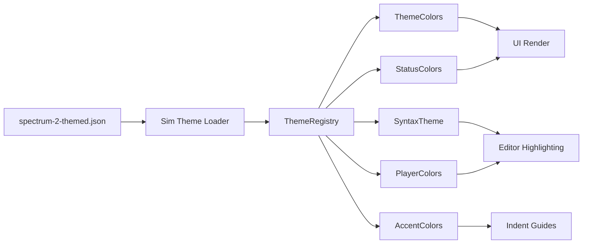
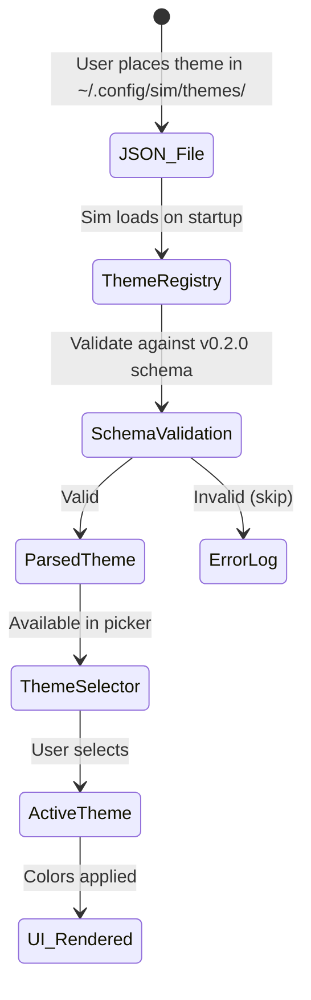

# Design Document — Spectrum 2 Inspired Theme

## 1. Overview

### Rationale

Sim's default themes ("One Dark" / "One Light") are derived from Atom One, a scheme designed in 2014. This design replaces them with a theme inspired by Adobe Spectrum 2 — a modern design system built around layered surfaces, semantic color tokens, restrained accent usage, and accessibility.

The core design decision is: **translate Spectrum 2's design language into Sim's existing theme schema without modifying any Rust code or the schema itself.** This is purely a data change — a new JSON file with carefully curated color values.

### Key Architectural Decisions

| Decision | Choice | Rationale |
|---|---|---|
| File location | Local `~/.config/sim/themes/` | Installed as a user theme, not replacing the built-in. Allows One theme to remain available. |
| Naming | "Spectrum 2 Inspired" (family), "Spectrum 2 Inspired Light" / "Spectrum 2 Inspired Dark" | Clearly communicates inspiration without claiming Adobe branding. |
| Palette approach | Hand-curated hex values, not algorithmic | Provides precise control over perceived lightness, saturation, and hue relationships. |
| Surface layering | 4 distinct layers (background → panel → editor → elevated) | Creates clear visual hierarchy without hard borders. |
| Accent language | Blue primary, purple secondary, 6 hues total | Restrained palette prevents visual noise while providing semantic signal. |
| Syntax highlighting | Hue-per-category mapping | Each semantic token type gets a consistent hue assignment, making code scannable. |

### Technology Stack

- **Format**: JSON (Sim theme schema `v0.2.0`)
- **No dependencies**: The theme is self-contained, no build step, no imports
- **Validation**: JSON Schema at `https://sim.dev/schema/themes/v0.2.0.json`

## 2. Architecture

### Theme File Structure

```
~/.config/sim/themes/
└── spectrum-2-inspired.json
    ├── $schema
    ├── name: "Spectrum 2 Inspired"
    ├── author: "Ahmad Vegah"
    └── themes[]
        ├── { name: "Spectrum 2 Inspired Light", appearance: "light", style: { ... } }
        └── { name: "Spectrum 2 Inspired Dark",  appearance: "dark",  style: { ... } }
```

### Data Flow



The theme loader reads the JSON, deserializes it into thematic structs, and distributes values to the rendering pipeline. **No changes to this pipeline are required** — the new JSON plugs into the existing system.

### Color Mapping Architecture

```
Spectrum 2 Concept           → Sim Theme Key
────────────────────────────────────────────────
base (most background)       → background
layer-1 (panel surface)      → panel.background
layer-2 (editor surface)     → editor.background
elevated (modal/popover)     → elevated_surface.background

accent (blue semantic)       → border.focused, text.accent, icon.accent,
                               search.match_background, player[0]
accent-200 (subtle accent)   → editor.selection.background-like uses

negative (red semantic)      → error, deleted, conflict
positive (green semantic)    → success, created
notice (orange semantic)     → warning, modified
informative (blue semantic)  → info, hint, renamed
```

## 3. Components and Interfaces

### 3.1 Theme JSON File

**Purpose**: Define all color values for both light and dark appearance variants.

**Interface contract**: Must conform to `https://sim.dev/schema/themes/v0.2.0.json`.

**Structure**:

```json
{
  "$schema": "https://sim.dev/schema/themes/v0.2.0.json",
  "name": "Spectrum 2 Inspired",
  "author": "Ahmad Vegah",
  "themes": [
    {
      "name": "Spectrum 2 Inspired Light",
      "appearance": "light",
      "style": {
        // All ThemeColors keys (flat)
        // StatusColors keys (nested under status or flat...)
        // Syntax keys (nested under "syntax")
        // Player colors (nested under "players")
        // Accent colors array
      }
    },
    {
      "name": "Spectrum 2 Inspired Dark",
      "appearance": "dark",
      "style": {
        // Same structure, dark variant values
      }
    }
  ]
}
```

### 3.2 Surface Layer Definitions

The surface layer system maps Spectrum 2's concept of `base` → `layer-1` → `layer-2` → `elevated` onto Sim's theme keys:

| Layer | Light | Dark | Sim Keys |
|---|---|---|---|
| **App background** (Spectrum `base`) | `#F8F8FA` | `#15161A` | `background` |
| **Panel surface** (Spectrum `layer-1`) | `#F1F2F4` | `#202127` | `surface.background`, `panel.background`, `tab_bar.background`, `status_bar.background`, `title_bar.background`, `toolbar.background` |
| **Editor surface** (Spectrum `layer-2`) | `#FFFFFF` | `#1B1C21` | `editor.background`, `editor.gutter.background` |
| **Elevated** (Spectrum `elevated`) | `#FFFFFF` | `#272832` | `elevated_surface.background` |

### 3.3 Accent Color Assignments

**Primary accent (blue)** — mapped to these Sim keys:

| Token | Light | Dark |
|---|---|---|
| `border.focused` | `#1473E6` | `#5EA0EF` |
| `text.accent` | `#1473E6` | `#5EA0EF` |
| `icon.accent` | `#1473E6` | `#5EA0EF` |
| `search.match_background` | `#1473E633` | `#5EA0EF33` |
| `link_text.hover` | `#1473E6` | `#5EA0EF` |
| Player 0 cursor | `#1473E6` | `#5EA0EF` |
| Syntax `function` | `#0067B8` | `#79B8FF` |
| Syntax `constructor` | `#0067B8` | `#79B8FF` |
| Syntax `attribute` | `#1473E6` | `#5EA0EF` |
| Syntax `tag` | `#D7373F` | `#FF8A90` |

**Secondary accent (purple)** — restrained to syntax and select UI:

| Token | Light | Dark |
|---|---|---|
| `search.active_match_background` | `#7D5CFF33` | `#A38BFF33` |
| Syntax `keyword` | `#6B46C1` | `#B49CFF` |
| Syntax `constant` | `#7D5CFF` | `#A38BFF` |
| Syntax `number` | `#8A5CF6` | `#C5A3FF` |
| Syntax `boolean` | `#7D5CFF` | `#A38BFF` |
| Syntax `preproc` | `#6B46C1` | `#B49CFF` |

### 3.4 Light Mode Color Map

#### UI Colors

| Key | Value | Purpose |
|---|---|---|
| `border` | `#DCDDE1` | Subtle structural borders |
| `border.variant` | `#E6E7EB` | Visual dividers between sections |
| `border.focused` | `#1473E6` | Focused element ring |
| `border.selected` | `#1473E633` | Selected element border |
| `border.transparent` | `#00000000` | Placeholder border |
| `border.disabled` | `#E6E7EB` | Disabled element border |
| `elevated_surface.background` | `#FFFFFF` | Modal, popover, command palette |
| `surface.background` | `#F1F2F4` | Panel/tab surface |
| `background` | `#F8F8FA` | App chrome |
| `element.background` | `#FFFFFF` | Input, button, checkbox background |
| `element.hover` | `#E6E7EB` | Hovered element background |
| `element.active` | `#DCDDE1` | Active/pressed element |
| `element.selected` | `#DCDDE1` | Selected element |
| `element.disabled` | `#F1F2F4` | Disabled element |
| `element.selection_background` | `#1473E626` | Selection in lists/trees |
| `drop_target.background` | `#1473E61A` | Drag-and-drop target area |
| `drop_target.border` | `#1473E6` | Drag-and-drop target border |
| `ghost_element.background` | `#00000000` | Transparent element base |
| `ghost_element.hover` | `#E6E7EB` | Transparent element hover |
| `ghost_element.active` | `#DCDDE1` | Transparent element active |
| `ghost_element.selected` | `#DCDDE1` | Transparent element selected |
| `ghost_element.disabled` | `#00000000` | Transparent element disabled |

#### Text & Icons

| Key | Value | Contrast on `#FFFFFF` |
|---|---|---|
| `text` | `#1D1D1F` | 16.7:1 |
| `text.muted` | `#555862` | 6.5:1 |
| `text.placeholder` | `#777B86` | 4.8:1 |
| `text.disabled` | `#9EA0A8` | 3.3:1 (disabled, acceptable) |
| `text.accent` | `#1473E6` | 5.9:1 |
| `icon` | `#1D1D1F` | 16.7:1 |
| `icon.muted` | `#555862` | 6.5:1 |
| `icon.disabled` | `#9EA0A8` | 3.3:1 (disabled, acceptable) |
| `icon.placeholder` | `#777B86` | 4.8:1 |
| `icon.accent` | `#1473E6` | 5.9:1 |
| `debugger_accent` | `#D7373F` | Breakpoint accent |

#### UI Element Bars

| Key | Value |
|---|---|
| `status_bar.background` | `#F1F2F4` |
| `title_bar.background` | `#F1F2F4` |
| `title_bar.inactive_background` | `#F8F8FA` |
| `toolbar.background` | `#F1F2F4` |
| `tab_bar.background` | `#F1F2F4` |
| `tab.inactive_background` | `#F1F2F4` |
| `tab.active_background` | `#FFFFFF` |

#### Search

| Key | Value |
|---|---|
| `search.match_background` | `#1473E633` |
| `search.active_match_background` | `#7D5CFF33` |

#### Panels & Scrollbars

| Key | Value |
|---|---|
| `panel.background` | `#F1F2F4` |
| `panel.focused_border` | `#1473E6` |
| `panel.indent_guide` | `#DCDDE1` |
| `panel.indent_guide_hover` | `#B8BAC2` |
| `panel.indent_guide_active` | `#1473E6` |
| `panel.overlay_background` | `#F8F8FA` |
| `panel.overlay_hover` | `#E6E7EB` |
| `pane.focused_border` | `#1473E6` |
| `pane_group.border` | `#DCDDE1` |
| `scrollbar.thumb.background` | `#B8BAC280` |
| `scrollbar.thumb.hover_background` | `#9EA0A8` |
| `scrollbar.thumb.active_background` | `#7D818C` |
| `scrollbar.thumb.border` | `#00000000` |
| `scrollbar.track.background` | `#00000000` |
| `scrollbar.track.border` | `#00000000` |
| `minimap.thumb.background` | `#B8BAC280` |
| `minimap.thumb.hover_background` | `#9EA0A8` |
| `minimap.thumb.active_background` | `#7D818C` |
| `minimap.thumb.border` | `#00000000` |

#### Editor

| Key | Value |
|---|---|
| `editor.foreground` | `#1D1D1F` |
| `editor.background` | `#FFFFFF` |
| `editor.gutter.background` | `#FFFFFF` |
| `editor.subheader.background` | `#F1F2F4` |
| `editor.active_line.background` | `#F1F2F480` |
| `editor.highlighted_line.background` | `#F1F2F4` |
| `editor.line_number` | `#B8BAC2` |
| `editor.active_line_number` | `#555862` |
| `editor.hover_line_number` | `#555862` |
| `editor.invisible` | `#DCDDE1` |
| `editor.wrap_guide` | `#E6E7EB` |
| `editor.active_wrap_guide` | `#B8BAC2` |
| `editor.indent_guide` | `#E6E7EB` |
| `editor.indent_guide_active` | `#B8BAC2` |
| `editor.document_highlight.read_background` | `#1473E61A` |
| `editor.document_highlight.write_background` | `#D7373F26` |
| `editor.document_highlight.bracket_background` | `#1473E633` |

#### Terminal

| Key | Value |
|---|---|
| `terminal.background` | `#F1F2F4` |
| `terminal.foreground` | `#1D1D1F` |
| `terminal.bright_foreground` | `#1D1D1F` |
| `terminal.dim_foreground` | `#555862` |
| `terminal.ansi.background` | `#F1F2F4` |
| `terminal.ansi.black` | `#1D1D1F` |
| `terminal.ansi.bright_black` | `#555862` |
| `terminal.ansi.dim_black` | `#9EA0A8` |
| `terminal.ansi.red` | `#D7373F` |
| `terminal.ansi.bright_red` | `#E86060` |
| `terminal.ansi.dim_red` | `#A52B32` |
| `terminal.ansi.green` | `#12805C` |
| `terminal.ansi.bright_green` | `#1A9E6F` |
| `terminal.ansi.dim_green` | `#0D6649` |
| `terminal.ansi.yellow` | `#CB5D00` |
| `terminal.ansi.bright_yellow` | `#E87A00` |
| `terminal.ansi.dim_yellow` | `#A24A00` |
| `terminal.ansi.blue` | `#1473E6` |
| `terminal.ansi.bright_blue` | `#3A8FFF` |
| `terminal.ansi.dim_blue` | `#0F5CB8` |
| `terminal.ansi.magenta` | `#7D5CFF` |
| `terminal.ansi.bright_magenta` | `#A38BFF` |
| `terminal.ansi.dim_magenta` | `#6349CC` |
| `terminal.ansi.cyan` | `#0F8C8C` |
| `terminal.ansi.bright_cyan` | `#14ADAD` |
| `terminal.ansi.dim_cyan` | `#0B6B6B` |
| `terminal.ansi.white` | `#B8BAC2` |
| `terminal.ansi.bright_white` | `#DCDDE1` |
| `terminal.ansi.dim_white` | `#9EA0A8` |

#### Link & Version Control

| Key | Value |
|---|---|
| `link_text.hover` | `#1473E6` |
| `version_control.added` | `#12805C` |
| `version_control.deleted` | `#D7373F` |
| `version_control.modified` | `#CB5D00` |
| `version_control.renamed` | `#1473E6` |
| `version_control.conflict` | `#D7373F` |
| `version_control.ignored` | `#777B86` |
| `version_control.word_added` | `#12805C59` |
| `version_control.word_deleted` | `#D7373FCC` |
| `version_control.conflict_marker.ours` | `#12805C1A` |
| `version_control.conflict_marker.theirs` | `#1473E61A` |

#### Status Colors (Light)

| Key | Foreground | Background | Border |
|---|---|---|---|
| `conflict` | `#D7373F` | `#D7373F1A` | `#D7373F` |
| `created` | `#12805C` | `#12805C1A` | `#12805C` |
| `deleted` | `#D7373F` | `#D7373F1A` | `#D7373F` |
| `error` | `#D7373F` | `#D7373F1A` | `#D7373F` |
| `hidden` | `#777B86` | `#777B861A` | `#777B86` |
| `hint` | `#1473E6` | `#1473E61A` | `#1473E6` |
| `ignored` | `#777B86` | `#777B861A` | `#777B86` |
| `info` | `#1473E6` | `#1473E61A` | `#1473E6` |
| `modified` | `#CB5D00` | `#CB5D001A` | `#CB5D00` |
| `predictive` | `#777B86` | `#777B861A` | `#777B86` |
| `renamed` | `#1473E6` | `#1473E61A` | `#1473E6` |
| `success` | `#12805C` | `#12805C1A` | `#12805C` |
| `unreachable` | `#9EA0A8` | `#9EA0A81A` | `#9EA0A8` |
| `warning` | `#CB5D00` | `#CB5D001A` | `#CB5D00` |

### 3.5 Dark Mode Color Map

#### UI Colors

| Key | Value |
|---|---|
| `border` | `#343640` |
| `border.variant` | `#2A2C34` |
| `border.focused` | `#5EA0EF` |
| `border.selected` | `#5EA0EF33` |
| `border.transparent` | `#00000000` |
| `border.disabled` | `#343640` |
| `elevated_surface.background` | `#272832` |
| `surface.background` | `#202127` |
| `background` | `#15161A` |
| `element.background` | `#202127` |
| `element.hover` | `#343640` |
| `element.active` | `#4A4D59` |
| `element.selected` | `#4A4D59` |
| `element.disabled` | `#202127` |
| `element.selection_background` | `#5EA0EF26` |
| `drop_target.background` | `#5EA0EF1A` |
| `drop_target.border` | `#5EA0EF` |
| `ghost_element.background` | `#00000000` |
| `ghost_element.hover` | `#343640` |
| `ghost_element.active` | `#4A4D59` |
| `ghost_element.selected` | `#4A4D59` |
| `ghost_element.disabled` | `#00000000` |

#### Text & Icons

| Key | Value | Contrast on `#1B1C21` |
|---|---|---|
| `text` | `#F4F4F6` | 16.2:1 |
| `text.muted` | `#C4C7D0` | 10.5:1 |
| `text.placeholder` | `#8F939E` | 6.1:1 |
| `text.disabled` | `#6B6F7A` | 4.1:1 |
| `text.accent` | `#5EA0EF` | 7.3:1 |
| `icon` | `#F4F4F6` | 16.2:1 |
| `icon.muted` | `#C4C7D0` | 10.5:1 |
| `icon.disabled` | `#6B6F7A` | 4.1:1 |
| `icon.placeholder` | `#8F939E` | 6.1:1 |
| `icon.accent` | `#5EA0EF` | 7.3:1 |
| `debugger_accent` | `#FF8A90` | |

#### UI Element Bars

| Key | Value |
|---|---|
| `status_bar.background` | `#202127` |
| `title_bar.background` | `#202127` |
| `title_bar.inactive_background` | `#15161A` |
| `toolbar.background` | `#202127` |
| `tab_bar.background` | `#202127` |
| `tab.inactive_background` | `#202127` |
| `tab.active_background` | `#1B1C21` |

#### Search

| Key | Value |
|---|---|
| `search.match_background` | `#5EA0EF33` |
| `search.active_match_background` | `#A38BFF33` |

#### Panels & Scrollbars

| Key | Value |
|---|---|
| `panel.background` | `#202127` |
| `panel.focused_border` | `#5EA0EF` |
| `panel.indent_guide` | `#343640` |
| `panel.indent_guide_hover` | `#4A4D59` |
| `panel.indent_guide_active` | `#5EA0EF` |
| `panel.overlay_background` | `#15161A` |
| `panel.overlay_hover` | `#2A2C34` |
| `pane.focused_border` | `#5EA0EF` |
| `pane_group.border` | `#343640` |
| `scrollbar.thumb.background` | `#4A4D5980` |
| `scrollbar.thumb.hover_background` | `#6B6F7A` |
| `scrollbar.thumb.active_background` | `#8F939E` |
| `scrollbar.thumb.border` | `#00000000` |
| `scrollbar.track.background` | `#00000000` |
| `scrollbar.track.border` | `#00000000` |
| `minimap.thumb.background` | `#4A4D5980` |
| `minimap.thumb.hover_background` | `#6B6F7A` |
| `minimap.thumb.active_background` | `#8F939E` |
| `minimap.thumb.border` | `#00000000` |

#### Editor

| Key | Value |
|---|---|
| `editor.foreground` | `#C4C7D0` |
| `editor.background` | `#1B1C21` |
| `editor.gutter.background` | `#1B1C21` |
| `editor.subheader.background` | `#202127` |
| `editor.active_line.background` | `#20212780` |
| `editor.highlighted_line.background` | `#202127` |
| `editor.line_number` | `#4A4D59` |
| `editor.active_line_number` | `#C4C7D0` |
| `editor.hover_line_number` | `#8F939E` |
| `editor.invisible` | `#343640` |
| `editor.wrap_guide` | `#2A2C34` |
| `editor.active_wrap_guide` | `#4A4D59` |
| `editor.indent_guide` | `#2A2C34` |
| `editor.indent_guide_active` | `#4A4D59` |
| `editor.document_highlight.read_background` | `#5EA0EF1A` |
| `editor.document_highlight.write_background` | `#FF8A9026` |
| `editor.document_highlight.bracket_background` | `#5EA0EF33` |

#### Terminal

| Key | Value |
|---|---|
| `terminal.background` | `#202127` |
| `terminal.foreground` | `#C4C7D0` |
| `terminal.bright_foreground` | `#F4F4F6` |
| `terminal.dim_foreground` | `#6B6F7A` |
| `terminal.ansi.background` | `#202127` |
| `terminal.ansi.black` | `#1B1C21` |
| `terminal.ansi.bright_black` | `#6B6F7A` |
| `terminal.ansi.dim_black` | `#2A2C34` |
| `terminal.ansi.red` | `#FF6B72` |
| `terminal.ansi.bright_red` | `#FF8A90` |
| `terminal.ansi.dim_red` | `#CC555C` |
| `terminal.ansi.green` | `#4CC38A` |
| `terminal.ansi.bright_green` | `#74D99F` |
| `terminal.ansi.dim_green` | `#3D9C6E` |
| `terminal.ansi.yellow` | `#E87A00` |
| `terminal.ansi.bright_yellow` | `#F39C5E` |
| `terminal.ansi.dim_yellow` | `#B86100` |
| `terminal.ansi.blue` | `#5EA0EF` |
| `terminal.ansi.bright_blue` | `#79B8FF` |
| `terminal.ansi.dim_blue` | `#4B80BF` |
| `terminal.ansi.magenta` | `#A38BFF` |
| `terminal.ansi.bright_magenta` | `#C5A3FF` |
| `terminal.ansi.dim_magenta` | `#826FCC` |
| `terminal.ansi.cyan` | `#3DBDBD` |
| `terminal.ansi.bright_cyan` | `#5CD4D4` |
| `terminal.ansi.dim_cyan` | `#309797` |
| `terminal.ansi.white` | `#C4C7D0` |
| `terminal.ansi.bright_white` | `#F4F4F6` |
| `terminal.ansi.dim_white` | `#8F939E` |

#### Link & Version Control

| Key | Value |
|---|---|
| `link_text.hover` | `#5EA0EF` |
| `version_control.added` | `#4CC38A` |
| `version_control.deleted` | `#FF6B72` |
| `version_control.modified` | `#E87A00` |
| `version_control.renamed` | `#5EA0EF` |
| `version_control.conflict` | `#FF6B72` |
| `version_control.ignored` | `#6B6F7A` |
| `version_control.word_added` | `#4CC38A59` |
| `version_control.word_deleted` | `#FF6B72CC` |
| `version_control.conflict_marker.ours` | `#4CC38A1A` |
| `version_control.conflict_marker.theirs` | `#5EA0EF1A` |

#### Status Colors (Dark)

| Key | Foreground | Background | Border |
|---|---|---|---|
| `conflict` | `#FF6B72` | `#FF6B721A` | `#FF6B72` |
| `created` | `#4CC38A` | `#4CC38A1A` | `#4CC38A` |
| `deleted` | `#FF6B72` | `#FF6B721A` | `#FF6B72` |
| `error` | `#FF6B72` | `#FF6B721A` | `#FF6B72` |
| `hidden` | `#8F939E` | `#8F939E1A` | `#8F939E` |
| `hint` | `#5EA0EF` | `#5EA0EF1A` | `#5EA0EF` |
| `ignored` | `#8F939E` | `#8F939E1A` | `#8F939E` |
| `info` | `#5EA0EF` | `#5EA0EF1A` | `#5EA0EF` |
| `modified` | `#E87A00` | `#E87A001A` | `#E87A00` |
| `predictive` | `#8F939E` | `#8F939E1A` | `#8F939E` |
| `renamed` | `#5EA0EF` | `#5EA0EF1A` | `#5EA0EF` |
| `success` | `#4CC38A` | `#4CC38A1A` | `#4CC38A` |
| `unreachable` | `#6B6F7A` | `#6B6F7A1A` | `#6B6F7A` |
| `warning` | `#E87A00` | `#E87A001A` | `#E87A00` |

### 3.6 Syntax Highlighting

Complete syntax palette for both modes.

#### Light Mode Syntax

| Token | Color | Font Style | Font Weight |
|---|---|---|---|
| `attribute` | `#1473E6` | normal | normal |
| `boolean` | `#7D5CFF` | normal | normal |
| `comment` | `#777B86` | italic | normal |
| `comment.doc` | `#777B86` | italic | normal |
| `constant` | `#7D5CFF` | normal | normal |
| `constructor` | `#0067B8` | normal | normal |
| `embedded` | `#1D1D1F` | normal | normal |
| `emphasis` | `#1D1D1F` | italic | normal |
| `emphasis.strong` | `#1D1D1F` | italic | bold |
| `enum` | `#CB5D00` | normal | normal |
| `function` | `#0067B8` | normal | normal |
| `hint` | `#777B86` | italic | normal |
| `keyword` | `#6B46C1` | normal | normal |
| `label` | `#0F6CBD` | normal | normal |
| `link_text` | `#1473E6` | italic | normal |
| `link_uri` | `#0F8C8C` | normal | normal |
| `namespace` | `#555862` | normal | normal |
| `number` | `#8A5CF6` | normal | normal |
| `operator` | `#555862` | normal | normal |
| `predictive` | `#777B86` | italic | normal |
| `preproc` | `#6B46C1` | normal | normal |
| `primary` | `#1D1D1F` | normal | normal |
| `property` | `#0F6CBD` | normal | normal |
| `punctuation` | `#555862` | normal | normal |
| `punctuation.bracket` | `#777B86` | normal | normal |
| `punctuation.delimiter` | `#777B86` | normal | normal |
| `punctuation.list_marker` | `#D7373F` | normal | normal |
| `punctuation.markup` | `#D7373F` | normal | normal |
| `punctuation.special` | `#CB5D00` | normal | normal |
| `selector` | `#6B46C1` | normal | normal |
| `selector.pseudo` | `#1473E6` | normal | normal |
| `string` | `#12805C` | normal | normal |
| `string.escape` | `#CB5D00` | normal | normal |
| `string.regex` | `#12805C` | normal | normal |
| `string.special` | `#12805C` | normal | normal |
| `string.special.symbol` | `#12805C` | normal | normal |
| `tag` | `#D7373F` | normal | normal |
| `text.literal` | `#12805C` | normal | normal |
| `title` | `#0067B8` | normal | normal |
| `type` | `#CB5D00` | normal | normal |
| `variable` | `#1D1D1F` | normal | normal |
| `variable.special` | `#D7373F` | normal | normal |
| `variant` | `#0067B8` | normal | normal |
| `diff.plus` | `#12805C` | normal | normal |
| `diff.minus` | `#D7373F` | normal | normal |

#### Dark Mode Syntax

| Token | Color | Font Style | Font Weight |
|---|---|---|---|
| `attribute` | `#5EA0EF` | normal | normal |
| `boolean` | `#A38BFF` | normal | normal |
| `comment` | `#8F939E` | italic | normal |
| `comment.doc` | `#8F939E` | italic | normal |
| `constant` | `#A38BFF` | normal | normal |
| `constructor` | `#79B8FF` | normal | normal |
| `embedded` | `#F4F4F6` | normal | normal |
| `emphasis` | `#F4F4F6` | italic | normal |
| `emphasis.strong` | `#F4F4F6` | italic | bold |
| `enum` | `#F7B267` | normal | normal |
| `function` | `#79B8FF` | normal | normal |
| `hint` | `#8F939E` | italic | normal |
| `keyword` | `#B49CFF` | normal | normal |
| `label` | `#8CCBFF` | normal | normal |
| `link_text` | `#5EA0EF` | italic | normal |
| `link_uri` | `#3DBDBD` | normal | normal |
| `namespace` | `#C4C7D0` | normal | normal |
| `number` | `#C5A3FF` | normal | normal |
| `operator` | `#C4C7D0` | normal | normal |
| `predictive` | `#8F939E` | italic | normal |
| `preproc` | `#B49CFF` | normal | normal |
| `primary` | `#C4C7D0` | normal | normal |
| `property` | `#8CCBFF` | normal | normal |
| `punctuation` | `#C4C7D0` | normal | normal |
| `punctuation.bracket` | `#8F939E` | normal | normal |
| `punctuation.delimiter` | `#8F939E` | normal | normal |
| `punctuation.list_marker` | `#FF8A90` | normal | normal |
| `punctuation.markup` | `#FF8A90` | normal | normal |
| `punctuation.special` | `#F7B267` | normal | normal |
| `selector` | `#B49CFF` | normal | normal |
| `selector.pseudo` | `#5EA0EF` | normal | normal |
| `string` | `#74D99F` | normal | normal |
| `string.escape` | `#F7B267` | normal | normal |
| `string.regex` | `#74D99F` | normal | normal |
| `string.special` | `#74D99F` | normal | normal |
| `string.special.symbol` | `#74D99F` | normal | normal |
| `tag` | `#FF8A90` | normal | normal |
| `text.literal` | `#74D99F` | normal | normal |
| `title` | `#79B8FF` | normal | normal |
| `type` | `#F7B267` | normal | normal |
| `variable` | `#F4F4F6` | normal | normal |
| `variable.special` | `#FF8A90` | normal | normal |
| `variant` | `#79B8FF` | normal | normal |
| `diff.plus` | `#74D99F` | normal | normal |
| `diff.minus` | `#FF8A90` | normal | normal |

### 3.7 Player Colors

#### Light Mode

| Player | Cursor | Background | Selection |
|---|---|---|---|
| 0 (local) | `#1473E6` | `#1473E6` | `#1473E63D` |
| 1 | `#D77D2C` | `#D77D2C` | `#D77D2C3D` |
| 2 | `#D7377A` | `#D7377A` | `#D7377A3D` |
| 3 | `#4CC38A` | `#4CC38A` | `#4CC38A3D` |
| 4 | `#7D5CFF` | `#7D5CFF` | `#7D5CFF3D` |
| 5 | `#CB8B00` | `#CB8B00` | `#CB8B003D` |
| 6 | `#3DBDBD` | `#3DBDBD` | `#3DBDBD3D` |
| 7 | `#D7373F` | `#D7373F` | `#D7373F3D` |

#### Dark Mode

| Player | Cursor | Background | Selection |
|---|---|---|---|
| 0 (local) | `#5EA0EF` | `#5EA0EF` | `#5EA0EF3D` |
| 1 | `#F39C5E` | `#F39C5E` | `#F39C5E3D` |
| 2 | `#FF7EB3` | `#FF7EB3` | `#FF7EB33D` |
| 3 | `#4CC38A` | `#4CC38A` | `#4CC38A3D` |
| 4 | `#A38BFF` | `#A38BFF` | `#A38BFF3D` |
| 5 | `#F7B267` | `#F7B267` | `#F7B2673D` |
| 6 | `#5CD4D4` | `#5CD4D4` | `#5CD4D43D` |
| 7 | `#FF8A90` | `#FF8A90` | `#FF8A903D` |

### 3.8 Accent Colors Array

#### Light Mode
```json
["#1473E6", "#D77D2C", "#D7377A", "#12805C", "#7D5CFF", "#CB8B00", "#0F8C8C", "#D7373F", "#5B8CBF"]
```

#### Dark Mode
```json
["#5EA0EF", "#F39C5E", "#FF7EB3", "#4CC38A", "#A38BFF", "#F7B267", "#3DBDBD", "#FF8A90", "#79B8FF"]
```

## 4. Data Models

### Theme Structure Model

```json
{
  "$schema":   "string (URL)",
  "name":      "string (theme family name)",
  "author":    "string (creator name)",
  "themes": [
    {
      "name":       "string (variant name)",
      "appearance": "string (\"light\" | \"dark\")",
      "style": {
        // ~60 flat color keys (border.*, text.*, icon.*, element.*, etc.)
        // ~10 editor.* keys
        // ~20 terminal.* keys
        // ~5 version_control.* keys
        // ~42 status_colors (14 status × 3 variants each: foreground, background, border)
        // ~24 syntax capture entries (each with color, font_style, font_weight)
        // 8 player color sets (each with cursor, background, selection)
        // 1 accents array (13 colors)
      }
    }
  ]
}
```

### Color Value Format

All colors use 8-digit hex RGBA: `#RRGGBBAA`.
- `#RRGGBBFF` — fully opaque
- `#RRGGBB00` — fully transparent
- `#RRGGBB33` — ~20% opacity
- `#RRGGBB1A` — ~10% opacity
- `#RRGGBB80` — ~50% opacity
- `null` — allowed for `panel.focused_border` and `pane.focused_border` to inherit behavior

### State Machine for Theme Application



## 5. Correctness Properties

### Property 1: Layer Distinctness

_For any_ active theme variant, `background`, `surface.background`, `editor.background`, and `elevated_surface.background` SHALL all be distinct from each other by at least 3% lightness.

**Validates: Requirement 2.1, 2.2**

### Property 2: Accent Consistency

_For any_ active theme variant, `border.focused`, `text.accent`, `icon.accent`, `search.match_background`, and `link_text.hover` SHALL use the same blue hue (hue angle within ±5°).

**Validates: Requirement 3.1, 3.2, 3.3**

### Property 3: Syntax Hue Mapping

_For any_ light or dark variant, the `keyword` syntax token SHALL use a purple hue (270° ± 20°), `function` SHALL use a blue hue (210° ± 15°), and `string` SHALL use a green hue (150° ± 20°).

**Validates: Requirement 4.3, 4.4, 4.5**

### Property 4: Comment Readability

_For any_ active theme variant, the `comment` syntax token SHALL have a contrast ratio of at least 4.5:1 against `editor.background`.

**Validates: Requirement 4.2, 12.1**

### Property 5: Text Contrast Floor

_For any_ active theme variant, `text`, `text.muted`, and `text.placeholder` SHALL each have a contrast ratio of at least 4.5:1 against their typical background surfaces.

**Validates: Requirement 12.1, 12.5**

### Property 6: Semantic Status Mapping

_For any_ active theme variant, `error` and `deleted` SHALL use a red hue, `success` and `created` SHALL use a green hue, `warning` and `modified` SHALL use an orange/amber hue, and `info` and `hint` SHALL use a blue hue.

**Validates: Requirement 7.1, 7.2, 7.3, 7.4**

### Property 7: Light/Dark Hue Consistency

_For any_ pair of light and dark variants, the `keyword` hue in both modes SHALL differ by at most 20° on the color wheel. The same constraint SHALL hold for `function`, `string`, `type`, and `comment`.

**Validates: Requirement 11.3**

### Property 8: Player Color Distinctness

_For any_ two different player color sets, the hue of their cursor colors SHALL differ by at least 30° on the color wheel.

**Validates: Requirement 9.2**

### Property 9: Maximum Hues

_For any_ active theme variant, the set of unique hues used across all syntax tokens SHALL be at most 6 (excluding grays/neutrals).

**Validates: Requirement 3.8**

### Property 10: Terminal Contrast

_For any_ active theme variant, `terminal.foreground` SHALL have a contrast ratio of at least 4.5:1 against `terminal.background`.

**Validates: Requirement 8.3**

## 6. Error Handling

### What Can Go Wrong

| Error | Root Cause | Impact | Mitigation |
|---|---|---|---|
| Invalid hex color | Typo in JSON value | Theme fails to load, falls back to default | Validate hex format before deployment using JSON schema linting |
| Missing required key | Incomplete theme | UI element gets default/factory color | Reference `one.json` as complete key checklist |
| Schema violation | Structural JSON error | Sim logs error, skips theme | Validate with `ajv` or similar JSON schema validator before copying |
| File not found | Wrong path | Theme not available in selector | Ensure correct path `~/.config/sim/themes/` |
| Duplicate name | Another theme with same name | Conflicts in ThemeRegistry | Use unique name "Spectrum 2 Inspired" |
| Override collision | User has `theme_overrides` for One theme | Overrides no-op for Spectrum theme | Document that overrides are theme-scoped |
| Wrong contrast | Color looks different on different displays | Reduced readability | Test across multiple displays and OS color profiles |

### Recovery Strategy

Since this is a data-only change, error handling is straightforward:
1. **Before deployment**: Validate the JSON against the schema using `script/validate-theme` or schema linting
2. **After deployment**: If the theme fails to load, Sim falls back to factory defaults — the app remains functional
3. **User recovery**: User can switch back to One Dark/Light via the Theme Selector at any time

## 7. Testing Strategy

### Unit Tests (Manual Verification)

Each of these is a visual/manual check:

1. **Surface layering**: Open Sim with 3 panels (project panel, editor, terminal). Verify each surface layer is visually distinct.
2. **Accent consistency**: Click through inputs, buttons, tabs. Verify focused border and accent colors match.
3. **Syntax scanning**: Open TypeScript, Rust, JSON, and Markdown files. Verify each token type is readable and distinct.
4. **Diagnostics**: Trigger errors, warnings, info diagnostics. Verify colors match expected semantics.
5. **Terminal**: Run `ls`, `git status`, and a colorful CLI tool. Verify ANSI colors are readable.
6. **Search**: Use search in a file. Verify match and active-match backgrounds are visible but not overwhelming.
7. **Git**: Stage, modify, and delete files. Verify gutter decorations use correct colors.
8. **Light mode**: Switch to light mode. Verify the same semantic mappings apply and contrast is maintained.
9. **Theme selector**: Verify "Spectrum 2 Inspired" appears and both variants can be selected.
10. **Theme overrides**: Add a `theme_overrides` entry for `editor.background`. Verify it overrides correctly.

### Schema Validation

```bash
# Validate JSON against schema using any JSON Schema validator
# e.g., using ajv-cli:
npx ajv validate -s schema.json -d spectrum-2-inspired.json --strict
```

### Contrast Verification

Use a tool like `contrast-checker` or `colour-contrast` to verify all text tokens meet WCAG AA:

```bash
# Script to verify contrast ratios for all text-carrying tokens
# against their typical background surfaces
```

### Cross-Mode Consistency

Verify that light and dark variants maintain consistent hue mappings by comparing the hue angle of corresponding tokens across modes. Hues should shift by ≤20° for syntax tokens and ≤10° for UI accent tokens.

## 8. Implementation Roadmap

### Step 1: Create the Theme JSON

Build `spectrum-2-inspired.json` with the complete color maps defined in sections 3.4–3.8 above.

### Step 2: Validate

- Run JSON schema validation
- Run contrast ratio verification
- Check for missing keys vs `one.json`

### Step 3: Install

```bash
mkdir -p ~/.config/sim/themes
cp spectrum-2-inspired.json ~/.config/sim/themes/
```

### Step 4: Test

Test across all surface types listed in section 7 and adjust color values based on real-screen appearance.

### Step 5: Update Settings

The user can then configure Sim to use the new theme:

```json
{
  "theme": {
    "mode": "system",
    "light": "Spectrum 2 Inspired Light",
    "dark": "Spectrum 2 Inspired Dark"
  }
}
```
