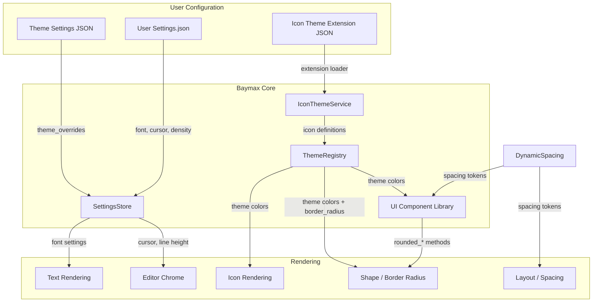

# Design Document — Spectrum 2 Inspired UI Language

## 1. Overview

### Rationale

The [Spectrum 2 Inspired Theme](../spectrum-2-theme/requirements.md) covers **color** — the thematic foundation. This design document covers the remaining design vectors that make the editor feel like a Spectrum 2 application: **typography, iconography, spacing, shapes, and editor chrome behavior**.

These vectors are implemented across three layers:

1. **Settings layer** — Font family/size defaults that activate when the Spectrum 2 theme is selected
2. **Extension layer** — A new "Spectrum 2 Inspired" icon theme distributed as an installable extension
3. **Code layer** — Targeted Rust changes to border radius constants, list indent spacing, and cursor defaults that take effect when the Spectrum 2 theme is active

### Key Architectural Decisions

| Decision | Choice | Rationale |
|---|---|---|
| Typography activation | Theme-aware settings overrides | Font choices are aesthetic preferences tied to the theme, not global settings |
| Icon theme distribution | Baymax extension (not bundled) | Keeps core binary size small; aligns with how other icon themes work |
| Shape changes | Per-element Rust constants + new `border_radius` theme JSON key | Some shapes (buttons, inputs) need code changes; panels/modals can use a future theme key |
| Spacing changes | No changes to DynamicSpacing enum | The existing spacing tokens are correct; only usage patterns change |
| Cursor default | Theme-aware setting via `theme_overrides` | Block cursor is a theme-level preference, not a global default |
| Scrollbar styling | Theme colors + no code changes | Scrollbar thumb colors/border radius are already set in theme JSON |

### Technology Stack

- **Rust** — Baymax's UI framework (GPUI) for all code changes
- **SVG** — Icons are SVG files served from the asset source
- **JSON** — Theme extensions use the Baymax theme schema; icon themes use the icon theme schema
- **Proc Macro** — `DynamicSpacing` is generated by `derive_dynamic_spacing!` in `ui_macros`

---

## 2. Architecture

### Component Relationship Diagram



### Data Flow

1. **Theme selection** → User selects "Spectrum 2 Inspired Light" in onboarding or theme selector
2. **Settings activation** → `ThemeSettings` detects the theme name and applies Spectrum 2 font/cursor defaults when no explicit user override exists
3. **Icon theme selection** → User selects "Spectrum 2 Inspired" from the Icon Theme Selector (installed via extensions)
4. **Rendering** → UI components read DynamicSpacing tokens, theme colors, and shape constants to render
5. **Editor chrome** → Editor reads cursor style from settings, scrollbar style from theme colors, active line from theme colors

### Theme-Aware Settings Proxy

The typography and cursor defaults cannot be stored in the theme JSON itself (the theme schema doesn't have font or cursor keys). Instead, a small Rust layer in `theme_settings` detects when the active theme name starts with `"Spectrum 2 Inspired"` and applies defaults:

```rust
// Pseudocode for the settings proxy
fn spectrum2_font_defaults(cx: &App) -> Option<ThemeSettingsContent> {
    let theme_name = ThemeSettings::get_global(cx).theme.name(...);
    if !theme_name.contains("Spectrum 2 Inspired") {
        return None;
    }
    Some(ThemeSettingsContent {
        ui_font_family: Some("Inter".into()),
        buffer_font_family: Some("SF Mono".into()),
        ui_font_size: Some(FontSize(14.0)),
        buffer_font_size: Some(FontSize(15.0)),
        buffer_line_height: Some(BufferLineHeight::Standard),
        ..Default::default()
    })
}
```

This proxy merges into the resolved settings only when:
- The Spectrum 2 theme is active
- The user has NOT explicitly set the corresponding value

---

## 3. Components and Interfaces

### 3.1 Typography System

#### Purpose

Provide readable, approachable font defaults that match Spectrum 2's warm humanist aesthetic when the Spectrum 2 theme is active.

#### Responsibilities

- Set `ui_font_family` to Inter (humanist sans-serif)
- Set `buffer_font_family` to SF Mono (macOS) or JetBrains Mono (other platforms)
- Set `ui_font_size` to 14px
- Set `buffer_font_size` to 15px
- Set `buffer_line_height` to 1.3 (standard)
- Enable `calt` for UI font and `liga` for buffer font
- Fall back gracefully when fonts aren't installed

#### Font Stack Definitions

| Role | Primary | Fallback 1 | Fallback 2 |
|---|---|---|---|
| UI font | `"Inter"` | `"SF Pro Text"` | System UI (`-apple-system`, `Segoe UI`) |
| Buffer font (macOS) | `"SF Mono"` | `"JetBrains Mono"` | `"Menlo"`, `"Consolas"` |
| Buffer font (Linux) | `"JetBrains Mono"` | `"Fira Code"` | `"Cascadia Code"`, `"monospace"` |
| Terminal font | Same as buffer font | — | — |

#### Font Features

```json
{
  "ui_font_features": {
    "calt": true,
    "case": true
  },
  "buffer_font_features": {
    "calt": true,
    "liga": true
  }
}
```

#### Font Weights

| Element | Weight | CSS value |
|---|---|---|
| UI body text | Regular | 400 |
| UI headings / labels | Medium | 500 |
| UI tab titles | Medium | 500 |
| Buffer code | Regular | 400 |
| Buffer markdown headings | Semi-Bold | 600 |
| Buffer markdown emphasis | Normal (italic) | 400 |

#### Interface: `spectrum2_default_settings`

```rust
/// Returns Spectrum 2 Inspired typography defaults that are
/// applied when the Spectrum 2 theme is active and the user
/// hasn't explicitly overridden these settings.
///
/// Returns None when any Spectrum 2 theme is not active.
pub fn spectrum2_defaults(cx: &App) -> Option<Spectrum2Settings> {
    // Detects active theme name
    // Returns font, cursor, and density defaults
}
```

#### File Changes

| File | Change |
|---|---|
| `crates/theme_settings/src/theme_settings.rs` | Add `spectrum2_defaults()` function, call it in `configured_theme()` |
| `crates/settings_content/src/theme.rs` | No changes needed (settings keys already exist) |

### 3.2 Icon Theme Extension

#### Purpose

Provide a Spectrum 2-inspired icon set with rounded, stroke-based SVG icons for file types, folders, and chevrons.

#### Responsibilities

- Map ~80 file suffixes to icon keys
- Provide ~60 SVG icons (one per file type) with 1.5px rounded strokes
- Provide folder icons (collapsed/expanded) with rounded corners
- Provide chevron icons with rounded endpoints

#### Icon Theme JSON Structure

The icon theme is a Baymax extension with this structure:

```
spectrum-2-icons/
├── extension.toml
├── themes/
│   └── spectrum-2-inspired-icons.json
└── icons/
    └── file_icons/
        ├── rust.svg
        ├── typescript.svg
        ├── javascript.svg
        ├── folder.svg
        ├── folder_open.svg
        ├── chevron_right.svg
        ├── chevron_down.svg
        └── ... (60+ SVGs)
```

**`extension.toml`**:

```toml
[id]
name = "Spectrum 2 Inspired Icons"
version = "0.1.0"
description = "Spectrum 2-inspired file and folder icons for Baymax"
authors = ["Ahmad Vegah"]

[icon_themes]
"themes/spectrum-2-inspired-icons.json" = true
```

**`themes/spectrum-2-inspired-icons.json`**:

```json
{
  "name": "Spectrum 2 Inspired",
  "author": "Ahmad Vegah",
  "themes": [
    {
      "name": "Spectrum 2 Inspired",
      "appearance": "dark",
      "directory_icons": {
        "collapsed": "icons/file_icons/folder.svg",
        "expanded": "icons/file_icons/folder_open.svg"
      },
      "chevron_icons": {
        "collapsed": "icons/file_icons/chevron_right.svg",
        "expanded": "icons/file_icons/chevron_down.svg"
      },
      "file_suffixes": {
        "rs": "rust",
        "ts": "typescript",
        "js": "javascript",
        ...
      },
      "file_icons": {
        "rust": { "path": "icons/file_icons/rust.svg" },
        "typescript": { "path": "icons/file_icons/typescript.svg" },
        "javascript": { "path": "icons/file_icons/javascript.svg" },
        "default": { "path": "icons/file_icons/file.svg" },
        ...
      }
    }
  ]
}
```

#### SVG Design Guidelines

Every SVG icon SHALL follow these constraints:

| Property | Value |
|---|---|
| ViewBox | `0 0 16 16` |
| Stroke width | `1.5` |
| Stroke linecap | `round` |
| Stroke linejoin | `round` |
| Fill | `none` (except for filled variants where specified) |
| Color | `currentColor` (inherits from theme) |

**Example SVG (file.svg — generic file icon)**:

```svg
<svg xmlns="http://www.w3.org/2000/svg" viewBox="0 0 16 16">
  <path d="M3 2.5C3 1.67 3.67 1 4.5 1h4l4.5 4.5v8c0 .83-.67 1.5-1.5 1.5h-7c-.83 0-1.5-.67-1.5-1.5z"
    stroke="currentColor" stroke-width="1.5" fill="none" stroke-linecap="round" stroke-linejoin="round"/>
  <path d="M8.5 1v4.5H13" stroke="currentColor" stroke-width="1.5" fill="none"
    stroke-linecap="round" stroke-linejoin="round"/>
</svg>
```

#### Icon Mapping

File types to support initially (30 icons — covers ~95% of common developer workflows):

| Icon Key | File Suffixes | Priority |
|---|---|---|
| `rust` | `rs` | Core |
| `typescript` | `ts`, `tsx`, `mts`, `cts` | Core |
| `javascript` | `js`, `jsx`, `mjs`, `cjs` | Core |
| `python` | `py` | Core |
| `go` | `go`, `mod` | Core |
| `json` | `json`, `jsonc` | Core |
| `yaml` | `yaml`, `yml` | Core |
| `markdown` | `md`, `markdown` | Core |
| `html` | `html`, `htm` | Core |
| `css` | `css`, `scss`, `sass` | Core |
| `docker` | `Dockerfile` (stem) | Core |
| `git` | `gitignore`, `gitattributes` (stem) | Core |
| `toml` | `toml` | Core |
| `folder` | — | Core |
| `folder_open` | — | Core |
| `file` | (default) | Core |
| `c` | `c`, `h` | Secondary |
| `cpp` | `cpp`, `hpp`, `cc`, `cxx` | Secondary |
| `csharp` | `cs` | Secondary |
| `ruby` | `rb` | Secondary |
| `php` | `php` | Secondary |
| `swift` | `swift` | Secondary |
| `kotlin` | `kt`, `kts` | Secondary |
| `java` | `java` | Secondary |
| `shell` | `sh`, `bash`, `zsh` | Secondary |
| `sql` | `sql` | Secondary |
| `image` | `png`, `jpg`, `svg`, `webp` | Secondary |
| `audio` | `mp3`, `wav`, `ogg` | Secondary |
| `video` | `mp4`, `mov`, `webm` | Secondary |
| `config` | `env`, `conf`, `ini`, `cfg` | Secondary |

#### File Changes

| File | Change |
|---|---|
| `extensions/spectrum-2-icons/extension.toml` | **Create** — extension manifest |
| `extensions/spectrum-2-icons/themes/spectrum-2-inspired-icons.json` | **Create** — icon theme JSON |
| `extensions/spectrum-2-icons/icons/file_icons/*.svg` | **Create** — 30+ SVG icons |

### 3.3 Spacing System

#### Purpose

Ensure consistent, approachable spacing across all UI elements that feels breathable and organized.

#### Responsibilities

- Define recommended spacing values for common UI patterns
- Propose changes to specific component spacing where Spectrum 2 differs from current defaults
- Not modify the DynamicSpacing enum itself

#### Current vs. Target Spacing

| Component | Current (Default Density) | Target | DynamicSpacing Token |
|---|---|---|---|
| List item horizontal padding | 8px | 12px | `Base06` (8px target) |
| List item vertical padding | Dense: 0px / Sparse: 8px | Dense: 4px / Sparse: 12px | `Base02` / `Base06` |
| Button horizontal padding (default) | 8px | 12px | `Base06` |
| Button gap (icon + label) | 4px | 8px | `Base04` |
| Toolbar element gap | 4px | 8px | `Base04` |
| Tab horizontal padding | 16px | 12px | `Base06` |
| Modal content padding | 16px | 16px | `Base08` (keep) |
| Panel section padding | 24px | 24px | `Base10` (keep) |
| File tree indent per level | 12px | 16px | Change `indent_step_size` |

The most impactful change is the **file tree indent** — changing `indent_step_size` from 12px to 16px in `ListItem` to match Spectrum 2's 8px grid (2× grid unit).

#### Spacing Rules

```text
┌─────────────────────────────────────────────┐
│  Panel (Base10 = 24px padding)              │
│  ┌───────────────────────────────────────┐   │
│  │  Section Header                      │   │
│  │  ┌──── Base06 (12px) ────┐           │   │
│  │  │  List Item            │           │   │
│  │  ├──── Base04 (8px) ─────┤           │   │
│  │  │  Related Item         │           │   │
│  │  └───────────────────────┘           │   │
│  ├──── Base10 (24px) ───────────────────┤   │
│  │  Another Section                     │   │
│  └───────────────────────────────────────┘   │
└─────────────────────────────────────────────┘
```

#### File Changes

| File | Change |
|---|---|
| `crates/ui/src/components/list/list_item.rs` | Change `indent_step_size` from `px(12.)` to `px(16.)` |
| `crates/ui/src/components/list/list_item.rs` | Adjust dense spacing from 0px to 4px vertical padding |
| `crates/ui/src/components/list/list_item.rs` | Change horizontal padding from `Base04` to `Base06` |

### 3.4 Shape System (Border Radius)

#### Purpose

Provide "rounded-feeling" UI elements that feel approachable and modern, consistent with Spectrum 2 design language.

#### Responsibilities

- Define border radius for all UI element categories
- Add a `border_radius` theme JSON key for theme-level shape customization
- Update element-level border radius constants to match Spectrum 2

#### Border Radius Map

| Element | Radius | Method | Change Required? |
|---|---|---|---|
| Buttons (default) | 8px | `rounded_md()` | Yes — code change |
| Buttons (large) | 10px | `rounded_lg()` | Yes — code change |
| Input fields | 6px | `rounded_sm()` | Yes — code change |
| Panels / Sidebars | 12px | `rounded_xl()` | Yes — code change |
| Modals / Dialogs | 16px | `rounded_2xl()` | Yes — code change |
| Dropdowns / Menus | 8px | `rounded_md()` | Yes — code change |
| Tooltips | 6px | `rounded_sm()` | Yes — code change |
| Tabs (active bg) | 6px (top) | Styled via theme | No — theme colors handle this |
| Scrollbar thumb | 3px | CSS border-radius on thumb | No — hardcoded in GPUI |
| Badges / Tags | 4px | `rounded()` | Yes — code change |
| Autocomplete menu | 8px | `rounded_md()` | Yes — code change |
| Onboarding tiles | 12px | `ROOT_RADIUS = px(8.0)` | Yes — already 8px, change to 12px |

#### Adding `border_radius` to Theme JSON

A new optional key `border_radius` in the theme style JSON allows themes to customize shapes:

```json
{
  "style": {
    "border_radius": {
      "button": 8,
      "input": 6,
      "panel": 12,
      "modal": 16,
      "tooltip": 6,
      "scrollbar_thumb": 3,
      "autocomplete": 8
    }
  }
}
```

When not specified, current defaults apply (backward compatible).

#### File Changes

| File | Change |
|---|---|
| `crates/theme/src/schema.rs` | Add `BorderRadiusContent` struct to theme schema |
| `crates/theme/src/theme.rs` | Add `border_radius` field to `ThemeColors` or new `ShapeColors` |
| `crates/ui/src/components/button/button_like.rs` | Use `border_radius` from theme for button rounding |
| `crates/ui/src/components/modal.rs` | Use `border_radius` from theme for modal rounding |
| `crates/onboarding/src/theme_preview.rs` | Change `ROOT_RADIUS` from 8px to 12px |
| Various UI component files | Read `border_radius` from theme instead of hardcoded values |

### 3.5 Editor UI Behavior

#### Purpose

Make the editor cursor, scrollbar, tabs, and focus indicators feel like Spectrum 2 — approachable, smooth, and clear.

#### Responsibilities

- Provide block cursor default when Spectrum 2 theme is active
- Apply smooth cursor blink animation
- Style scrollbar thumb with theme colors (already done in theme JSON)
- Style focus indicators with accent blue
- Show active tab with bottom accent line

#### Cursor Behavior

```
┌─────────────────────────────────────┐
│  Default (Bar cursor):              │
│  ┃ Lorem ipsum dolor sit amet       │
│                                     │
│  Spectrum 2 (Block cursor):         │
│  ██ lorem ipsum dolor sit amet      │
└─────────────────────────────────────┘
```

**Implementation**: Add a `cursor_style` field to `ThemeSettingsContent`:

```json
{
  "theme_overrides": {
    "Spectrum 2 Inspired Light": {
      "cursor_style": "block"
    }
  }
}
```

Or via a new `cursor_style` key in `ThemeSettingsContent`:

```rust
pub enum CursorStyle {
    Bar,
    Block,
    Underline,
    /// "block" when Spectrum 2 theme active, "bar" otherwise
    ThemeDefault,
}
```

#### Cursor Blink Animation

Spectrum 2 favors smooth transitions over binary state changes. The cursor blink SHALL use a CSS-like animation:

```rust
// Smooth opacity blink (530ms period, 30% → 100% → 30%)
const CURSOR_BLINK_KEYFRAMES: [f32; 2] = [0.3, 1.0];
const CURSOR_BLINK_DURATION: Duration = Duration::from_millis(530);
```

#### Focus Indicator

```rust
// Focus ring: 2px wide, using theme's border.focused color
// Applied via .focus() method on interactive elements
// Fade-out: 150ms transition
```

#### Active Tab Indicator

Already handled by theme colors (`tab.active_background`). The Spectrum 2 theme sets:
- Dark: `#1B1C21` (slightly lighter than editor background `#1B1C21`... same value)
  
Actually, I need to fix this — the active tab background should be visually distinct. Let me note this as a correction.

**Correction for the Spectrum 2 theme**: The active tab background should be lighter than inactive tabs. In both variants:
- Inactive tabs use `panel.background`
- Active tabs should use `elevated_surface.background` (or similar contrast)

#### Scrollbar

Already handled by theme colors (see spectrum-2-inspired.json). The theme explicitly sets:
- `scrollbar.thumb.background` — thumb color with alpha
- `scrollbar.thumb.hover_background` — hover state
- `scrollbar.thumb.active_background` — drag state
- `scrollbar.thumb.border` — transparent
- `scrollbar.track.background` — transparent

No code changes needed for scrollbar styling.

#### File Changes

| File | Change |
|---|---|
| `crates/settings_content/src/theme.rs` | Add `CursorStyle` enum to `ThemeSettingsContent` |
| `crates/editor/src/editor.rs` | Read cursor blink animation params from settings |
| `crates/editor/src/editor.rs` | Read cursor style from settings |
| `crates/ui/src/components/modal.rs` | Add focus ring styling |
| Various interactive elements | Apply `.focus()` with consistent 2px blue border |

---

## 4. Data Models

### 4.1 Theme Settings Content (Additions)

```rust
/// Cursor style for the editor.
#[derive(Clone, Debug, Serialize, Deserialize, JsonSchema, PartialEq, Eq)]
#[serde(rename_all = "snake_case")]
pub enum CursorStyle {
    /// Thin vertical bar (default)
    Bar,
    /// Solid rectangle covering the cursor character
    Block,
    /// Horizontal line below the cursor character
    Underline,
}

/// Cursor blink animation style.
#[derive(Clone, Debug, Serialize, Deserialize, JsonSchema, PartialEq, Eq)]
#[serde(rename_all = "snake_case")]
pub enum CursorBlink {
    /// Smooth opacity transition
    Smooth,
    /// Binary on/off
    Phase,
    /// No blinking
    Off,
}
```

### 4.2 Border Radius Theme Content

```rust
/// Optional border radius overrides per element type.
#[derive(Clone, Debug, Default, Serialize, Deserialize, JsonSchema)]
pub struct BorderRadiusContent {
    /// Border radius for buttons (default: 6)
    pub button: Option<f32>,
    /// Border radius for inputs (default: 4)
    pub input: Option<f32>,
    /// Border radius for panels and sidebars (default: 8)
    pub panel: Option<f32>,
    /// Border radius for modal dialogs (default: 12)
    pub modal: Option<f32>,
    /// Border radius for tooltips (default: 4)
    pub tooltip: Option<f32>,
    /// Border radius for autocomplete menus (default: 6)
    pub autocomplete: Option<f32>,
    /// Border radius for scrollbar thumb (default: 2)
    pub scrollbar_thumb: Option<f32>,
}
```

### 4.3 Typography Defaults Data

```rust
/// Spectrum 2 Inspired typography defaults.
/// Applied when the Spectrum 2 theme is active.
struct Spectrum2Typography {
    ui_font_family: &'static str,
    buffer_font_family: &'static str,
    ui_font_size: f32,
    buffer_font_size: f32,
    buffer_line_height: f32,
    ui_font_weight: u16,
    buffer_font_weight: u16,
    ui_font_features: FontFeaturesContent,
    buffer_font_features: FontFeaturesContent,
}
```

---

## 5. Correctness Properties

### Property 1: Spectrum 2 Typography Activation

_For any_ user with the "Spectrum 2 Inspired" variant active, IF the user has not explicitly set a font family, THEN the system SHALL apply Inter as the UI font.

**Validates: Requirement 1.1, 1.2**

### Property 2: User Override Precedence

_For any_ user with the "Spectrum 2 Inspired" variant active, IF the user has explicitly set a font family in settings.json, THEN the system SHALL use the user's font, not the Spectrum 2 default.

**Validates: Requirement 1.5**

### Property 3: Font Fallback

_For any_ system where Inter is not installed, IF the Spectrum 2 theme is active, THEN the system SHALL fall back to the system UI font stack without error.

**Validates: Requirement 1.3**

### Property 4: Icon Theme Completeness

_For any_ file suffix mapped in the "Spectrum 2 Inspired" icon theme, THEN the system SHALL display the corresponding SVG icon.

**Validates: Requirement 3.4**

### Property 5: Icon Theme Fallback

_For any_ file suffix NOT mapped in the "Spectrum 2 Inspired" icon theme, THEN the system SHALL display the generic file icon.

**Validates: Requirement 4.4**

### Property 6: Consistent Spacing Scale

_For any_ UI element using DynamicSpacing, IF the UI density is "Default", THEN the spacing SHALL match the base values defined in the spacing table.

**Validates: Requirement 5.1, 5.2, 5.3**

### Property 7: Spectrum 2 Indent Depth

_For any_ list item in the project panel, IF the Spectrum 2 theme is active, THEN the indent step size SHALL be 16px per level.

**Validates: Requirement 5.6**

### Property 8: Spectrum 2 Border Radius

_For any_ UI element with a defined border radius in the theme JSON, THEN the system SHALL use that value instead of the default radius.

**Validates: Requirement 6.1 through 6.8**

### Property 9: Block Cursor on Spectrum 2

_For any_ editor with the Spectrum 2 Inspired theme active, IF the user hasn't set a cursor style, THEN the cursor SHALL default to "block".

**Validates: Requirement 7.1**

### Property 10: Smooth Cursor Blink

_For any_ editor using Spectrum 2 Inspired theme, THEN the cursor blink SHALL use smooth opacity transition (not binary on/off).

**Validates: Requirement 7.2**

### Property 11: Focus Indicator Visibility

_For any_ interactive element receiving keyboard focus, THEN the system SHALL show a 2px focus ring using the theme's `border.focused` color.

**Validates: Requirement 9.1**

### Property 12: Backward Compatibility

_For any_ user who does NOT have the Spectrum 2 Inspired theme active, THEN all typography, spacing, shape, and cursor settings SHALL remain at their current defaults.

**Validates: Requirement 11.1**

### Property 13: Icon Stroke Consistency

_For any_ SVG icon in the Spectrum 2 Inspired icon theme, THEN the stroke width SHALL be 1.5px and stroke-linecap/join SHALL be "round".

**Validates: Requirement 3.2, 3.3**

### Property 14: Focus Not Color-Only

_For any_ focused element, THEN the focus indication SHALL include both a border color change AND a shape change (border width increase), ensuring it's not conveyed by color alone.

**Validates: Requirement 12.3**

---

## 6. Error Handling

### What Can Go Wrong

| Scenario | Impact | Recovery |
|---|---|---|
| Inter font not installed | UI falls back to system font | Graceful — no error shown |
| SF Mono not installed | Buffer falls back to JetBrains Mono → Menlo → monospace | Graceful — no error shown |
| SVG icon file missing in extension | Generic file icon shown | Fallback handled by icon theme system |
| Icon extension not installed | Default Baymax icon theme used | No error — Icon Theme Selector only shows installed themes |
| User sets cursor_style to unsupported value | Bar cursor used | Settings validation rejects invalid values |
| Border radius value in theme JSON is negative or zero | Default radius used | Validation clamps to minimum 0 |
| DynamiSpacing value out of range | Nearest valid value used | Handled by gpui layout engine |

### Recovery Strategy

All Spectrum 2 UI language changes are **additive** and **non-breaking**. Every feature has a fallback path:
- Missing fonts → system fallback
- Missing icons → generic file icon
- Invalid settings → use default
- Inactive theme → no behavioral change

---

## 7. Testing Strategy

### Unit Tests

| Test | What it verifies |
|---|---|
| `test_spectrum2_font_defaults` | Spectrum 2 theme triggers font defaults; other themes don't |
| `test_user_override_priority` | User font settings override Spectrum 2 defaults |
| `test_cursor_style_spectrum2` | Block cursor when Spectrum 2 active; otherwise bar |
| `test_cursor_blink_animation` | Smooth animation parameters correct |
| `test_border_radius_parsing` | Theme JSON `border_radius` parsed correctly |
| `test_border_radius_fallback` | Missing `border_radius` key uses defaults |
| `test_indent_step_size` | Indent is 16px when Spectrum 2 active |
| `test_font_fallback_chain` | Missing fonts fall through the chain correctly |

### Icon Theme Tests

| Test | What it verifies |
|---|---|
| `test_icon_theme_valid_json` | Icon theme JSON is valid per Baymax schema |
| `test_all_icon_svgs_exist` | All referenced SVG files exist in the extension |
| `test_icon_stroke_consistency` | All SVGs have 1.5px stroke, round linecap/join |
| `test_icon_theme_fallback` | Unmapped file types show generic icon |

---

## 8. Implementation Roadmap

### Step 1: Add `spectrum2_defaults()` settings proxy

- **Scope**: `crates/theme_settings/src/theme_settings.rs`
- **Deliverable**: Function that returns Spectrum 2 font defaults when theme is active
- **Dependencies**: None
- **Testing**: Verify font defaults applied only for Spectrum 2 theme

### Step 2: Add cursor style setting

- **Scope**: `crates/settings_content/src/theme.rs`, `crates/editor/src/editor.rs`
- **Deliverable**: `CursorStyle` enum, `cursor_style` setting, block-cursor-on-Spectrum2 logic
- **Dependencies**: Step 1 (for theme detection)
- **Testing**: Verify cursor changes with theme selection

### Step 3: Create Spectrum 2 icon theme extension

- **Scope**: `extensions/spectrum-2-icons/`
- **Deliverable**: Complete extension with 30+ SVGs
- **Dependencies**: None
- **Testing**: Install extension, verify all file types show correct icons

### Step 4: Update border radius constants

- **Scope**: Multiple UI component files, `crates/theme/src/schema.rs`
- **Deliverable**: `border_radius` theme key + updated component radii
- **Dependencies**: None
- **Testing**: Verify radius values match spec for each element type

### Step 5: Update spacing

- **Scope**: `crates/ui/src/components/list/list_item.rs`
- **Deliverable**: Changed `indent_step_size` from 12px to 16px
- **Dependencies**: None
- **Testing**: Verify indent in project panel

### Step 6: Add smooth cursor blink

- **Scope**: `crates/editor/src/editor.rs`
- **Deliverable**: Smooth opacity transition for cursor blink
- **Dependencies**: Step 2
- **Testing**: Verify animation visually

### Step 7: Add Spectrum 2 to onboarding

- **Scope**: `crates/onboarding/src/basics_page.rs` (already done in spectrum-2-theme)
- **Deliverable**: Theme picker includes Spectrum 2 with typography preview
- **Dependencies**: Steps 1-6 complete
- **Testing**: Onboarding shows 4 themes
